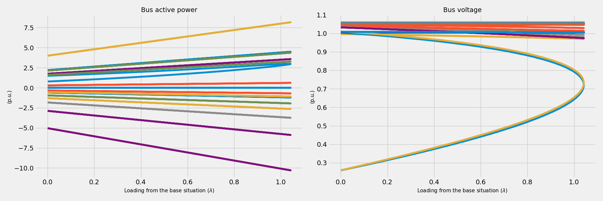

# ➿ Continuation power flow


GridCal can run continuation power flows (voltage collapse studies) 

## API

### Snapshot continuation power flow

```python
import os
from matplotlib import pyplot as plt
import GridCalEngine as gce

plt.style.use('fivethirtyeight')

folder = os.path.join('..', 'Grids_and_profiles', 'grids')
fname = os.path.join(folder, 'South Island of New Zealand.gridcal')

# open the grid file
main_circuit = gce.open_file(fname)

# Run the continuation power flow with the default options
# Since we do not provide any power flow results, it will run one for us
results = gce.continuation_power_flow(grid=main_circuit, 
                                      factor=2.0, 
                                      stop_at=gce.CpfStopAt.Full)

# plot the results
fig = plt.figure(figsize=(18, 6))

ax1 = fig.add_subplot(121)
res = results.mdl(gce.ResultTypes.BusActivePower)
res.plot(ax=ax1)

ax2 = fig.add_subplot(122)
res = results.mdl(gce.ResultTypes.BusVoltage)
res.plot(ax=ax2)

plt.tight_layout()

plt.show()
```

A more elaborated way to run the simulation, controlling all the steps:

```python
import os
from matplotlib import pyplot as plt
import GridCalEngine as gce

plt.style.use('fivethirtyeight')

folder = os.path.join('..', 'Grids_and_profiles', 'grids')
fname = os.path.join(folder, 'South Island of New Zealand.gridcal')

# open the grid file
main_circuit = gce.FileOpen(fname).open()

# we need to initialize with a power flow solution
pf_options = gce.PowerFlowOptions()
power_flow = gce.PowerFlowDriver(grid=main_circuit, options=pf_options)
power_flow.run()

# declare the CPF options
vc_options = gce.ContinuationPowerFlowOptions(step=0.001,
                                              approximation_order=gce.CpfParametrization.ArcLength,
                                              adapt_step=True,
                                              step_min=0.00001,
                                              step_max=0.2,
                                              error_tol=1e-3,
                                              tol=1e-6,
                                              max_it=20,
                                              stop_at=gce.CpfStopAt.Full,
                                              verbose=False)

# We compose the target direction
factor = 2.0
base_power = power_flow.results.Sbus / main_circuit.Sbase
vc_inputs = gce.ContinuationPowerFlowInput(Sbase=base_power,
                                           Vbase=power_flow.results.voltage,
                                           Starget=base_power * factor)

# declare the CPF driver and run
vc = gce.ContinuationPowerFlowDriver(grid=main_circuit,
                                     options=vc_options,
                                     inputs=vc_inputs,
                                     pf_options=pf_options)
vc.run()

# plot the results
fig = plt.figure(figsize=(18, 6))

ax1 = fig.add_subplot(121)
res = vc.results.mdl(gce.ResultTypes.BusActivePower)
res.plot(ax=ax1)

ax2 = fig.add_subplot(122)
res = vc.results.mdl(gce.ResultTypes.BusVoltage)
res.plot(ax=ax2)

plt.tight_layout()

plt.show()
```


