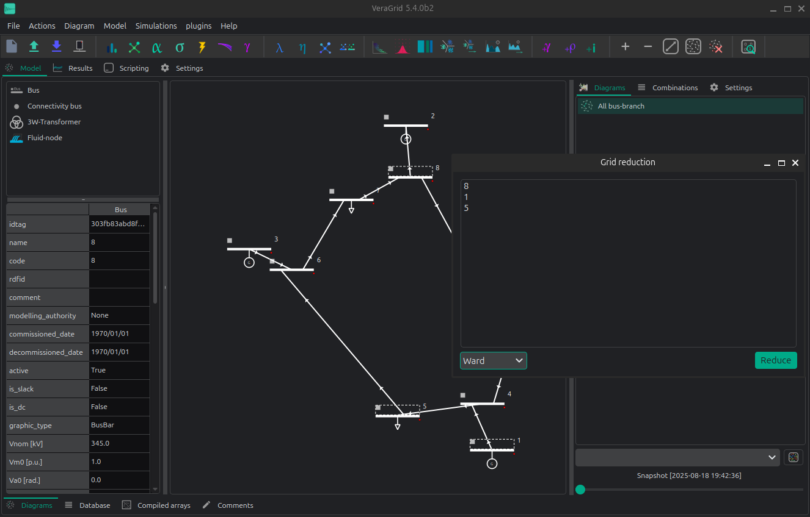

# 👾 Grid Reduction

VeraGrid has the ability to perform planning-style grid reductions.

A) From the schematic:

1. First, Select the buses that you want to reduce in the schematic.

2. The launch the grid reduction window by selecting the menu option `Model > Grid Reduction`

B) From the database:

1. Select the buses according to some rule in the database view. 
2. Right click and call the **grid reduction** action in the context menu.




A small window  will pop up indicating the list of buses that you are going to remove.
By accepting, the grid will be reduced according to the theory developed by [1].
You can expect that the reduced grid flows behave roughly like the original grid.

Changing the injections, or further topological changes will alter the equivalent behavior.

This action cannot be undone.

## API

Grid reduction examples:

```python
import numpy as np
import VeraGridEngine as vg

grid = vg.open_file('case118.m')

pf_res = vg.power_flow(grid=grid)

# define the buses to remove
reduction_bus_indices = np.array([
    1, 2, 3, 4, 5, 6, 7, 8, 9, 10, 11, 12, 13, 14, 15, 16, 17, 18, 19,
    20, 21, 22, 23, 25, 26, 27, 28, 29, 30, 31, 32, 33, 34, 35, 36, 38, 113, 114, 115, 117
]) - 1  # minus 1 for zero based indexing

# Ward reduction
grid_ward = vg.ward_standard_reduction(
    grid=grid.copy(),
    reduction_bus_indices=reduction_bus_indices,
    V0=pf_res.voltage,
    logger=vg.Logger()
)

# PTDF reduction
nc = vg.compile_numerical_circuit_at(circuit=grid, t_idx=None)
lin = vg.LinearAnalysis(nc=nc)

if grid.has_time_series:
    lin_ts = vg.LinearAnalysisTs(grid=grid)
else:
    lin_ts = None

grid_ptdf, logger_ptdf = vg.ptdf_reduction(
    grid=grid.copy(),
    reduction_bus_indices=reduction_bus_indices,
    PTDF=lin.PTDF,
    lin_ts=lin_ts
)

# Di-Shi reduction
grid_di_shi, logger_ds = vg.di_shi_reduction(
    grid=grid.copy(),
    reduction_bus_indices=reduction_bus_indices,
    V0=pf_res.voltage
)

```

Observe how we feed a copy of the original grid to the 
reduction functions. This is because those functions alter
the input grid.

## Theory


### Ward reduction

Performs the standard ward reduction.

Define the bus sets $E$ (external buses to remove), 
$I$ (internal buses that are not boundary) and 
$B$ (boundary buses)

- Run a power flow of the base grid and slice $V_b = V[B]$ and $V_e = V[E]$
- Slice $Y_{BE} = Y[B, E]$, $Y_{EB} = Y[E, B]$ and $Y_{EE} = Y[E, E]$
- Compute the equivalent boundary admittances as:
$$
Y_{eq} = Y_{BE} \times Y_{EE}^{-1} \times Y_{EB}
$$
- Compute the equivalent boundary injection currents as: 
$$
I_{eq} = - Y_{BE} \times Y_{EE}^{-1} \times (Y_{EB} \times V_b + Y_{EE} \times V_e)
$$

- Compute the boundary power injections as:
$$
S_{eq} = V_b \cdot (I_{eq})^*
$$
- Create a new load with the value of $S_{eq}[b]$ for every bus $b$ of $B$.
- For every entry in the lower triangle of $Y_{eq}$, create a shunt or series reactance 
at the boundary or between the boundary buses.
- Finally, remove all buses in $E$ from the grid.


### Di-Shi grid equivalent

The PhD dissertation of Di-Shi presented in [1] [2], expands on the traditional ward equivalent reduction method.
The proposed method allows the generators to be *just moved* to the boundary buses. Later, 
the injections are calibrated to compensate for that. It is a very friendly method for 
planning engineers that want to reduce the grid, and still need to keep the generators as previously 
defined for dispatching.

**Step 0 – Define bus sets**

- I: set of internal buses.
- E: set of external buses: those that we want to remove.
- B: set of boundary buses between E and I.

**Step 1 – First Ward reduction**

This first reduction is to obtain the equivalent admittance matrix $Y_eq^{(1}$ that serves
to create the inter-boundary branches that represent the grid that we are going to remove.
For this the buses to keep are the internal (I) + boundary (B).

**Step 2 – Second Ward reduction: Extending to the external generation buses**

The second reduction is to generate another equivalent admittance matrix $Y_eq^{(2}$
that we use as adjacency matrix to search the closest bus to move each generator that is external.
For this the buses to keep are the internal (I) + boundary (B) + the generation buses of E.

**Step 3 – Relocate generators**

Using the matrix $Y_eq^{(2}$, we calculate the shortest paths from every 
external generation bus, to all the other buses in I + B. The end of each 
path will be the relocation bus of every external generator.

**Step 4 – Relocate loads with inverse power flow**

Let's not forget about the loads! in order to move the external loads such that
the reduced flows resemble the original flows (even after brutally moving the generators!),
we need to perform an *inverse power flow*.

First, we need to run a linear power flow in the original system. 
That will get us the original voltage angles.

Second, we need to form the admittance matrix of the reduced grid 
(including the inter-boundary branches), and multiply this admittance
matrix by the original voltage angles for the reduced set of buses.
This gets us the "final" power injections in the reduced system.

From those, we need to subtract the reduced grid injections. 
This will provide us with a vector of new loads that we need to add at 
the corresponding reduced grid buses in order to have a final equivalent.


[1]: [Power System Network Reduction for Engineering and Economic 
Analysis by Di Shi, 
2012 Arizona State University](https://core.ac.uk/download/pdf/79564835.pdf).

[2]: [Optimal Generation Investment Planning: Pt 1: Network Equivalents](https://ieeexplore.ieee.org/document/6336375)


### PTDF reduction

Performs a analogous method as the Di-Shi reduction but using the PTDF

Along with the bus sets $E$ (external buses to remove), 
$I$ (internal buses that are not boundary) and 
$B$ (boundary buses), we add a set of branches that 
join an external bus to a boundary bus and call if $BE$.

The theory behind is as follows:

1) Compute the PTDF ($PTDF_0$)
2) Compute the Flows $P_{f_0} = PTDF_0 \times Pbus_0$
3) Move the injections to the boundary (all of them, load and generation)
4) Delete the buses from the External set.
5) Compute the PTDF again ($PTDF_2$)
6) Compute the current injections vector ($Pbus_2$)
7) Compute the ideal injections that fullfill the base flows using least-squares: $Pbus_3 = LSQ(PTDF_2, P_{f_0}[I])$
8) Compute the difference between the ideal and the actual injections $dPbus = Pbus_2 - Pbus_3$
9) For every entry in $dPbus$ greater than a threshold, add a load compensating the difference

The PTDF flows pre and post reduction are guaranteed to be the same, 
as much as the least-squares problem is able to find a solution.

## Benchmarks

On the IEEE 118, we obtain the following reduction results:

| Comparison                  | Di-Shi           | PTDF          | Ward          |
|-----------------------------|------------------|---------------|---------------|
| With non-linear power flows | 0.24 +/- 0.45 MW | 3.23 +/- 5.23 | 5.06 +/- 8.99 |
| With linear power flows     | 6.79 +/- 6.61 MW | 4.10 +/- 7.21 | 5.45 +/- 9.34 |

These are the mean +/- standard deviation statistics of the 
active flow diference at the bus "from" between a power flow 
before and after the reduction. These measure the "error" of the reduction.

Observe that the PTDF-reduction flows are not exact even for the linear power flow. 
This is because the  PTDF is a simplification with regard the linear power flow
and does not account for transformer taps, shunts and other modifications.

Code to reproduce the benchmarks:

```python
import os
import numpy as np
import pandas as pd
import VeraGridEngine as vg
from VeraGridEngine.Topology.GridReduction.di_shi_grid_reduction import di_shi_reduction
from VeraGridEngine.Topology.GridReduction.ptdf_grid_reduction import ptdf_reduction
from VeraGridEngine.Topology.GridReduction.ward_equivalents import ward_standard_reduction

fname = os.path.join('..', '..', 'tests', 'data', 'grids', 'Matpower', 'case118.m')

grid = vg.open_file(fname)

reduction_bus_indices = np.array([
    1, 2, 3, 4, 5, 6, 7, 8, 9, 10, 11, 12, 13, 14, 15, 16, 17, 18, 19,
    20, 21, 22, 23, 25, 26, 27, 28, 29, 30, 31, 32, 33, 34, 35, 36, 38, 113, 114, 115, 117
]) - 1  # minus 1 for zero based indexing

for pf_method in [vg.SolverType.NR, vg.SolverType.Linear]:
    pf_opt = vg.PowerFlowOptions(solver_type=pf_method)
    pf_res = vg.power_flow(grid=grid, options=pf_opt)

    # build a dictionary with the from flows
    flow_d = {
        br.idtag: pf_res.Sf[k]
        for k, br in enumerate(grid.get_branches_iter())
    }

    for method in [vg.GridReductionMethod.DiShi,
                   vg.GridReductionMethod.PTDF,
                   vg.GridReductionMethod.Ward]:

        if method == vg.GridReductionMethod.DiShi:

            grid2, logger = di_shi_reduction(
                grid=grid.copy(),
                reduction_bus_indices=reduction_bus_indices,
                V0=pf_res.voltage
            )

        elif method == vg.GridReductionMethod.PTDF:

            nc = vg.compile_numerical_circuit_at(circuit=grid, t_idx=None)
            lin = vg.LinearAnalysis(nc=nc)

            if grid.has_time_series:
                lin_ts = vg.LinearAnalysisTs(grid=grid)
            else:
                lin_ts = None

            grid2, logger = ptdf_reduction(
                grid=grid.copy(),
                reduction_bus_indices=reduction_bus_indices
            )

        elif method == vg.GridReductionMethod.Ward:

            grid2 = ward_standard_reduction(
                grid=grid.copy(),
                reduction_bus_indices=reduction_bus_indices,
                V0=pf_res.voltage,
                logger=vg.Logger()
            )
        else:
            raise Exception("Method not found :(")

        # run a power flow after
        pf_res2 = vg.power_flow(grid=grid2, options=pf_opt)

        # build the flows comparison dictionary
        flow_d2 = dict()

        for k, br in enumerate(grid2.get_branches_iter()):
            Sf_pre = flow_d.get(br.idtag, None)

            if Sf_pre is not None:
                flow_d2[br.idtag] = {
                    "name": br.name,
                    "Pf pre": Sf_pre.real,
                    "Pf post": pf_res2.Sf[k].real,
                    "Pf err": abs(Sf_pre.real - pf_res2.Sf[k].real),
                    "Pf err %": abs(Sf_pre.real - pf_res2.Sf[k].real) / Sf_pre.real,
                    "Qf pre": Sf_pre.imag,
                    "Qf post": pf_res2.Sf[k].imag,
                    "Qf err": abs(Sf_pre.imag - pf_res2.Sf[k].imag),
                }

        df_flow_comp = pd.DataFrame(data=flow_d2).transpose()

        print()
        print(pf_method.value, method.value)
        print("Mean error:", df_flow_comp["Pf err"].mean(), '+-', df_flow_comp["Pf err"].std())
        print("Mean error %:", df_flow_comp["Pf err %"].mean(), '+-', df_flow_comp["Pf err %"].std())
```