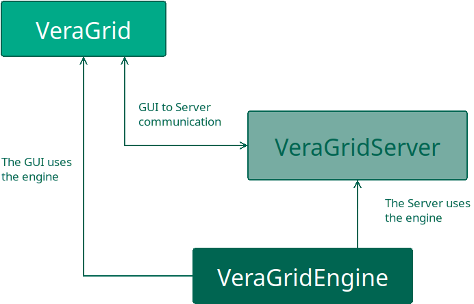

# 💽 Installation

GridCal is a software made in the Python programming language.
Therefore, it needs a Python interpreter installed in your operative system.

The GridCal project is divided in three packages:

- GridCalEngine: A package with the database and calculations logic.
- GridCalServer: A package that serves an API-rest to use GridCalEngine remotely.
- GridCal: A package that contains the Graphical User Interface (GUI) and operates with `GridCalEngine` and
  `GridCalServer` seamlessly.

To install everything, you only need to install the GridCal package and the others will be installed as dependencies.



## Standalone setup

If you don't know what is this Python thing, we offer a windows installation:

[Windows setup](https://www.eroots.tech/software)

This will install GridCal as a normal windows program, and you don't need to worry
about any of the previous instructions. Still, if you need some guidance, the
following video might be of assistance: [Setup tutorial (video)](https://youtu.be/SY66WgLGo54).

## Package installation

We recommend to install the latest version of [Python](www.python.org) and then,
install GridCal with the following terminal command:

```
pip install GridCal
```

You may need to use `pip3` if you are under Linux or MacOS, both of which
come with Python pre-installed already.

## Install into an environment

```bash
python3 -m venv gc5venv
source gc5venv/bin/activate
pip install GridCal
gridcal
```

## Run the graphical user interface

Once you install GridCal in your local Python distribution, you can run the
graphical user interface with the following terminal command:

```
gridcal
```

If this doesn't work, try:

```
python -c "from GridCal.ExecuteGridCal import runGridCal; runGridCal()"
```

You may save this command in a shortcut for easy future access.

## Install only the engine

Some of you may only need GridCal as a library for some other purpose
like batch calculations, AI training or simple scripting. Whatever it may be,
you can get the GridCal engine with the following terminal command:

```
pip install GridCalEngine
```

This will install the `GridCalEngine` package that is a dependency of `GridCal`.

Again, you may need to use `pip3` if you are under Linux or MacOS.