# 📐 Grid Modelling

## Three-phase Modelling
Three-phase AC systems dominate power transmission and distribution due to efficiency, capacity, and compatibility.
While ideal systems are balanced and can be analysed using positive-sequence models, real networks often experience
asymmetries from factors like untransposed lines, uneven loads, single-phase connections, and converter-based resources. 
Also, the classical method of symmetrical components simplifies unbalanced fault analysis under linear conditions but
struggles with strong sequence coupling, non-linearities, and complex network topologies.

Direct phase-domain (abc) modelling overcomes these limitations by representing actual phase quantities, naturally
handling asymmetry, non-linearities, single-phase, two-phase and three-phase systems, as well as symmetrical and
asymmetrical faults. It is well-suited for transient and time-domain simulations, EMTP-type tools, and control design,
making it applicable from large power plants, through transmission and distribution, to finally low-voltage networks.

The conventional elements of the electrical power system are generators, loads, transformers, and lines, as well as the
necessary reactive power compensation equipment. These elements are suitably interconnected to enable the generation,
transportation and consumption of electricity to meet system demand at any given point in time.
The electrical power network may then be divided into generation, transmission, distribution, and customer subsystems,
as represented in figure bellow. Transmission networks operate at high voltages (HV) to minimise
transport losses. Conversely, electricity is generated at medium voltages (MV), and step-up transformers are employed
at the generator substation to raise the voltage to transmission levels. In contrast, step-down transformers are used
to reduce the high transmission voltages to levels suitable for distribution (MV), and eventually for industrial,
commercial, and residential applications at low voltages (LV).


Three-phase synchronous generators are used to produce electrical power, which is delivered to demand points via 
alternating current (AC) three-phase transmission and distribution lines. The geometrical arrangement of these lines
introduces some impedance unbalance between phases. Often, long-distance transmission circuits consist of more than one
three-phase circuit and include series and shunt compensation to enable stable operation. It should also be noted that
the windings of three-phase transformers can be connected in various ways to suit specific requirements, and that
transformer connections must be modeled in detail when system imbalances cannot be neglected in power system studies.
Additionally, distribution load points may be highly unbalanced due to the prevalence of individual single-phase loads.

### Three-phase Overhead Lines

Power lines are fundamental components of power systems, responsible for transmitting
electrical energy from generation sources to loads. They consist of a group of phase conductors
located at a finite distance from the earth’s surface and may use the ground as a
return path. Accordingly, it becomes necessary to account for this effect when calculating
the line parameters. High-voltage transmission lines may contain several conductors
per phase (known as bundled conductors) and ground wires, while distribution lines may
include a neutral wire as a return path. Both transmission and distribution circuits may
introduce considerable geometric unbalances, hence electrical unbalances, depending on
their layout. The main objective is to develop an overhead power line model that
enables precise calculation of voltage drops and losses during the power transmission process.
The basis of power line modelling is to determine the resistance $R$, inductance $L$,
conductance $G$, and capacitance $C$ per unit length.

#### π model

Lines can be represented using mathematical models that describe their electrical behaviour.
It is a current practice to model the inductive and resistive effects of multiconductor
transmission lines as a series impedance matrix, and the capacitive effects as a
shunt admittance matrix. The overall transmission line model then can be represented by
the π equivalent model, as shown in the figure bellow.

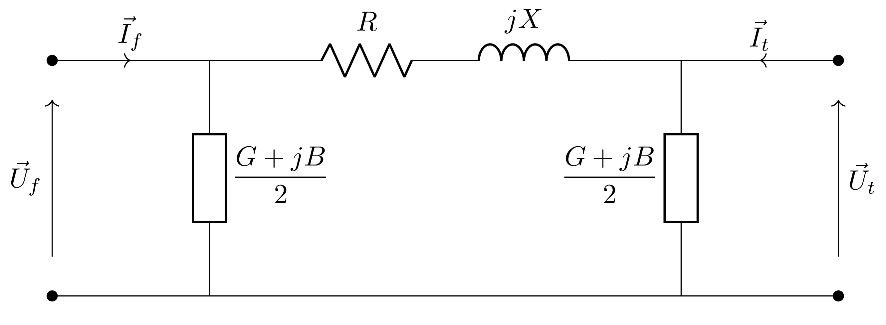

It consists of:

- Series impedance: $Z_{\text{series}} = R + jX$

- Shunt admittance: $Y_{\text{shunt}} = G + jB$

Where $R$ is the series equivalent resistance of the conductors, $X$ is the series self and mutual inductive
reactances resulting from the magnetic fields surrounding the conductors, $G$ is the shunt conductance through
insulating materials and $B$ represents the shunt susceptance derived from the line capacitance due to the induced
electric fields.

The line capacitance is split between the two connection points with the resistance and the reactance in the middle,
whose shape gives the so-called π-model. Although this single-phase simplification is a widely used technique, when
modeling unbalanced systems it is needed to consider a 5-wire approach, that later becomes a 3-wire equivalent.
This 5-wire model is that including the three phases, the neutral and the ground:

- The first three wires are the three-phase $abc$ conductors. These carry the alternating current (AC) electricity and
are used to distribute power efficiently.
- The fourth wire is the neutral conductor $n$. It provides a return path for unbalanced current and is often grounded
at substations to stabilize the system voltage.
- The fifth wire is typically a ground wire $g$, which is connected to earth to protect equipment and people by providing
a low-resistance path for fault currents, ensuring safety and system stability.

Not all physical lines will have neutral, and the ”ground return” is certainly not a wire, but it is represented as one
in order to close the electrical circuit. Each wire has its own impedance, however, other impedances arise from the 
electromagnetic coupling of the wires, such that it is necessary to use a 5x5 matrix to represent the total line
impedance or admittance:

$$
\vec{Z} =
\begin{bmatrix}
\vec{Z}_{aa} & \vec{Z}_{ab} & \vec{Z}_{ac} & \vec{Z}_{an} & \vec{Z}_{ag} \\
\vec{Z}_{ba} & \vec{Z}_{bb} & \vec{Z}_{bc} & \vec{Z}_{bn} & \vec{Z}_{bg} \\
\vec{Z}_{ca} & \vec{Z}_{cb} & \vec{Z}_{cc} & \vec{Z}_{cn} & \vec{Z}_{cg} \\
\vec{Z}_{na} & \vec{Z}_{nb} & \vec{Z}_{nc} & \vec{Z}_{nn} & \vec{Z}_{ng} \\
\vec{Z}_{ga} & \vec{Z}_{gb} & \vec{Z}_{gc} & \vec{Z}_{gn} & \vec{Z}_{gg} \\
\end{bmatrix}
$$

Most transmission power lines do not carry the neutral, since that one is normally earthed at both ends of the line.
Also, the ground return effect can be incorporated into the phase impedance as it will be detailed later. Then, it can
be simply expressed as a 3x3 matrix:

$$
\vec{Z} =
\begin{bmatrix}
\vec{Z}_{aa} & \vec{Z}_{ab} & \vec{Z}_{ac} \\
\vec{Z}_{ba} & \vec{Z}_{bb} & \vec{Z}_{bc} \\
\vec{Z}_{ca} & \vec{Z}_{cb} & \vec{Z}_{cc}
\end{bmatrix}
$$

#### Series Impedance

Carson’s equations are used in power system analysis to calculate the series self and mutual impedances of overhead
transmission lines, taking into account the effects of the ground return path.
They are based on the following assumptions:

- The conductors are perfectly horizontal above ground and are long enough so that three-dimensional end effects can be
neglected. This makes the field problem two-dimensional. The sag is taken into account indirectly by using an average 
height above ground.
- The free space is homogeneous and lossless, with permeability $\mu_0$ and permittivity $\varepsilon_0$.
- The earth is homogeneous, with uniform resistivity $\rho$, permeability $\mu_0$, and permittivity $\varepsilon_0$,
bounded by a flat plane of infinite extent. 
- The spacing between conductors is at least one order of magnitude larger than the conductor radius, so that proximity
effects can be ignored.

The elements of the series impedance matrix can then be calculated from the geometry of the tower configuration and
from characteristics of the conductors:

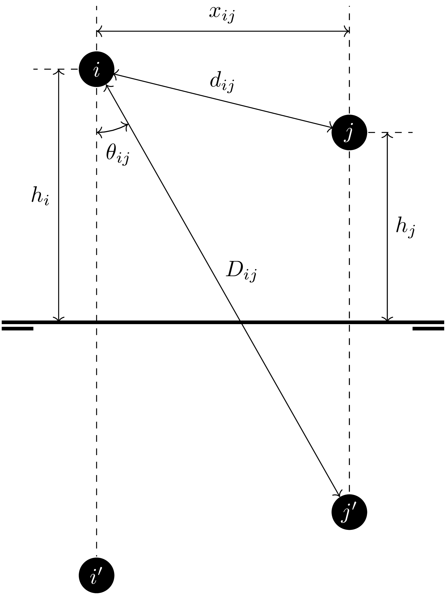

Then, the following equations are implemented to obtain the self and mutual values:

$$
    \vec{Z}_{ii} = (R_i+R^c_{ii}) + j \left(\omega \frac{\mu_0}{2\pi} \ln{\frac{2h_i}{r_i}} + X_i + X^c_{ii} \right)
    \label{eq:Carson_Zii}
$$

$$
    \vec{Z}_{ij} = \vec{Z}_{ji} =
    R^c_{ij} + j \left( \omega \frac{\mu_0}{2\pi} \ln{\frac{D_{ij}}{d_{ij}}} + X^c_{ij} \right)
    \label{eq:Carson_Zij}
$$

Where:
- $R_i$ and $X_i$ are the internal resistance and reactance of conductor $i$ in $\Omega$/km.
- $R^c$ and $X^c$ are the Carson's correction terms for earth return effects in $\Omega$/km.
- $\mu_0 = 4\pi\cdot 10^{-4}$ is the permeability of free space in H/km.
- $\omega = 2\pi f$ is the angular frequency in rad/s.
- $h_i$ is the average height above ground of conductor $i$ in m.
- $r_i$ is the radius of conductor $i$ in m.
- $d_{ij}$ is the distance between conductors $i$ and $j$ in m.
- $D_{ij}$ is the distance between conductor $i$ and the image of conductor $j$ in m.

The correction terms $R^c$ and $X^c$ are derived from an infinite integral representing the impedance contribution due
to the earth return path. For a more indepth explanation of the Carson's equations, as well as of its parameters,
the reader is kindly referred to the bellow example calculation code of the Series impedance, Shunt admittance and
Kron's reduction.

#### Shunt Admittance

Just as the calculation of the series impedance has accounted for the resistance and inductance, the shunt admittance
must incorporate the capacitance between the conductor and the ground, as well as between conductors, as previously
explained. These effects can be mathematically modelled using the following equations, given that the air is lossless,
the earth is uniformly at zero potential and the conductor radius is at least an order of magnitude smaller that the
distance among the conductors, which it is reasonable for overhead lines. Therefore, the shunt admittance between a
conductor and the ground, and the shunt admittance between two conductors, should be calculated using:

$$
    \vec{Y}_{ii} = j\frac{\omega}{2 \pi \varepsilon_0} \ln{\frac{2 h_i}{r_i}}
    \label{eq:self_Y}
$$

$$
    \vec{Y}_{ij} = j\frac{\omega}{2 \pi \varepsilon_0} \ln{\frac{D_{ij}}{d_{ij}}}
    \label{eq:mutual_Y}
$$

Where $\varepsilon_0 = \dfrac{1}{\mu_0 c^2} \approx 8,85 \cdot 10^{-12}$ F/m is the free space permittivity.

#### Kron's reduction

Kron's reduction, or node elimination, is a technique from network theory used to simplify a multi-node electrical
network by eliminating certain nodes, often called internal or passive nodes, while preserving the electrical
behaviour at the remaining nodes.

Assuming a set of nodes divided into two groups between ground conductors $g$ (to eliminate) and phase conductors $p$
(to keep), the impedance matrix is partitioned accordingly:

$$
    \vec{Z} =
    \begin{bmatrix}
        \vec{Z}_{gg} & \vec{Z}_{gp} \\
        \vec{Z}_{pg} & \vec{Z}_{pp} 
    \end{bmatrix}
$$

Where:
- $\vec{Z}_{gg}$ is the impedance between eliminated nodes.
- $\vec{Z}_{gp}$ is the mutual impedance between eliminated and preserved nodes.
- $\vec{Z}_{pg}$ is the mutual impedance between preserved and eliminated nodes.
- $\vec{Z}_{pp}$ is the impedance between preserved nodes.

Then, the network equations are:

$$
    \begin{bmatrix}
        \vec{U}_{g} \\
        \vec{U}_{p}
    \end{bmatrix}
    =
    \begin{bmatrix}
        \vec{Z}_{gg} & \vec{Z}_{gp} \\
        \vec{Z}_{pg} & \vec{Z}_{pp} 
    \end{bmatrix}
    \begin{bmatrix}
        \vec{I}_{g} \\
        \vec{I}_{p}
    \end{bmatrix}
$$

Assuming that the eliminated nodes are held at zero voltage because they are grounded, $\vec{U}_{g} = 0$. From the
first row of the system:

$$
    \vec{I}_e = -\vec{Z}_{gg}^{-1} \cdot \vec{Z}_{gp} \cdot \vec{I}_{p}
$$

Then, substituting $\vec{I}_e$ in the second row:

$$
    \vec{U}_p = (\vec{Z}_{pp} - \vec{Z}_{pg} \cdot \vec{Z}_{gg}^{-1} \cdot \vec{Z}_{gp}) \vec{I}_{p}
$$

Finally, the Kron-reduced impedance matrix is defined as:

$$
    \vec{Z}_\text{Kron} = \vec{Z}_{pp} - \vec{Z}_{pg} \cdot \vec{Z}_{gg}^{-1} \cdot \vec{Z}_{gp}
$$

This new matrix allows to describe the electrical behaviour of the remaining phase nodes $p$, while implicitly
incorporating the effect of the eliminated ground nodes $g$, which were assumed to be held at 0 V.

####  Example calculation code of the Series impedance, Shunt admittance and Kron's reduction

The following code is provided in order to compute the series impedance and the shunt admittances matrices, by using the
where the Kron's reduction is also implemented. The calculation process is detailed during the code, as well as the 
conductor's properties, with the following power line geometry used as an example:

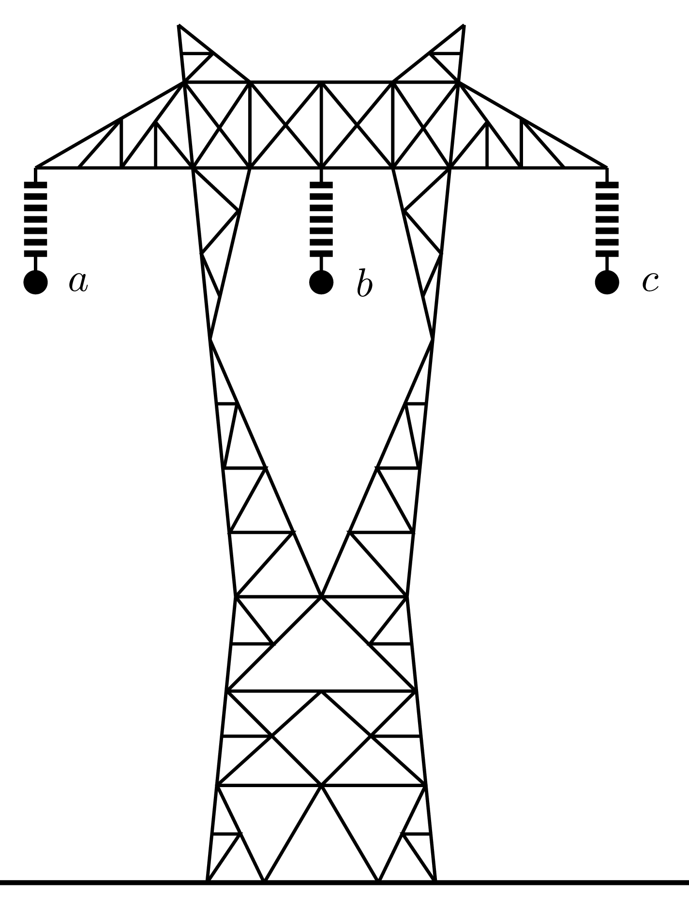

```python
"""
Overhead Line Constants Calculation Library

Reference:
    [1] Dommel, H. W., "Electromagnetic Transients Program Reference Manual (EMTP Theory Book)",
    Chapter 4, "Overhead Transmission Lines".
    
    [2] Arrillaga, J., and Watson, N. R., "Computer Modelling of Electrical Power Systems",
    2nd Edition, Wiley, 2005, Chapter 2.6.
    
    [3] J. Susanto, “line-constants: Overhead line constants calculation library,”
    https://github.com/susantoj/line-constants, 2017.

Functions:
    calc_L_int          Calculates internal inductance of solid or tubular conductor
    calc_GMR            Calculates geometric mean radius (GMR) of solid or tubular conductor
    carsons             Calculates Carson's earth return correction factors Rp and Xp for self or mutual terms
    calc_self_Z         Calculates self impedance term (in Ohm/km)
    calc_mutual_Z       Calculates mutual impedance term (in Ohm/km)
    calc_Dubanton_Z     Calculates Dubanton approximation for self or mutual impedance (in Ohm/km)
    calc_Z_matrix       Calculates primitive impedance matrix
    calc_Y_matrix       Calculates primitive admittance matrix
    calc_kron_Z         Calculates Kron reduced matrix
"""

import numpy as np

def calc_L_int(type, r, q):
    """
    Calculates internal inductance of solid or tubular conductor
    Note that calculations assume uniform current distribution in the conductor,
    thus conductor stranding is not taken into account.

    Usage:
        L_int = calc_L_int(type, r, q)

    where:
       type is 'solid' or 'tube'
        r is the radius of the conductor [m]
        q is the radius of the inner tube [m]

    Returns:
        L_int the internal inductance of the conductor [H/m]
    """
    mu_0 = 4 * np.pi * 1e-7 # Permeability of free space [H/m]

    if type == 'solid':
        L_int = mu_0 / 8 / np.pi # Solid conductor internal inductance [H/m]
    else:
        L_int = mu_0 / 2 / np.pi * (q ** 4 / (r ** 2 - q ** 2) ** 2 * np.log(r / q)
                                    - (3 * q ** 2 - r ** 2) / (4 * (r ** 2 - q ** 2)))
                                    # Tubular conductor internal inductance [H/m]

    return L_int


def calc_GMR(type, r, q):
    """
    Calculates geometric mean radius (GMR) of solid or tubular conductor
    Note that calculations assume uniform current distribution in the conductor,
    thus conductor stranding is not taken into account.

    Usage:
        GMR = calc_GMR(type, r, q)

    where   type is 'solid' or 'tube'
            r is the radius of the conductor [m]
            q is the radius of the inner tube [m]

    Returns:
            GMR the geometric mean radius [m]
    """
    if type == 'solid':
        GMR = r * np.exp(-0.25) # Solid conductor GMR [m]
    else:
        GMR = r * np.exp((3 * q ** 2 - r ** 2) / (4 * (r ** 2 - q ** 2))
                         - q ** 4 / (r ** 2 - q ** 2) ** 2 * np.log(r / q)) # Tubular conductor GMR [m]

    return GMR


def carsons(type, h_i, h_k, x_ik, f, rho, err_tol=1e-6):
    """
    Calculates Carson's earth return correction factors Rp and Xp for both self and mutual terms.
    The number of terms evaluated in the infinite loop is based on convergence to the desired error tolerance.

    Usage:
        Rp, Xp = carsons(type, h_i, h_k, x_ik, f, rho, err_tol)

    where   type is 'self' or 'mutual'
            h_i is the height of conductor i above ground (m)
            h_k is the height of conductor k above ground (m)
            x_ik is the horizontal distance between conductors i and k (m)
            f is the frequency (Hz)
            rho is the earth resistivity (Ohm.m)
            err_tol is the error tolerance for the calculation (default = 1e-6)

    Returns:
            Rp, Xp the Carson earth return correction factors (in Ohm/km)
    """
    # Geometrical calculations - See Figure 4.4. of EMTP Theory Book
    if type == 'self':
        D = 2 * h_i # Distance between conductor i and its image [m]
        cos_phi = 1
        sin_phi = 0
        phi = 0
    else:
        D = np.sqrt((h_i + h_k) ** 2 + x_ik ** 2)  # Distance between conductor i and image of conductor k [m]
        cos_phi = (h_i + h_k) / D
        sin_phi = (x_ik) / D
        phi = np.arccos(cos_phi)

    # Initialise parameters
    i = 1
    err = 1
    sgn = 1

    # Initial values and constants for calculation
    omega = 2 * np.pi * f
    a = 4 * np.pi * np.sqrt(5) * 1e-4 * D * np.sqrt(f / rho) # Equation 4.10 EMTP
    acosphi = a * cos_phi
    asinphi = a * sin_phi
    b = np.array([np.sqrt(2) / 6, 1 / 16]) # Equation 4.12 EMTP
    c = np.array([0, 1.3659315])
    d = np.pi / 4 * b

    # First two terms of carson correction factor
    Rp = np.pi / 8 - b[0] * acosphi
    Xp = 0.5 * (0.6159315 - np.log(a)) + b[0] * acosphi

    # Loop through carson coefficient terms starting with i = 2
    while (err > err_tol):
        term = np.mod(i, 4)
        # Check sign for b term
        if term == 0:
            sgn = -1 * sgn

        # Calculate coefficients
        bi = b[i - 1] * sgn / ((i + 1) * (i + 3))
        ci = c[i - 1] + 1 / (i + 1) + 1 / (i + 3)
        di = np.pi / 4 * bi
        b = np.append(b, bi)
        c = np.append(c, ci)
        d = np.append(d, di)

        # Recursively calculate powers of acosphi and asinphi
        acosphi_prev = acosphi
        asinphi_prev = asinphi
        acosphi = (acosphi_prev * cos_phi - asinphi_prev * sin_phi) * a
        asinphi = (acosphi_prev * sin_phi + asinphi_prev * cos_phi) * a

        Rp_prev = Rp
        Xp_prev = Xp

        # First term
        if term == 0:
            Rp = Rp - bi * acosphi
            Xp = Xp + bi * acosphi

        # Second term
        elif term == 1:
            Rp = Rp + bi * ((ci - np.log(a)) * acosphi + phi * asinphi)
            Xp = Xp - di * acosphi

        # Third term
        elif term == 2:
            Rp = Rp + bi * acosphi
            Xp = Xp + bi * acosphi

        # Fourth term
        else:
            Rp = Rp - di * acosphi
            Xp = Xp - bi * ((ci - np.log(a)) * acosphi + phi * asinphi)

        i = i = 1
        err = np.sqrt((Rp - Rp_prev) ** 2 + (Xp - Xp_prev) ** 2)

    Rp = 4 * omega * 1e-04 * Rp
    Xp = 4 * omega * 1e-04 * Xp
    return Rp, Xp


def calc_self_Z(R_int, cond_type, r, q, h_i, f, rho, err_tol=1e-6):
    """
    Calculates self impedance term [Ohm/km]
    NOTE: No allowance has been made for skin effects

    Usage:
        self_Z = calc_self_Z(R_int, cond_type, r, q, h_i, f, rho, err_tol=1e-6)

    where   R_int is the AC conductor resistance [Ohm/km]
            cond_type is the conductor type ('solid' or 'tube')
            r is the radius of the conductor [m]
            q is the radius of the inner tube [m]
            h_i is the height of conductor i above ground [m]
            f is the frequency [Hz]
            rho is the earth resistivity [Ohm.m]
            err_tol is the error tolerance for the calculation (default = 1e-6)

    Returns:
            self_Z the self impedance term of line impedance matrix [Ohm/km]
    """
    # Constants
    omega = 2 * np.pi * f  # Nominal angular frequency [rad/s]
    mu_0 = 4 * np.pi * 1e-7  # Permeability of free space [H/m]

    # Calculate internal conductor reactance (in Ohm/km)
    X_int = 1000 * omega * calc_L_int(cond_type, r, q)

    # Calculate geometrical reactance (in Ohm/km) - Equation 4.15 EMTP
    X_geo = 1000 * omega * mu_0 / 2 / np.pi * np.log(2 * h_i / r)

    # Calculate Carson's correction factors (in Ohm/km)
    Rp, Xp = carsons('self', h_i, 0, 0, f, rho, err_tol)

    self_Z = complex(R_int + Rp, X_int + X_geo + Xp)

    return self_Z


def calc_mutual_Z(cond_type, r, q, h_i, h_k, x_ik, f, rho, err_tol=1e-6):
    """
    Calculates mutual impedance term [Ohm/km]

    Usage:
        mutual_Z = calc_mutual_Z(cond_type, r, q, h_i, h_k, x_ik, f, rho, err_tol=1e-6)

    where   cond_type is the conductor type ('solid' or 'tube')
            r is the radius of the conductor [m]
            q is the radius of the inner tube [m]
            h_i is the height of conductor i above ground [m]
            h_k is the height of conductor k above ground [m]
            x_ik is the horizontal distance between conductors i and k [m]
            f is the frequency [Hz]
            rho is the earth resistivity [Ohm.m]
            err_tol is the error tolerance for the calculation (default = 1e-6)

    Returns:
            mutual_Z the self impedance term of line impedance matrix (Ohm/km)
    """
    # Constants
    omega = 2 * np.pi * f  # Nominal angular frequency [rad/s]
    mu_0 = 4 * np.pi * 1e-7  # Permeability of free space [H/m]
    # See Figure 4.4. EMTP
    D = np.sqrt((h_i + h_k) ** 2 + x_ik ** 2)  # Distance between conductor i and image of conductor k [m]
    d = np.sqrt((h_i - h_k) ** 2 + x_ik ** 2)  # Distance between conductors i and k [m]

    # Calculate geometrical mutual reactance (in Ohm/km)
    X_geo = 1000 * omega * mu_0 / 2 / np.pi * np.log(D / d)

    # Calculate Carson's correction factors (in Ohm/km)
    Rp, Xp = carsons('mutual', h_i, h_k, x_ik, f, rho, err_tol)

    mutual_Z = complex(Rp, X_geo + Xp)

    return mutual_Z


def calc_Dubanton_Z(type, R_int, cond_type, r, q, h_i, h_k, x_ik, f, rho):
    """
    Calculates Dubanton approximation for self or mutual impedance (in Ohm/km)

    Usage:
        Dubanton_Z = calc_Dubanton_Z(type, R_int, cond_type, r, q, h_i, h_k, x_ik, f, rho)

    where   type is 'self' or 'mutual'
            cond_type is the conductor type ('solid' or 'tube')
            r is the radius of the conductor [m]
            q is the radius of the inner tube [m]
            h_i is the height of conductor i above ground [m]
            h_k is the height of conductor k above ground [m]
            x_ik is the horizontal distance between conductors i and k [m]
            f is the frequency [Hz]
            rho is the earth resistivity [Ohm.m]

    Returns:
            Dubanton_Z the self or mutual impedance term of line impedance matrix (Ohm/km)
    """
    # Constants
    omega = 2 * np.pi * f  # Nominal angular frequency [rad/s]
    mu_0 = 4 * np.pi * 10**(-7)  # Permeability of free space [H/km]
    p = np.sqrt( rho / (1j * omega * mu_0) )  # Complex depth below earth

    if type == 'self':
        # Self impedance
        # Calculate internal conductor reactance (in Ohm/km)
        X_int = 1000 * omega * calc_L_int(cond_type, r, q)

        # Calculate geometrical reactance (in Ohm/km)
        X_geo = 1000 * omega * mu_0 / 2 / np.pi * np.log((h_i + p) / r)

        Dubanton_Z = complex(R_int, X_int + X_geo)

    else:
        # Mutual impedance
        d = np.sqrt((h_i - h_k) ** 2 + x_ik ** 2)  # Distance between conductors i and k [m]
        X_geo = 1000 * omega * mu_0 / 2 / np.pi * np.log(np.sqrt((h_i + h_k + 2 * p) ** 2 + x_ik ** 2) / d)

        Dubanton_Z = complex(0, X_geo)

    return Dubanton_Z


def calc_Z_matrix(line_dict):
    """
    Calculates primitive impedance matrix
    NOTE: all phase conductor vectors must be the same size. No checks are made to enforce this.
    Same goes for earth conductor vectors.

    Usage:
        Z = calc_Z_matrix(line_dict)

    where   line_dict is a dictionary of overhead line parameters:
                'mode' is the calculate mode ('carson' or 'dubanton')
                'f' is the nominal frequency (Hz)
                'rho' is the earth resistivity (Ohm.m)
                'err_tol' is the error tolerance for the calculation (default = 1e-6)
                'phase_h' is a vector of phase conductor heights above ground (m)
                'phase_x' is a vector of phase conductor horizontal spacings with arbitrary reference point (m)
                'phase_cond' is a vector of phase conductor types ('solid' or 'tube')
                'phase_R' is a vector of phase conductor AC resistances (Ohm/km)
                'phase_r' is a vector of phase conductor radii [m]
                'phase_q' is a vector of phase conductor inner tube radii [m] - use 0 for solid conductors
                'earth_h' is a vector of earth conductor heights above ground (m)
                'earth_x' is a vector of earth conductor horizontal spacings with arbitrary reference point (m)
                'earth_cond' is a vector of earth conductor types ('solid' or 'tube')
                'earth_R' is a vector of earth conductor AC resistances (Ohm/km)
                'earth_r' is a vector of earth conductor radii [m]
                'earth_q' is a vector of earth conductor inner tube radii [m] - use 0 for solid conductors

    Returns:
            Z is the primitive impedance matrix (with earth conductors shown first)
            n_p is the number of phase conductors
            n_e is the number of earth conductors
    """
    # Unpack line dictionary
    mode = line_dict['mode']
    f = line_dict['f']
    rho = line_dict['rho']
    cond_h = line_dict['earth_h'] + line_dict['phase_h']
    cond_x = line_dict['earth_x'] + line_dict['phase_x']
    cond_type = line_dict['earth_cond'] + line_dict['phase_cond']
    cond_R = line_dict['earth_R'] + line_dict['phase_R']
    cond_r = line_dict['earth_r'] + line_dict['phase_r']
    cond_q = line_dict['earth_q'] + line_dict['phase_q']

    # Set error tolerance for carsons equations
    if 'err_tol' in line_dict:
        err_tol = line_dict['err_tol']
    else:
        err_tol = 1e-6

    # Number of phase and earth conductors
    n_p = len(line_dict['phase_h'])
    n_e = len(line_dict['earth_h'])
    n_c = n_p + n_e

    # Set up primitive Z matrix
    Z = np.asmatrix(np.zeros((n_c, n_c)), dtype='complex') # [Ohm/km]
    if mode == 'carson':
        for i in range(n_c):
            for j in range(n_c):
                if i == j:
                    Z[i, j] = calc_self_Z(cond_R[i], cond_type[i], cond_r[i], cond_q[i], cond_h[i],
                                          f, rho, err_tol)
                else:
                    Z[i, j] = calc_mutual_Z(cond_type[i], cond_r[i], cond_q[i], cond_h[i], cond_h[j],
                                            cond_x[i] - cond_x[j], f, rho, err_tol)
    else:
        for i in range(n_c):
            for j in range(n_c):
                if i == j:
                    Z[i, j] = calc_Dubanton_Z('self', cond_R[i], cond_type[i], cond_r[i], cond_q[i],
                                              cond_h[i], cond_h[j], cond_x[i] - cond_x[j], f, rho)
                else:
                    Z[i, j] = calc_Dubanton_Z('mutual', cond_R[i], cond_type[i], cond_r[i], cond_q[i],
                                              cond_h[i], cond_h[j], cond_x[i] - cond_x[j], f, rho)

    return Z, n_p, n_e


def calc_Y_matrix(line_dict):
    """
    Calculates primitive admittance matrix
    Assumes that conductance of air is zero.
    NOTE: all phase conductor vectors must be the same size. No checks are made to enforce this. Same goes for earth
    conductor vectors.

    Usage:
        Y = calc_Y_matrix(line_dict)

    where   line_dict is a dictionary of overhead line parameters:
                'f' is the nominal frequency [Hz]
                'rho' is the earth resistivity [Ohm.m]
                'err_tol' is the error tolerance for the calculation (default = 1e-6)
                'phase_h' is a vector of phase conductor heights above ground [m]
                'phase_x' is a vector of phase conductor horizontal spacings with arbitrary reference point [m]
                'phase_r' is a vector of phase conductor radii [m]
                'earth_h' is a vector of earth conductor heights above ground [m]
                'earth_x' is a vector of earth conductor horizontal spacings with arbitrary reference point [m]
                'earth_r' is a vector of earth conductor radii [m]

    Returns:
            Y is the primitive admittance matrix (with earth conductors shown first)
            n_p is the number of phase conductors
            n_e is the number of earth conductors
    """
    # Unpack line dictionary
    f = line_dict['f']
    rho = line_dict['rho']
    cond_h = line_dict['earth_h'] + line_dict['phase_h']
    cond_x = line_dict['earth_x'] + line_dict['phase_x']
    cond_r = line_dict['earth_r'] + line_dict['phase_r']

    # Number of phase and earth conductors
    n_p = len(line_dict['phase_h'])
    n_e = len(line_dict['earth_h'])
    n_c = n_p + n_e

    # Constants
    omega = 2 * np.pi * f  # Nominal angular frequency [rad/s]
    e_0 = 8.85418782 * 1e-12  # Permittivity of free space [F/m]

    # Set up primitive Y matrix
    Y = np.asmatrix(np.zeros((n_c, n_c)), dtype='complex')
    # Build up potential coefficients
    for i in range(n_c):
        for j in range(n_c):
            if i == j:
                # Self potential coefficient
                Y[i, j] = (1 / 2 / np.pi / e_0) * np.log(2 * cond_h[i] / cond_r[i])
            else:
                # Mutual potential coefficient
                D = np.sqrt((cond_h[i] + cond_h[j]) ** 2 + (
                            cond_x[i] - cond_x[j]) ** 2)  # Distance between conductor i and image of conductor k [m]
                d = np.sqrt(
                    (cond_h[i] - cond_h[j]) ** 2 + (cond_x[i] - cond_x[j]) ** 2) # Distance between conductors i & k [m]
                Y[i, j] = (1 / 2 / np.pi / e_0) * np.log(D / d)

    Y = 1000j * omega * Y.I # [S/km]

    return Y, n_p, n_e


def calc_kron_Z(Z, n_e):
    """
    Calculates Kron reduced matrix
    Reduction can be used for impedance or admittance matrix reductions

    Usage:
        kron_Z = calc_kron_Z(Z, n_e)

    where   Z is the primitive matrix (with earth conductors shown first)
            n_e is the number of earth conductors

    Returns:
            kron_Z is the kron reduced matrix
    """
    # Slice up primtive matrix into constituent parts
    Zee = Z[0:n_e, 0:n_e]
    Zep = Z[0:n_e, n_e:]
    Zpe = Z[n_e:, 0:n_e]
    Zpp = Z[n_e:, n_e:]

    # Calculate Kron reduced matrix # [ /km]
    kron_Z = Zpp - Zpe * Zee.I * Zep

    return kron_Z

# Definition of the overhead line parameters
line_dict = {
    'mode': 'carson', # carson or dubanton
    'f': 50,  # Nominal frequency [Hz]
    'rho': 100,  # Earth resistivity [Ohm.m]
    'phase_h': [27.5, 27.5, 27.5],  # Phase conductor heights [m]
    'phase_x': [-12.65, 0, 12.65],  # Phase conductor x-axis coordinates [m]
    'phase_cond': ['tube', 'tube', 'tube'],  # Phase conductor types ('tube' or 'solid')
    'phase_R': [0.1363, 0.1363, 0.1363],  # Phase conductor AC resistances [Ohm/km]
    'phase_r': [0.0105, 0.0105, 0.0105],  # Phase conductor radi [m]
    'phase_q': [0.0045, 0.0045, 0.0045],  # Phase conductor inner tube radii [m]
    'earth_h': [],  # Earth conductor heights [m]
    'earth_x': [],  # Earth conductor x-axis coordinates [m]
    'earth_cond': [],  # Earth conductor types ('tube' or 'solid')
    'earth_R': [],  # Earth conductor AC resistances [Ohm/km]
    'earth_r': [],  # Earth conductor radi [m]
    'earth_q': []  # Earth conductor inner tube radii [m]
}

# Impedance and admittance matrices
Zseries, n_p, n_e = calc_Z_matrix(line_dict)
Yshunt, n_p, n_e = calc_Z_matrix(line_dict)

np.set_printoptions(precision=4, suppress=True)
print('Series Impedance Zs =\n', Zseries)
print('Shunt Admittance Ysh =\n', Yshunt)
```

### Three-phase Transformers

Power transformers are essential components of the power system. In general, they provide an interface between sections
of the network that operate at different rated voltages, for example, between a generating plant and the transmission
network. In this section, two-winding, three-phase transformers will be modelled. Therefore, it is convenient to treat 
the electric circuit, formed by the copper windings, separately from the magnetic circuit, formed by the iron core.
The winding impedance $\vec{Z}_s$ is obtained from a short-circuit test, whereas the iron-core shunt admittance
$\vec{Y}_{sh}$ is determined from open-circuit tests.

The starting point for developing comprehensive steady-state transformer models is the schematic representation of the
basic two-winding transformer shown in the following figure:

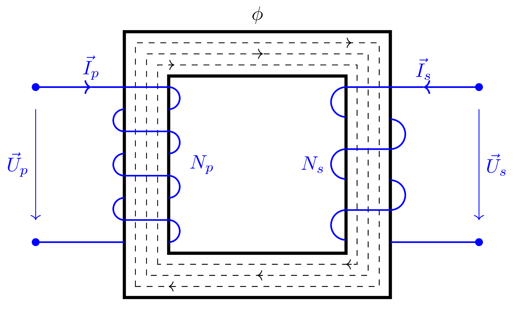

The two transformer windings, termed the primary and secondary, contain $N_p$ and $N_s$ turns, respectively.
The voltages and currents in both windings are related by a matrix of short-circuit and open-circuit admittance
parameters, represented in the following electrical equivalent circuit:


Representing the transformer parameters in the per-unit system, it converts the original voltage ratio $N_p\!:\!N_s$
into a unity ratio of $1\!:\!1$. Power transformers are, however, often fitted with a tap-changing mechanism that
permits a degree of voltage regulation at one of their terminals. This regulation is achieved by injecting a small
variable voltage of magnitude and phase into the ratio $\vec{m} : 1$. The implemented equivalent circuit also includes
the tap transformers $m_f$ and $m_t$ in the branch’s $\pi$ model, as in the previous section on power lines.
These virtual tap transformers arise solely from the per-unit normalisation of the voltages, as they reconcile the
nominal voltage of a device at a connection point with the nominal voltage of the point itself.

Then, based on the single-phase transformer model shown in the figure above, the corresponding primitive admittance
matrix is derived and presented bellow, which relates the primary and secondary voltages and currents:

$$
    \begin{bmatrix}
        \vec{I_p} \\
        \vec{I_s}
    \end{bmatrix}
    =
    \begin{bmatrix}
        \dfrac{ \vec{Y}_s+\dfrac{\vec{Y}_{sh}}{2}} {m^2 \, m_f^2} & \dfrac{-\vec{Y}_s}{\vec{m}^* \, m_f \, m_t} \\
        \dfrac{-\vec{Y}_s}{\vec{m} \, m_t \, m_f} & \dfrac{\vec{Y}_s+\dfrac{\vec{Y}_{sh}}{2}}{m_t^2}
    \end{bmatrix}
    \begin{bmatrix}
        \vec{U_p} \\
        \vec{U_s}
    \end{bmatrix}
$$

Using nodal analysis, general models for multi-winding and multi-phase transformers can be derived. The essence of the
method is to transform the single-phase voltages and currents at each winding, denoted “$1\,2\,3\,4\,5\,6$”, into the
“$A\,B\,C\,a\,b\,c$” phase reference frame, where consecutive numbers refer to the primary and secondary windings of
each phase (e.g., $1$ and $2$ correspond to phase $Aa$). The primitive parameters of three identical single-phase
transformers are arranged as follows:

$$
    \begin{bmatrix}
        \vec{I}_1 \\
        \vec{I}_2 \\
        \vec{I}_3 \\
        \vec{I}_4 \\
        \vec{I}_5 \\
        \vec{I}_6
    \end{bmatrix}
    =
    \begin{bmatrix}
        \dfrac{ \vec{Y}_s+\dfrac{\vec{Y}_{sh}}{2}} {m^2m_f^2} & \dfrac{-\vec{Y}_s}{\vec{m}^*m_fm_t} & 0 & 0 & 0 & 0 \\
        \dfrac{-\vec{Y}_s}{\vec{m}m_tm_f} & \dfrac{\vec{Y}_s+\dfrac{\vec{Y}_{sh}}{2}}{m_t^2} & 0 & 0 & 0 & 0 \\
        0 & 0 & \dfrac{ \vec{Y}_s+\dfrac{\vec{Y}_{sh}}{2}} {m^2m_f^2} & \dfrac{-\vec{Y}_s}{\vec{m}^*m_fm_t} & 0 & 0 \\
        0 & 0 & \dfrac{-\vec{Y}_s}{\vec{m}m_tm_f} & \dfrac{\vec{Y}_s+\dfrac{\vec{Y}_{sh}}{2}}{m_t^2} & 0 & 0 \\
        0 & 0 & 0 & 0 & \dfrac{ \vec{Y}_s+\dfrac{\vec{Y}_{sh}}{2}} {m^2m_f^2} & \dfrac{-\vec{Y}_s}{\vec{m}^*m_fm_t} \\
        0 & 0 & 0 & 0 & \dfrac{-\vec{Y}_s}{\vec{m}m_tm_f} & \dfrac{\vec{Y}_s+\dfrac{\vec{Y}_{sh}}{2}}{m_t^2}
    \end{bmatrix}
    \begin{bmatrix}
        \vec{U}_1 \\
        \vec{U}_2 \\
        \vec{U}_3 \\
        \vec{U}_4 \\
        \vec{U}_5 \\
        \vec{U}_6
    \end{bmatrix}
$$

Expressed in compact form, the resulting expression is:

$$
    \vec{I}_\text{coils} = \vec{Y}_\text{primitive} \cdot \vec{U}_\text{coils}
$$

Which can be operated in order to relate phase magnitudes:

$$
    \vec{I}_\text{phases} = C_I^{-1} \cdot \vec{Y}_\text{primitive} \cdot C_U \cdot \vec{U}_\text{phases}
    \label{eq:Y_transformer1}
$$

It follows that the next step is to find the connectivity matrices $C_U$ and $C_I$, which relate the voltages and
currents at each winding to the phase magnitudes, to obtain the transformer admittance matrix $\vec{Y}$.
This matrix links the primary and secondary phase voltages and currents:

$$
    \vec{Y} = C_I^{-1} \cdot \vec{Y}_\text{primitive} \cdot C_U
\label{eq:Y_transformer}
$$

The three-phase windings of power transformers may be connected in several ways. In high voltage transmission the most
popular connections are star and delta, although the zig-zag connection is also used in distribution systems, depicted
in figure bellow. Consequently, connectivity matrices must be computed for each configuration.

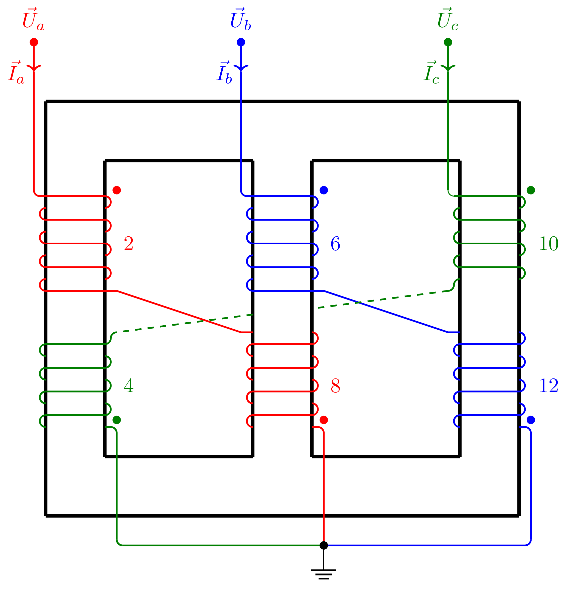

#### Delta-star (Dy) connection

The following shows the three-phase delta-star (Dy) connection:

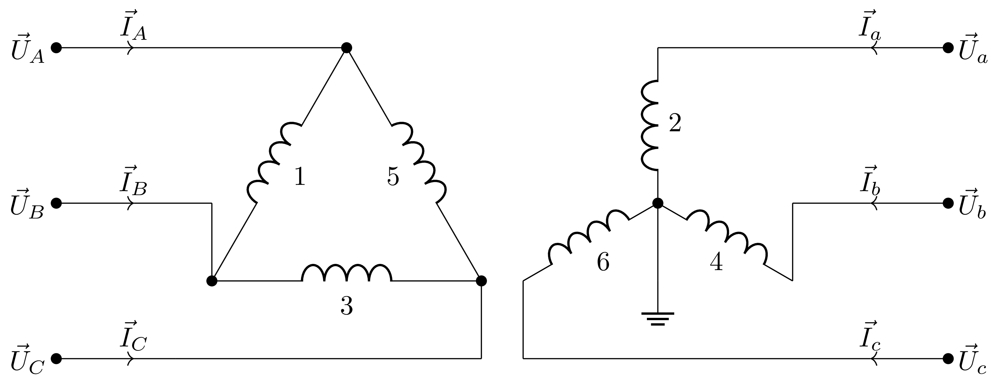

The transformation matrix $C_U$, which relates the voltages of each winding to the corresponding phase voltages,
is given explicitly in the following expression:

$$
    \begin{bmatrix}
        \vec{U}_1 \\
        \vec{U}_2 \\
        \vec{U}_3 \\
        \vec{U}_4 \\
        \vec{U}_5 \\
        \vec{U}_6
    \end{bmatrix}
    =
    \begin{bmatrix}
        \dfrac{1}{\sqrt{3}} & -\dfrac{1}{\sqrt{3}} & 0 & 0 & 0 & 0 \\
        0 & 0 & 0 & 1 & 0 & 0 \\
        0 & \dfrac{1}{\sqrt{3}} & -\dfrac{1}{\sqrt{3}} & 0 & 0 & 0 \\
        0 & 0 & 0 & 0 & 1 & 0 \\
        -\dfrac{1}{\sqrt{3}} & 0 & \dfrac{1}{\sqrt{3}} & 0 & 0 & 0 \\
        0 & 0 & 0 & 0 & 0 & 1 \\
    \end{bmatrix}
    \begin{bmatrix}
        \vec{U}_A \\
        \vec{U}_B \\
        \vec{U}_C \\
        \vec{U}_a \\
        \vec{U}_b \\
        \vec{U}_c
    \end{bmatrix}
$$

And in compact form:

$$
    \vec{U}_\text{coils} = C_U \cdot \vec{U}_\text{phases}
$$

Similarly, the inverse current connectivity matrix $C_I^{-1}$ is obtained:

$$
    \begin{bmatrix}
        \vec{I}_A \\
        \vec{I}_B \\
        \vec{I}_C \\
        \vec{I}_a \\
        \vec{I}_b \\
        \vec{I}_c
    \end{bmatrix}
    =
    \begin{bmatrix}
        \dfrac{1}{\sqrt{3}} & 0 & 0 & 0 & -\dfrac{1}{\sqrt{3}} & 0 \\
        -\dfrac{1}{\sqrt{3}} & 0 & \dfrac{1}{\sqrt{3}} & 0 & 0 & 0 \\
        0 & 0 & -\dfrac{1}{\sqrt{3}} & 0 & \dfrac{1}{\sqrt{3}} & 0 \\
        0 & 1 & 0 & 0 & 0 & 0 \\
        0 & 0 & 0 & 1 & 0 & 0 \\
        0 & 0 & 0 & 0 & 0 & 1 \\
    \end{bmatrix}
    \begin{bmatrix}
        \vec{I}_1 \\
        \vec{I}_2 \\
        \vec{I}_3 \\
        \vec{I}_4 \\
        \vec{I}_5 \\
        \vec{I}_6
    \end{bmatrix}
$$

And also in compact form:

$$
    \vec{I}_\text{phases} = C_I^{-1} \cdot \vec{I}_\text{coils}
$$

The full transformer admittance matrix for the Dy connection is obtained by substituting the connectivity matrices $C_U$
and $C_I$:

\begin{equation}
    \vec{Y} = C_I^{-1} \cdot \vec{Y}_\text{primitive} \cdot C_U
    \label{eq:Dy_Compact}
\end{equation}

Finally, the transformer admittance matrix for the Dy connection is computed:

$$
\vec{Y}
    =
    \begin{bmatrix}
        \dfrac{2\vec{Y}_s+\vec{Y}_{sh}}{3m^2m_f^2} & \dfrac{-\vec{Y}_s-\dfrac{\vec{Y}_{sh}}{2}}{3m^2m_f^2} & \dfrac{-\vec{Y}_s-\dfrac{\vec{Y}_{sh}}{2}}{3m^2m_f^2} & \dfrac{-\vec{Y_s}}{\sqrt{3}\vec{m}^*m_fm_t} & 0 & \dfrac{\vec{Y_s}}{\sqrt{3}\vec{m}^*m_fm_t} \\
        \dfrac{-\vec{Y}_s-\dfrac{\vec{Y}_{sh}}{2}}{3m^2m_f^2} & \dfrac{2\vec{Y}_s+\vec{Y}_{sh}}{3m^2m_f^2} & \dfrac{-\vec{Y}_s-\dfrac{\vec{Y}_{sh}}{2}}{3m^2m_f^2} & \dfrac{\vec{Y_s}}{\sqrt{3}\vec{m}^*m_fm_t} & \dfrac{-\vec{Y_s}}{\sqrt{3}\vec{m}^*m_fm_t} & 0 \\
        \dfrac{-\vec{Y}_s-\dfrac{\vec{Y}_{sh}}{2}}{3m^2m_f^2} & \dfrac{-\vec{Y}_s-\dfrac{\vec{Y}_{sh}}{2}}{3m^2m_f^2} & \dfrac{2\vec{Y}_s+\vec{Y}_{sh}}{3m^2m_f^2} & 0 & \dfrac{\vec{Y_s}}{\sqrt{3}\vec{m}^*m_fm_t} & \dfrac{-\vec{Y_s}}{\sqrt{3}\vec{m}^*m_fm_t} \\
        \dfrac{-\vec{Y_s}}{\sqrt{3}\vec{m}m_tm_f} & \dfrac{\vec{Y_s}}{\sqrt{3}\vec{m}m_tm_f} & 0 & \dfrac{\vec{Y}_s+\dfrac{\vec{Y}_{sh}}{2}}{m_t^2} & 0 & 0 \\
        0 & \dfrac{-\vec{Y_s}}{\sqrt{3}\vec{m}m_tm_f} & \dfrac{\vec{Y_s}}{\sqrt{3}\vec{m}m_tm_f} & 0 & \dfrac{\vec{Y}_s+\dfrac{\vec{Y}_{sh}}{2}}{m_t^2} & 0 \\
        \dfrac{\vec{Y_s}}{\sqrt{3}\vec{m}m_tm_f} & 0 & \dfrac{-\vec{Y_s}}{\sqrt{3}\vec{m}m_tm_f} & 0 & 0 & \dfrac{\vec{Y}_s+\dfrac{\vec{Y}_{sh}}{2}}{m_t^2} \\
    \end{bmatrix}
$$

The admittance matrices for the other eight possible configurations have been obtained using exactly the same procedure.
The final matrices are shown below.

#### Star-delta (Yd) connection

$$
\vec{Y}
=
\begin{bmatrix}
    \dfrac{\vec{Y}_s+\dfrac{\vec{Y}_{sh}}{2}}{m^2m_f^2} & 0 & 0 & \dfrac{-\vec{Y_s}}{\sqrt{3}\vec{m}^*m_fm_t} & \dfrac{\vec{Y_s}}{\sqrt{3}\vec{m}^*m_fm_t} & 0 \\
    0 & \dfrac{\vec{Y}_s+\dfrac{\vec{Y}_{sh}}{2}}{m^2m_f^2} & 0 & 0 & \dfrac{-\vec{Y_s}}{\sqrt{3}\vec{m}^*m_fm_t} & \dfrac{\vec{Y_s}}{\sqrt{3}\vec{m}^*m_fm_t} \\
    0 & 0 & \dfrac{\vec{Y}_s+\dfrac{\vec{Y}_{sh}}{2}}{m^2m_f^2} & \dfrac{\vec{Y_s}}{\sqrt{3}\vec{m}^*m_fm_t} & 0 & \dfrac{-\vec{Y_s}}{\sqrt{3}\vec{m}^*m_fm_t} \\
    \dfrac{-\vec{Y_s}}{\sqrt{3}\vec{m}m_tm_f} & 0 & \dfrac{\vec{Y_s}}{\sqrt{3}\vec{m}m_tm_f} & \dfrac{2\vec{Y}_s+\vec{Y}_{sh}}{3m_t^2} & \dfrac{-\vec{Y}_s-\dfrac{\vec{Y}_{sh}}{2}}{3m_t^2} & \dfrac{-\vec{Y}_s-\dfrac{\vec{Y}_{sh}}{2}}{3m_t^2} \\
    \dfrac{\vec{Y_s}}{\sqrt{3}\vec{m}m_tm_f} & \dfrac{-\vec{Y_s}}{\sqrt{3}\vec{m}m_tm_f} & 0 & \dfrac{-\vec{Y}_s-\dfrac{\vec{Y}_{sh}}{2}}{3m_t^2} & \dfrac{2\vec{Y}_s+\vec{Y}_{sh}}{3m_t^2} & \dfrac{-\vec{Y}_s-\dfrac{\vec{Y}_{sh}}{2}}{3m_t^2} \\
    0 & \dfrac{\vec{Y_s}}{\sqrt{3}\vec{m}m_tm_f} & \dfrac{-\vec{Y_s}}{\sqrt{3}\vec{m}m_tm_f} & \dfrac{-\vec{Y}_s-\dfrac{\vec{Y}_{sh}}{2}}{3m_t^2} &  \dfrac{-\vec{Y}_s-\dfrac{\vec{Y}_{sh}}{2}}{3m_t^2} & \dfrac{2\vec{Y}_s+\vec{Y}_{sh}}{3m_t^2} \\
\end{bmatrix}
$$

#### Star-star (Yy) connection

$$
\begin{bmatrix}
    \vec{I}_A \\
    \vec{I}_B \\
    \vec{I}_C \\
    \vec{I}_a \\
    \vec{I}_b \\
    \vec{I}_c
\end{bmatrix}
=
\begin{bmatrix}
    \dfrac{ \vec{Y_s}+\dfrac{\vec{Y_{sh}}}{2}} {m^2m_f^2} & 0 & 0 & \dfrac{\vec{-Y_s}}{\vec{m}^*m_fm_t} & 0 & 0 \\
    0 & \dfrac{ \vec{Y_s}+\dfrac{\vec{Y_{sh}}}{2}} {m^2m_f^2} & 0 & 0 & \dfrac{\vec{-Y_s}}{\vec{m}^*m_fm_t} & 0 \\
    0 & 0 & \dfrac{ \vec{Y_s}+\dfrac{\vec{Y_{sh}}}{2}} {m^2m_f^2} & 0 & 0 & \dfrac{\vec{-Y_s}}{\vec{m}^*m_fm_t} \\
    \dfrac{\vec{-Y_s}}{\vec{m}m_tm_f} & 0 & 0 & \dfrac{\vec{Y_s}+\dfrac{\vec{Y_{sh}}}{2}}{m_t^2} & 0 & 0 \\
    0 & \dfrac{\vec{-Y_s}}{\vec{m}m_tm_f} & 0 & 0 & \dfrac{\vec{Y_s}+\dfrac{\vec{Y_{sh}}}{2}}{m_t^2} & 0 \\
    0 & 0 & \dfrac{\vec{-Y_s}}{\vec{m}m_tm_f} & 0 & 0 & \dfrac{\vec{Y_s}+\dfrac{\vec{Y_{sh}}}{2}}{m_t^2}
\end{bmatrix}
\begin{bmatrix}
    \vec{U}_A \\
    \vec{U}_B \\
    \vec{U}_C \\
    \vec{U}_a \\
    \vec{U}_b \\
    \vec{U}_c
\end{bmatrix} \\
$$

#### Delta-delta (Dd) connection

$$
\vec{Y}
= \frac{1}{3}
\begin{bmatrix}
    \dfrac{2\vec{Y}_s+\vec{Y}_{sh}}{m^2m_f^2} & \dfrac{-\vec{Y}_s-\dfrac{\vec{Y}_{sh}}{2}}{m^2m_f^2} & \dfrac{-\vec{Y}_s-\dfrac{\vec{Y}_{sh}}{2}}{m^2m_f^2} & \dfrac{-2\vec{Y_s}}{\vec{m}^*m_fm_t} & \dfrac{\vec{Y_s}}{\vec{m}^*m_fm_t} & \dfrac{\vec{Y_s}}{\vec{m}^*m_fm_t} \\
    \dfrac{-\vec{Y}_s-\dfrac{\vec{Y}_{sh}}{2}}{m^2m_f^2} & \dfrac{2\vec{Y}_s+\vec{Y}_{sh}}{m^2m_f^2} & \dfrac{-\vec{Y}_s-\dfrac{\vec{Y}_{sh}}{2}}{m^2m_f^2} & \dfrac{\vec{Y_s}}{\vec{m}^*m_fm_t} & \dfrac{-2\vec{Y_s}}{\vec{m}^*m_fm_t} & \dfrac{\vec{Y_s}}{\vec{m}^*m_fm_t} \\
    \dfrac{-\vec{Y}_s-\dfrac{\vec{Y}_{sh}}{2}}{m^2m_f^2} & \dfrac{-\vec{Y}_s-\dfrac{\vec{Y}_{sh}}{2}}{m^2m_f^2} & \dfrac{2\vec{Y}_s+\vec{Y}_{sh}}{m^2m_f^2} & \dfrac{\vec{Y_s}}{\vec{m}^*m_fm_t} & \dfrac{\vec{Y_s}}{\vec{m}^*m_fm_t} & \dfrac{-2\vec{Y_s}}{\vec{m}^*m_fm_t} \\
    \dfrac{-2\vec{Y_s}}{\vec{m}m_tm_f} & \dfrac{\vec{Y_s}}{\vec{m}m_tm_f} & \dfrac{\vec{Y_s}}{\vec{m}m_tm_f} & \dfrac{2\vec{Y}_s+\vec{Y}_{sh}}{m_t^2} & \dfrac{-\vec{Y}_s-\dfrac{\vec{Y}_{sh}}{2}}{m_t^2} & \dfrac{-\vec{Y}_s-\dfrac{\vec{Y}_{sh}}{2}}{m_t^2} \\
    \dfrac{\vec{Y_s}}{\vec{m}m_tm_f} & \dfrac{-2\vec{Y_s}}{\vec{m}m_tm_f} & \dfrac{\vec{Y_s}}{\vec{m}m_tm_f} & \dfrac{-\vec{Y}_s-\dfrac{\vec{Y}_{sh}}{2}}{m_t^2} & \dfrac{2\vec{Y}_s+\vec{Y}_{sh}}{m_t^2} & \dfrac{-\vec{Y}_s-\dfrac{\vec{Y}_{sh}}{2}}{m_t^2} \\
    \dfrac{\vec{Y_s}}{\vec{m}m_tm_f} & \dfrac{\vec{Y_s}}{\vec{m}m_tm_f} & \dfrac{-2\vec{Y_s}}{\vec{m}m_tm_f} & \dfrac{-\vec{Y}_s-\dfrac{\vec{Y}_{sh}}{2}}{m_t^2} & \dfrac{-\vec{Y}_s-\dfrac{\vec{Y}_{sh}}{2}}{m_t^2} & \dfrac{2\vec{Y}_s+\vec{Y}_{sh}}{m_t^2} \\
\end{bmatrix}
$$

#### Star-zigzag (Yz) connection

$$
\vec{Y}
=
\begin{bmatrix}
    \dfrac{ \vec{Y_s}+\dfrac{\vec{Y_{sh}}}{2}} {m^2m_f^2} & 0 & 0 & \dfrac{\vec{-Y_s}}{2\vec{m}^*m_fm_t} & 0 & \dfrac{\vec{Y_s}}{2\vec{m}^*m_fm_t} \\
    0 & \dfrac{ \vec{Y_s}+\dfrac{\vec{Y_{sh}}}{2}} {m^2m_f^2} & 0 & \dfrac{\vec{Y_s}}{2\vec{m}^*m_fm_t} & \dfrac{\vec{-Y_s}}{2\vec{m}^*m_fm_t} & 0 \\
    0 & 0 & \dfrac{ \vec{Y_s}+\dfrac{\vec{Y_{sh}}}{2}} {m^2m_f^2} & 0 & \dfrac{\vec{Y_s}}{2\vec{m}^*m_fm_t} & \dfrac{\vec{-Y_s}}{2\vec{m}^*m_fm_t} \\
    \dfrac{\vec{-Y_s}}{2\vec{m}m_tm_f} & \dfrac{\vec{Y_s}}{2\vec{m}m_tm_f} & 0 & \dfrac{\vec{Y_s}+\dfrac{\vec{Y_{sh}}}{2}}{m_t^2} & 0 & 0 \\
    0 & \dfrac{\vec{-Y_s}}{2\vec{m}m_tm_f} & \dfrac{\vec{Y_s}}{2\vec{m}m_tm_f} & 0 & \dfrac{\vec{Y_s}+\dfrac{\vec{Y_{sh}}}{2}}{m_t^2} & 0 \\
    \dfrac{\vec{Y_s}}{2\vec{m}m_tm_f} & 0 & \dfrac{\vec{-Y_s}}{2\vec{m}m_tm_f} & 0 & 0 & \dfrac{\vec{Y_s}+\dfrac{\vec{Y_{sh}}}{2}}{m_t^2}
\end{bmatrix}
$$

#### Zigzag-star (Zy) connection

$$
\vec{Y}
=
\begin{bmatrix}
    \dfrac{ \vec{Y_s}+\dfrac{\vec{Y_{sh}}}{2}} {m^2m_f^2} & 0 & 0 & \dfrac{\vec{-Y_s}}{2\vec{m}^*m_fm_t} & \dfrac{\vec{Y_s}}{2\vec{m}^*m_fm_t} & 0 \\
    0 & \dfrac{ \vec{Y_s}+\dfrac{\vec{Y_{sh}}}{2}} {m^2m_f^2} & 0 & 0 & \dfrac{\vec{-Y_s}}{2\vec{m}^*m_fm_t} & \dfrac{\vec{Y_s}}{2\vec{m}^*m_fm_t} \\
    0 & 0 & \dfrac{ \vec{Y_s}+\dfrac{\vec{Y_{sh}}}{2}} {m^2m_f^2} & \dfrac{\vec{Y_s}}{2\vec{m}^*m_fm_t} & 0 & \dfrac{\vec{-Y_s}}{2\vec{m}^*m_fm_t} \\
    \dfrac{\vec{-Y_s}}{2\vec{m}m_tm_f} & 0 & \dfrac{\vec{Y_s}}{2\vec{m}m_tm_f} & \dfrac{\vec{Y_s}+\dfrac{\vec{Y_{sh}}}{2}}{m_t^2} & 0 & 0 \\
    \dfrac{\vec{Y_s}}{2\vec{m}m_tm_f} & \dfrac{\vec{-Y_s}}{2\vec{m}m_tm_f} & 0 & 0 & \dfrac{\vec{Y_s}+\dfrac{\vec{Y_{sh}}}{2}}{m_t^2} & 0 \\
    0 & \dfrac{\vec{Y_s}}{2\vec{m}m_tm_f} & \dfrac{\vec{-Y_s}}{2\vec{m}m_tm_f} & 0 & 0 & \dfrac{\vec{Y_s}+\dfrac{\vec{Y_{sh}}}{2}}{m_t^2}
\end{bmatrix}
$$

#### Zigzag-zigzag (Zz) connection

$$
\vec{Y}
=
\begin{bmatrix}
    \dfrac{ \vec{Y_s}+\dfrac{\vec{Y_{sh}}}{2}} {m^2m_f^2} & 0 & 0 & \dfrac{\vec{-Y_s}}{\vec{m}^*m_fm_t} & 0 & 0 \\
    0 & \dfrac{ \vec{Y_s}+\dfrac{\vec{Y_{sh}}}{2}} {m^2m_f^2} & 0 & 0 & \dfrac{\vec{-Y_s}}{\vec{m}^*m_fm_t} & 0 \\
    0 & 0 & \dfrac{ \vec{Y_s}+\dfrac{\vec{Y_{sh}}}{2}} {m^2m_f^2} & 0 & 0 & \dfrac{\vec{-Y_s}}{\vec{m}^*m_fm_t} \\
    \dfrac{\vec{-Y_s}}{\vec{m}m_tm_f} & 0 & 0 & \dfrac{\vec{Y_s}+\dfrac{\vec{Y_{sh}}}{2}}{m_t^2} & 0 & 0 \\
    0 & \dfrac{\vec{-Y_s}}{\vec{m}m_tm_f} & 0 & 0 & \dfrac{\vec{Y_s}+\dfrac{\vec{Y_{sh}}}{2}}{m_t^2} & 0 \\
    0 & 0 & \dfrac{\vec{-Y_s}}{\vec{m}m_tm_f} & 0 & 0 & \dfrac{\vec{Y_s}+\dfrac{\vec{Y_{sh}}}{2}}{m_t^2}
\end{bmatrix}
$$

#### Delta-zigzag (Dz) connection

$$
\vec{Y}
=
\begin{bmatrix}
    \dfrac{2 \vec{Y_s}+\vec{Y_{sh}}} {3m^2m_f^2} & \dfrac{ \vec{-Y_s}-\dfrac{\vec{Y_{sh}}}{2}} {3m^2m_f^2} & \dfrac{ \vec{-Y_s}-\dfrac{\vec{Y_{sh}}}{2}} {3m^2m_f^2} & \dfrac{\vec{-Y_s}}{2\sqrt{3}\vec{m}^*m_fm_t} &\dfrac{\vec{-Y_s}}{2\sqrt{3}\vec{m}^*m_fm_t} & \dfrac{\vec{Y_s}}{\sqrt{3}\vec{m}^*m_fm_t} \\
    \dfrac{ \vec{-Y_s}-\dfrac{\vec{Y_{sh}}}{2}} {3m^2m_f^2} & \dfrac{2 \vec{Y_s}+\vec{Y_{sh}}} {3m^2m_f^2} & \dfrac{ \vec{-Y_s}-\dfrac{\vec{Y_{sh}}}{2}} {3m^2m_f^2} & \dfrac{\vec{Y_s}}{\sqrt{3}\vec{m}^*m_fm_t} & \dfrac{\vec{-Y_s}}{2\sqrt{3}\vec{m}^*m_fm_t} & \dfrac{\vec{-Y_s}}{2\sqrt{3}\vec{m}^*m_fm_t} \\
    \dfrac{ \vec{-Y_s}-\dfrac{\vec{Y_{sh}}}{2}} {3m^2m_f^2} & \dfrac{ \vec{-Y_s}-\dfrac{\vec{Y_{sh}}}{2}} {3m^2m_f^2} & \dfrac{2 \vec{Y_s}+\vec{Y_{sh}}} {3m^2m_f^2} & \dfrac{\vec{-Y_s}}{2\sqrt{3}\vec{m}^*m_fm_t} & \dfrac{\vec{Y_s}}{\sqrt{3}\vec{m}^*m_fm_t} & \dfrac{\vec{-Y_s}}{2\sqrt{3}\vec{m}^*m_fm_t} \\
    \dfrac{\vec{-Y_s}}{2\sqrt{3}\vec{m}m_tm_f} & \dfrac{\vec{Y_s}}{\sqrt{3}\vec{m}m_tm_f} & \dfrac{\vec{-Y_s}}{2\sqrt{3}\vec{m}m_tm_f} & \dfrac{\vec{Y_s}+\dfrac{\vec{Y_{sh}}}{2}}{m_t^2} & 0 & 0 \\
    \dfrac{\vec{-Y_s}}{2\sqrt{3}\vec{m}m_tm_f} & \dfrac{\vec{-Y_s}}{2\sqrt{3}\vec{m}m_tm_f} & \dfrac{\vec{Y_s}}{\sqrt{3}\vec{m}m_tm_f} & 0 & \dfrac{\vec{Y_s}+\dfrac{\vec{Y_{sh}}}{2}}{m_t^2} & 0 \\
    \dfrac{\vec{Y_s}}{\sqrt{3}\vec{m}m_tm_f} & \dfrac{\vec{-Y_s}}{2\sqrt{3}\vec{m}m_tm_f} & \dfrac{\vec{-Y_s}}{2\sqrt{3}\vec{m}m_tm_f} & 0 & 0 & \dfrac{\vec{Y_s}+\dfrac{\vec{Y_{sh}}}{2}}{m_t^2}
\end{bmatrix}
$$

#### Zigzag-delta (Zd) connection

$$
\vec{Y}
=
\begin{bmatrix}
    \dfrac{ \vec{Y_s}+\dfrac{\vec{Y_{sh}}}{2}} {m^2m_f^2} & 0 & 0 & \dfrac{\vec{-Y_s}}{2\sqrt{3}\vec{m}^*m_fm_t} & \dfrac{\vec{Y_s}}{\sqrt{3}\vec{m}^*m_fm_t} & \dfrac{\vec{-Y_s}}{2\sqrt{3}\vec{m}^*m_fm_t} \\
    0 & \dfrac{ \vec{Y_s}+\dfrac{\vec{Y_{sh}}}{2}} {m^2m_f^2} & 0 & \dfrac{\vec{-Y_s}}{2\sqrt{3}\vec{m}^*m_fm_t} & \dfrac{\vec{-Y_s}}{2\sqrt{3}\vec{m}^*m_fm_t} & \dfrac{\vec{Y_s}}{\sqrt{3}\vec{m}^*m_fm_t} \\
    0 & 0 & \dfrac{ \vec{Y_s}+\dfrac{\vec{Y_{sh}}}{2}} {m^2m_f^2} & \dfrac{\vec{Y_s}}{\sqrt{3}\vec{m}^*m_fm_t} & \dfrac{\vec{-Y_s}}{2\sqrt{3}\vec{m}^*m_fm_t} & \dfrac{\vec{-Y_s}}{2\sqrt{3}\vec{m}^*m_fm_t} \\
    \dfrac{\vec{-Y_s}}{2\sqrt{3}\vec{m}m_tm_f} & \dfrac{\vec{-Y_s}}{2\sqrt{3}\vec{m}m_tm_f} & \dfrac{\vec{Y_s}}{\sqrt{3}\vec{m}m_tm_f} & \dfrac{2\vec{Y_s}+\vec{Y_{sh}}}{3m_t^2} & \dfrac{-\vec{Y_s}-\dfrac{\vec{Y_{sh}}}{2}}{3m_t^2} & \dfrac{-\vec{Y_s}-\dfrac{\vec{Y_{sh}}}{2}}{3m_t^2} \\
    \dfrac{\vec{Y_s}}{\sqrt{3}\vec{m}m_tm_f} & \dfrac{\vec{-Y_s}}{2\sqrt{3}\vec{m}m_tm_f} & \dfrac{\vec{-Y_s}}{2\sqrt{3}\vec{m}m_tm_f} & \dfrac{-\vec{Y_s}-\dfrac{\vec{Y_{sh}}}{2}}{3m_t^2} & \dfrac{2\vec{Y_s}+\vec{Y_{sh}}}{3m_t^2} & \dfrac{-\vec{Y_s}-\dfrac{\vec{Y_{sh}}}{2}}{3m_t^2} \\
    \dfrac{\vec{-Y_s}}{2\sqrt{3}\vec{m}m_tm_f} & \dfrac{\vec{Y_s}}{\sqrt{3}\vec{m}m_tm_f} & \dfrac{\vec{-Y_s}}{2\sqrt{3}\vec{m}m_tm_f} & \dfrac{-\vec{Y_s}-\dfrac{\vec{Y_{sh}}}{2}}{3m_t^2} & \dfrac{-\vec{Y_s}-\dfrac{\vec{Y_{sh}}}{2}}{3m_t^2} & \dfrac{2\vec{Y_s}+\vec{Y_{sh}}}{3m_t^2}
\end{bmatrix}
$$

#### Vector group and clock notation

The vector group and clock notation define the connection type of the high-voltage (HV) and low-voltage (LV) windings
of a three-phase transformer, as well as the phase displacement between their voltages.
The HV side connection is indicated first using uppercase letters, followed by the LV side in lowercase.
The phase displacement is then specified using clock notation:

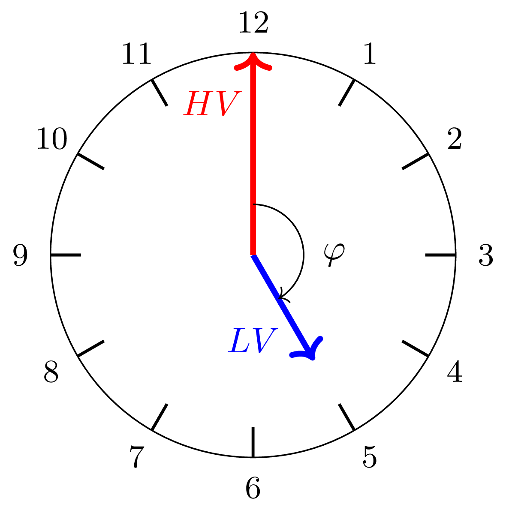

The full circumference of a clock is $360^\circ$, which, divided by its $12$ hours, assigns $30^\circ$ to each hour.
If the high-voltage (HV) side is taken as the reference, the low-voltage (LV) side indicates the phase displacement
between the two voltages. For instance, a \textbf{Dy5} transformer connection means that the HV side is delta-connected,
the LV side is star-connected, and the phase displacement between them is $150^\circ$ ($5 \cdot 30^\circ$), as
illustrated in the figure above.

### Three-phase Loads and Shunts

Owing to the large number and diversity of loads present in power networks, it is preferable to group loads and treat
them as bulk consumption points, rather than employing distinct models for rotating, static, etc.
The model used for the loads is the ZIP model, meaning it is considered as a combination of impedance, current, and
power loads, as depicted in the figure bellow.

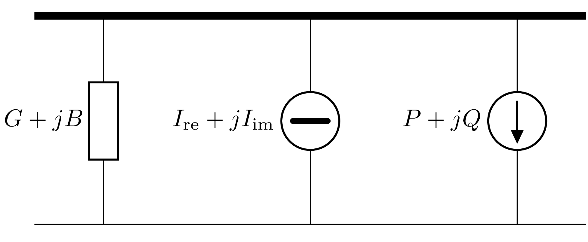

In steady-state applications, most system loads can be effectively represented as three-phase power sinks, connected
either in star or delta configuration depending on system requirements. The following figure illustrates a
star-connected load with the neutral point solidly grounded, alongside a delta-connected load. As will be shown later,
the power flow formulation operates using phase-to-neutral voltages and line currents, since the per-unit normalization
is based on these quantities. For this reason, the developed tool models all loads as star-connected. Consequently, a
preliminary conversion is required for delta-connected loads. The software must therefore be capable of transforming
impedance, current, and power injections from delta to star equivalents.

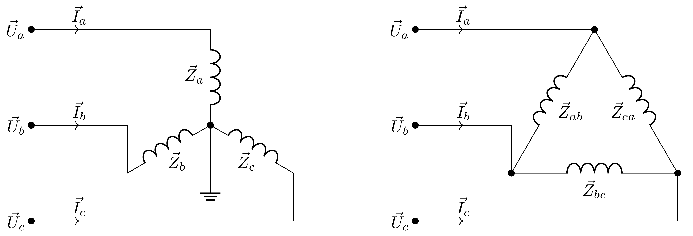

##### Constant impedance (Z) modelling of three-phase star-connected loads and shunts

Constant impedance loads and shunts are defined in terms of conductance G [MW] and susceptance B [MVAr].
If these elements have the three-phases active, and they are connected in star, the diagonal of the 3x3 admittance
matrix $\vec{Y}_0$ is simply filled with the values defined for each phase:

$$
\vec{Y}_0 =
\begin{bmatrix}
    \vec{Y}_a & 0 & 0 \\
    0 & \vec{Y}_b & 0 \\
    0 & 0 & \vec{Y}_c \\
\end{bmatrix}
$$

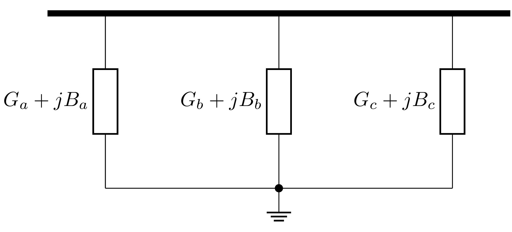

##### Constant impedance (Z) modelling of three-phase delta-connected loads and shunts

However, if the load is defined in delta connection, the 3x3 matrix shown bellow will be used to mathematically
model the load or the shunt element:

$$
\vec{Y}_0 = \dfrac{1}{3}
\begin{bmatrix}
    \vec{Y}_{ab} + \vec{Y}_{ca} & -\vec{Y}_{ab} & -\vec{Y}_{ca} \\
    -\vec{Y}_{ab} & \vec{Y}_{ab} + \vec{Y}_{bc} & -\vec{Y}_{bc} \\
    -\vec{Y}_{ca} & -\vec{Y}_{bc} & \vec{Y}_{bc} + \vec{Y}_{ca} \\
\end{bmatrix}
$$


##### Constant impedance (Z) modelling of two-phase loads and shunts

Two-phase loads and shunts defined as admittances are converted to their corresponding equivalent power values in star
configuration. This conversion is carried out using the voltage, and the resulting power values must be updated at each
iteration of the algorithm. Therefore, in this case, the values are not stored in the admittance matrix $\vec{Y}_0$ but
rather in the power vector $\vec{S}_0$. The current flowing through this type of load is equal to the voltage difference
between the phases to which it is connected, multiplied by its admittance, as shown the equation bellow. By multiplying
the resulting current in each phase by its corresponding voltage, the power value can be obtained.

$$
\vec{I}_{a} = (\vec{U}_{a} - \vec{U}_{b}) \cdot \dfrac{\vec{Y}_{ab}}{3}
$$

In the case where the load is connected between phases $a$ and $c$, the conversion is as follows:

$$
\vec{S}_0 = 
\begin{bmatrix}
    \vec{U}_{a} \cdot \left[ (\vec{U}_{a} - \vec{U}_{c}) \cdot \dfrac{\vec{Y}_{ca}}{3} \right]^* \\
    0 \\
    \vec{U}_{c} \cdot \left[ (\vec{U}_{c} - \vec{U}_{a}) \cdot \dfrac{\vec{Y}_{ca}}{3} \right]^* \\
\end{bmatrix}
$$


##### Constant impedance (Z) modelling of single-phase loads and shunts

Finally, single-phase loads and shunt elements are modelled as in the previous three-phase star case, but only saving
the admittance value for the active phase, for instance phase $b$:

$$
\vec{Y}_0 =
\begin{bmatrix}
    0 & 0 & 0 \\
    0 & \vec{Y}_b & 0 \\
    0 & 0 & 0 \\
\end{bmatrix}
$$

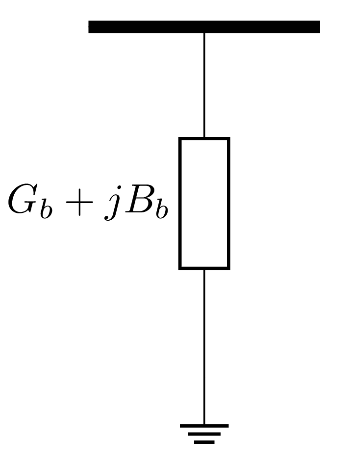

##### Constant current (I) modelling of three-phase star-connected loads

Traditionally, in positive sequence power flow analysis, constant current loads are directly stored in the $\vec{I}_0$
vector. However, since we are performing a three-phase power flow, the voltage angles of phases b and c are not zero,
so they must be taken into account. For both three-phase current star-connected loads, the defined phase currents are
stored in the vector $\vec{I}_0$ as follows:

$$
\vec{I}_0 =
\begin{bmatrix}
    \vec{I}_a^* \, e^{j \, \delta_a} \\
    \vec{I}_b^* \, e^{j \, \delta_b} \\
    \vec{I}_c^* \, e^{j \, \delta_c} \\
\end{bmatrix}
$$

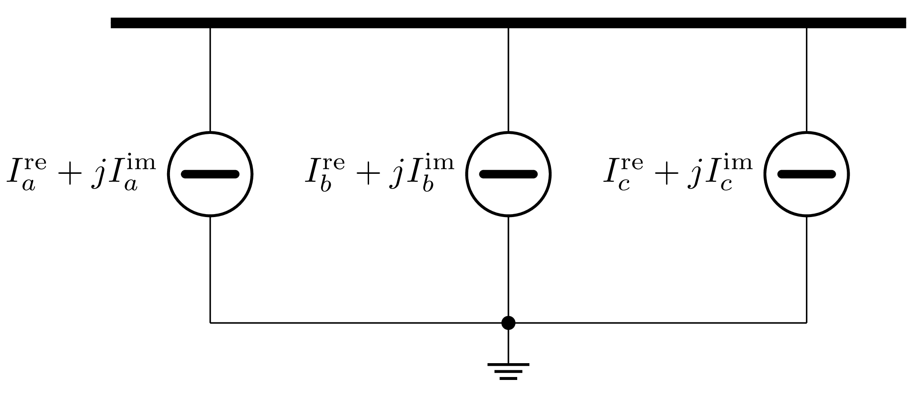

##### Constant current (I) modelling of three-phase delta-connected loads

However, if the current load is defined in delta connection, the vector shown bellow will be used to mathematically
model the element:

$$
\vec{I}_0 =
\begin{bmatrix}
\dfrac{\vec{I}_{ab}^* \, e^{j \, (\delta_a - \delta_b)} - \vec{I}_{ca}^* \, e^{j \, (\delta_c - \delta_a)}}{\sqrt{3}} \\
\dfrac{\vec{I}_{bc}^* \, e^{j \, (\delta_b - \delta_c)} - \vec{I}_{ab}^* \, e^{j \, (\delta_a - \delta_b)}}{\sqrt{3}} \\
\dfrac{\vec{I}_{ca}^* \, e^{j \, (\delta_c - \delta_a)} - \vec{I}_{bc}^* \, e^{j \, (\delta_b - \delta_c)}}{\sqrt{3}} \\
\end{bmatrix}
$$

Note that for loads connected between phases, the voltage angle to be applied is not that of the
phase to which the current load will be mapped, but rather the angle of the voltage difference
between the two phases to which the current-defined load is connected. Then, the angles
will be updated in each iteration, adding significant complexity compared to the traditional power flow.


##### Constant current (I) modelling of two-phase loads

Two-phase current loads, connected for instance between phases $a$ and $c$, are modelled in the same way as three-phase
delta-connected loads. The only difference is that, in this case, the current is defined solely as $vec{I}_{ca}$, while the
other phase-to-phase currents remain zero:

$$
\vec{I}_0 =
\begin{bmatrix}
\dfrac{- \vec{I}_{ca}^* \, e^{j \, (\delta_c - \delta_a)}}{\sqrt{3}} \\
0 \\
\dfrac{\vec{I}_{ca}^* \, e^{j \, (\delta_c - \delta_a)}}}{\sqrt{3}} \\
\end{bmatrix}
$$

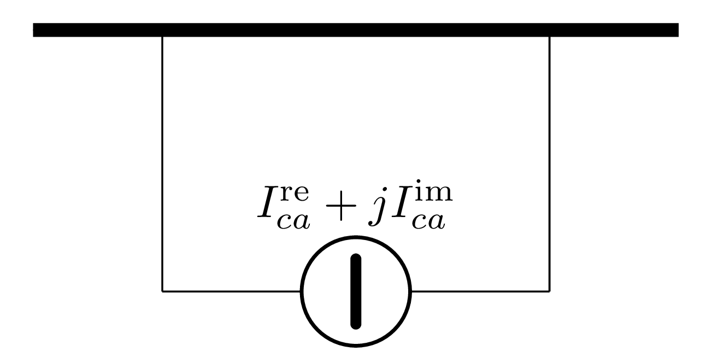

##### Constant current (I) modelling of single-phase loads

Finally, single-phase current loads, connected for instance to phase $b$, are modelled in the same way as three-phase
star-connected loads. The difference lies in the fact that the absent phases are stored with a value of zero.

$$
\vec{I}_0 =
\begin{bmatrix}
    0 \\
    \vec{I}_b^* \, e^{j \, \delta_b} \\
    0 \\
\end{bmatrix}
$$

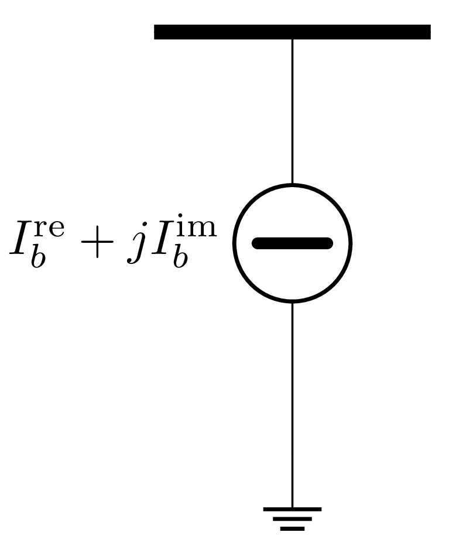

##### Constant power (P) modelling of three-phase star-connected loads

Finally, we will address the modelling of constant power loads. In the case of a three-phase power load connected in
star, the values defined by the user are stored in the $vec{S}_0$ vector for each phase:

$$
\vec{S}_0 =
\begin{bmatrix}
\vec{S}_a \\
\vec{S}_b \\
\vec{S}_c \\
\end{bmatrix}
$$


##### Constant power (P) modelling of three-phase delta-connected loads

In contrast, if the three-phase power load is connected in delta, the developed transformation to its star equivalent
involves the phase-to-ground voltages. Then, the power transformation vector to star will be
updated in each iteration, adding significant complexity compared to the traditional power flow.

$$
\vec{S}_0 = 
\begin{bmatrix}
\dfrac{\vec{U}_a \cdot \vec{S}_{ab}}{\vec{U}_a - \vec{U}_b}
- \dfrac{\vec{U}_a \cdot \vec{S}_{ca}}{\vec{U}_c - \vec{U}_a} \\
\dfrac{\vec{U}_b \cdot \vec{S}_{bc}}{\vec{U}_b - \vec{U}_c}
- \dfrac{\vec{U}_b \cdot \vec{S}_{ab}}{\vec{U}_a - \vec{U}_b} \\
\dfrac{\vec{U}_c \cdot \vec{S}_{ca}}{\vec{U}_c - \vec{U}_a}
- \dfrac{\vec{U}_c \cdot \vec{S}_{bc}}{\vec{U}_b - \vec{U}_c} \\
\end{bmatrix}
$$


##### Constant power (P) modelling of two-phase loads

Two-phase power loads, connected for instance between phases $a$ and $c$, are modelled in the same way as three-phase
delta-connected loads. The only difference is that, in this case, the power is defined solely as $vec{S}_{ca}$, while the
other phase-to-phase powers remain zero:

$$
\vec{S}_0 = 
\begin{bmatrix}
- \dfrac{\vec{U}_a \cdot \vec{S}_{ca}}{\vec{U}_c - \vec{U}_a} \\
0 \\
\dfrac{\vec{U}_c \cdot \vec{S}_{ca}}{\vec{U}_c - \vec{U}_a} \\
\end{bmatrix}
$$


##### Constant power (P) modelling of single-phase loads

Finally, single-phase power loads, connected for instance to phase $b$, are modelled in the same way as three-phase
star-connected loads. The difference lies in the fact that the absent phases are stored with a value of zero:

$$
\vec{S}_0 =
\begin{bmatrix}
0 \\
\vec{S}_b \\
0 \\
\end{bmatrix}
$$

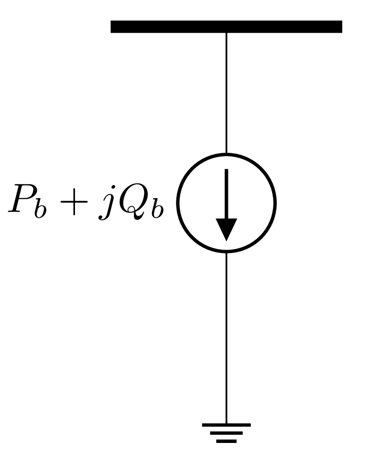

### Three-phase Generators

## AC modelling

### Universal Branch Model

This section describes the positive‑sequence branch model implemented in **GridCal**. 
The formulation is state‑of‑the‑art and general enough to cover overhead lines, 
cables and transformers.

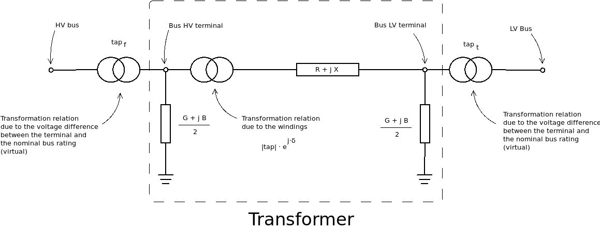

To define the π‑model we must specify the following quantities:

| Magnitude | Units | Description |
|-----------|-------|-------------|
| $R$ | p.u. | Resistance of the equivalent branch. |
| $X$ | p.u. | Reactance of the equivalent branch. |
| $G$ | p.u. | Shunt conductance. |
| $B$ | p.u. | Shunt susceptance. |
| $|\mathrm{tap}|$ | p.u. | Transformer tap magnitude (internal voltage regulation, e.g. 0.98 or 1.05). |
| $\delta$ | rad | Phase‑shift angle. |
| $\mathrm{tap}_f$ | p.u. | *Virtual* tap on the high‑voltage side (difference between bus HV rating and transformer HV rating). |
| $\mathrm{tap}_t$ | p.u. | *Virtual* tap on the low‑voltage side (difference between bus LV rating and transformer LV rating). |

`GridCal` computes $\mathrm{tap}_f$ and $\mathrm{tap}_t$ automatically, taking the connection sense into account.

#### Basic complex quantities

$$
Y_s = \frac{1}{R + jX}
$$

$$
Y_{sh} = G + jB
$$

$$
\mathrm{tap} = |\mathrm{tap}| \, e^{j\delta}
$$

$$
\mathrm{tap}_f = \frac{V_{HV}}{V_{\text{bus, HV}}}
$$

$$
\mathrm{tap}_t = \frac{V_{LV}}{V_{\text{bus, LV}}}
$$

#### Primitive admittances

$$
Y_{tt} = \frac{Y_s + Y_{sh}}{2\,\mathrm{tap}_t^{2}}
$$

$$
Y_{ff} = \frac{Y_s + Y_{sh}}{2\,\mathrm{tap}_f^{2}\,\mathrm{tap}\,\mathrm{tap}^*}
$$

$$
Y_{ft} = -\frac{Y_s}{\mathrm{tap}_f\,\mathrm{tap}_t\,\mathrm{tap}^*}
$$

$$
Y_{tf} = -\frac{Y_s}{\mathrm{tap}_t\,\mathrm{tap}_f\,\mathrm{tap}}
$$

In the actual implementation all branch primitives are assembled simultaneously 
in matrix form; the scalar expressions above are shown purely for clarity.


#### Temperature correction

`GridCal` can adjust the resistance to account for conductor temperature:

$$
R' = R \bigl(1 + \alpha\,\Delta t\bigr)
$$

where $\alpha$ depends on the conductor material and $\Delta t$ is the 
temperature rise above the reference value (commonly 20 °C).

| Material | Reference T (°C) | $\alpha$ (1/°C) |
|----------|-----------------|------------------|
| Copper | 20 | 0.004041 |
| Copper | 75 | 0.00323 |
| Annealed copper | 20 | 0.00393 |
| Aluminum | 20 | 0.004308 |
| Aluminum | 75 | 0.00330 |


#### Embedded tap‑changer

The general branch model includes a **discrete tap changer** so that the 
magnitude $|\mathrm{tap}|$ can be regulated manually or automatically by 
the power‑flow routines, enabling realistic transformer control within simulations.


## AC-DC modelling


## Substations modelling


## Distribution Grid example

This tutorial shows a step by step guide on how to build distribution grid 
system that contains: 13 Buses, 4 Transformers, 4 Loads. 
The tutorial shows how to create a grid using time profiles and device templates. 
The tutorial also contains:

- Easy drag and drop creation of components.
- Transformer type creation.
- Overhead lines creation.
- Templates for transformers and overhead lines.
- Import of profiles into the loads.
- Set s power flow snapshot from the profiles.
- Execution of power flow.
- Execution of power flow time series.
- Automatic precision adjustment.
- Results visualization.
- Live results visualization (grid colouring).

A video tutorial can be found [here](https://www.youtube.com/watch?v=Yx3zRYRbe04&t=404s)

Note: this tutorial was made with GridCal v 4.0.0

However, we will do this using the GridCal GUI.

### Step 0: System Overview

The system grid is supposed to look like the figure below.


The system features:

- 9 Buses.
- 5 Transformers.
- 4 Loads.
- 7 Lines.

Solution file of the grid system can be found in 
[GitHub](https://github.com/SanPen/GridCal/blob/devel/Grids_and_profiles/grids/Some%20distribution%20grid%20(Video).gridcal)


### Step 1: Create a Transformer

Open GridCal:

1. 'Drag and drop' 2 'Bus' element to the diagram canvas:


2. Select (double 'click') Bus 0 and change the parameters (on the left side pane):


| name     | HV Bus |
|----------|--------|
| Vnom[kV] |   20   |


3. Select (double 'click') Bus 1 and change the parameters (on the left side pane):

|   name   | Bus 2  |
|----------|--------|
| Vnom[kV] | 10     |

4. Hover over either bus element, 'click and drag' (when there is a cross) to the other bus to create a branch.


> Note: A transformer will be created between HV Bus and Bus 2 when nominal voltage values are different.

> Note: The name of an element may not change until you 'double click' the element on the diagram canvas after the change.

### Step 2: Create Lines of Different Lengths

1. Create 3 more Buses (Bus 3, Bus 4 and Bus 5) and create a branch between them.


2. Select the branch between Bus 2 and Bus 3 and change its parameters to:


|   name     | Line 1 |
|------------|--------|
| length[km] | 5      |

3. Select the branch between Bus 3 and Bus 4 and change its parameters to:


|   name     | Line 2 |
|------------|--------|
| length[km] | 3      |


4. Select the branch between Bus 4 and Bus 5 and change its parameters to:

|   name     | Line 3 |
|------------|--------|
| length[km] | 7      |


> Note: Element placing can be changed by 'clicking' the square on the right hand side of a bus.

### Step 3: Add More Lines and Buses

1. Add Bus 6 to the right of Bus 2.
2. Add Bus 7 to the right of Bus 3.
3. Add Bus 8 and Bus 10 to the left of Bus 4.
4. Add Bus 9 and Bus 11 to the left of Bus 5.


5. Select the branch between Bus 2 and Bus 6 and change its parameters to:

|   name     | Line 4 |
|------------|--------|
| length[km] | 2      |

5. Select the branch between Bus 3 and Bus 7 and change its parameters to:


|   name     | Line 5 |
|------------|--------|
| length[km] | 1.6    |

6. Select the branch between Bus 4 and Bus 8 and change its parameters to:


|   name     | Line 7 |
|------------|--------|
| length[km] | 1.5    |


7. Select the branch between Bus 5 and Bus 9 and change its parameters to:


|   name     | Line 8 |
|------------|--------|
| length[km] | 2      |


### Step 4: Create Loads

1. Select Bus 10 and change parameters to:


|   name   | House 3  |
|----------|----------|
| Vnom[kV] | 0.4      |

2. Create a line between Bus 8 and House 3 (a transformer will be created). Rename it to 'TR House 3'.

3. Select Bus 11 and change parameters to:

|   name   | House 4  |
|----------|----------|
| Vnom[kV] | 0.4      |

4. Create a line between Bus 9 and House 4 (a transformer will be created). Rename it to 'TR House 4'.

5. Right 'click' on House 3 and select 'Add Load'.

6. Right 'click' on House 4 and select 'Add Load'.


### Step 5: Create House 1 and House 2

1. Create load House 1: Create a new bus and name it 'House 1' to the right of Bus 6, and a transformer in the line between Bus 6 and House 1. The parameters are the following:

| name     | House 1  |
|----------|----------|
| Vnom[kV] |   0.4    |

2. Create load House 2: Create a new bus and name it 'House 2' to the right of Bus 7, and a transformer in the line between Bus 7 and House 2. The parameters are the following:

| name     | House 2  |
|----------|----------|
| Vnom[kV] |   0.4    |

The full system topology looks like:

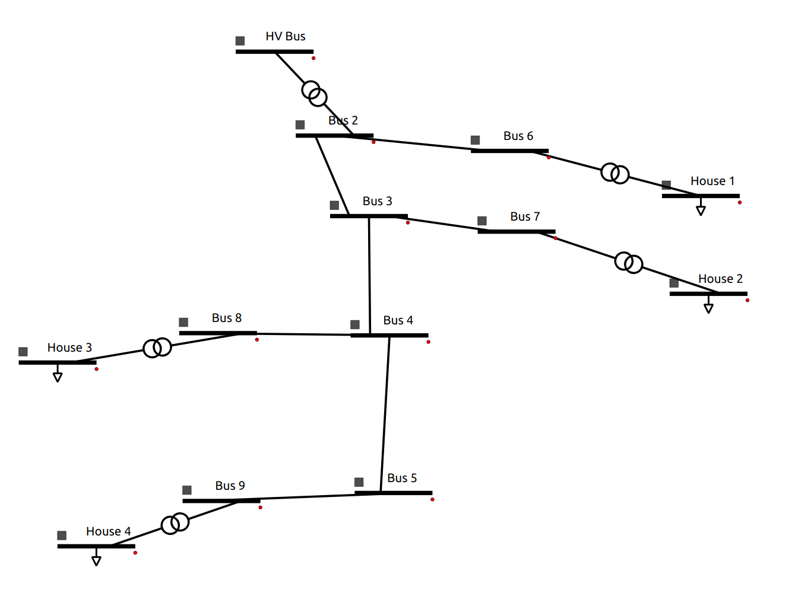


> Note: do not forget to add the load after you rename the House buses.

### Step 6: Defining the Main Transformer

In order to define the type of transformer a catalogue is available within the GridCal repository.

This transformer is the transformer between HV Bus and Bus 2. The transformer is: 25 MV 20/10 kV.

1. Access the catalogue (Excel file). It can be found in the repository at Gridcal/Grids_and_profiles/grids/equipment and select 'equipment.ods'.

2. Select the 'Transformers' sheet.

3. Remove all filters on the 'Rate (MVA)' column by pressing on the downward arrow.


4. Select the '20 kV' filter on the 'HV (kV)' column using the downward arrow.

4. Select the '10 kV' filter on the 'LV (kV)' column using the downward arrow.


6. The parameters of the transformer are:

| name               | 25 MVA 20/10 kV |
|--------------------|-----------------|
| Rate[MVA]          | 25              |
| Frequency[Hz]      | 50              |
| HV[kV]             | 20              |
| LV[kV]             | 10              |
| Copper Losses[kW]  | 102.76          |
| No Load Losses[kW] | 10.96           |
| No Load Current[%] | 0.1             |
| V Short Circuit[%] | 10.3            |
| HV Vector Group    | YN              |
| LV Vector Group    | D               |
| Phase Shift        | 5               |

7. Double click on the transformer between HV Bus and Bus 2 and enter the 
following parameters (based on the model selected):

|   Sn   | 25     |
|--------|--------|
|  Pcu   | 102.76 |
|   Pfe  | 10.96  |
|   lo   | 0.1    |
|    Vsc | 10.3   |

8. Once the parameters are placed, right click and select 'Add to catalogue'. 
This way the branch p.u. values are calculated from the template values.

> Note: In the new GridCal version, a transformer can be defined by just 
  right clicking on the desired transformer and selecting the type from the drop down menu.

> Note: All of the element types can be found under the 'Types catalogue' 
> tab after clicking on the desired element, then clock 'Load Values' to change the parameters.

### Step 7: Defining Load Transformers

The transformers used for the 4 loads (houses) a 10 to 0.4 kV transformer will be used. 
The name is a '0.016 MVA 10/0.4 kV ET 16/23 SGB'.

1. Using the same catalogue find the transformer and do this for the transformer between Bus 6 and House 1.

2. The parameters of the transformer are:

|        name        | 0.016 MVA 10/0.4 kV ET 16/23 SGB  |
|--------------------|-----------------------------------|
|     Rate[MVA]      | 0.016                             |
|   Frequency[Hz]    | 50                                |
|       HV[kV]       | 10                                |
|       LV[kV]       | 0.4                               |
|  Copper Losses[kW] | 0.45                              |
| No Load Losses[kW] | 0.11                              |
| No Load Current[%] | 0.68751                           |
| V Short Circuit[%] | 3.75                              |
| HV Vector Group    | Y                                 |
|   LV Vector Group  | ZN                                |
|   Phase Shift      | 5                                 |

3. Fill these values out for the pop up menu:

|   Sn   | 0.016    |
|--------|----------|
|  Pcu   | 0.45     |
|   Pfe  | 0.11     |
|   lo   | 0.687510 |
|    Vsc | 3.75     |

4. Right click on the transformer and select 'Add to catalogue' this will create a template for quick add.

5. Rename the transformer to 'TR house 1'.

6. On the lower tabs select 'Types catalogue'.


7. Select the transformer that has the characteristics of the 10 to 0.4 kV transformer and 
rename it to 'House trafo'. Now you have defined a transformer type that can be added to many transformers.

> Note: In the new GridCal version, a transformer can be defined by just right clicking on 
  the desired transformer and selecting the type from the drop down menu.

### Step 8: Defining Other Transformers

Now that 'House trafo' has been created, other transformers can be set to the same type.

1. In the 'Schematic' tab change the name of the other load transformers to their respective load (i.e. House 3 transformer rename to 'TR house 3').

2. Double click on the transformer

3. Click 'Load Values' to set the parameters.

4. Repeat for all desired transformers: TR house 3, TR house 4, TR house 2.

> Note: this can be done with all elements either to preloaded models or models you create.


### Step 9: Defining Wires and Overhead Lines

1. Just like in Step 7 access the 'Types catalouge' and select 'Wires'.

2. All of the wire types will show up and select the 17th option 'AWG SLD'. The parameters are:


|  R [Oh/Km]        | 1.485077  |
|-------------------|-----------|
|   X [Ohm/Km]      | 0         |
|    GMR [m]        | 0.001603  |
|  Max Current [kA] | 0.11      |

> Note: A new wire or custom wire can be added using the '+' button on the top right.

3. Now that you have located the wire you will use, in the same tab of 'Data structures' select 'Overhead Lines'.

4. Click on the '+' sign at the top right to create a new element. A new element '0:Tower' should come up.

5. Select the element '0: Tower' and click on the pencil on the top right corner to edit. A new window should pop up.

6. Rename the overhead line to: 'Distribution Line'.

7. Select the wire 'AWG SLD', highlight it and click on the '+' sign on the 'Wire composition' section below:


8. Add the 'AWG SLD' wire three times to enter the wire arrangement. The formulas come from ATP-EMTP.

9. Give each cable a different phase: 1, 2 and 3. Enter the following parameters for Phase 2 and Phase 3.

| Wire      | X[m] | Y [m] | Phase |
|-----------|------|-------|-------|
|  AWG SLD  |  0   |  7.0  | 1     |
|  AWG SLD  |0.4   |  7.3  | 2     |
|  AWG SLD  |0.8   |  7.0  | 3     |


10. Click on the 'Compute matrices' button the little calculator on the bottom right and you will be able to see:

-Tower Wire Position (right).
- Z Series [Ohm/Km] for ABCN (under the 'Z series' tab at the top).
- Z Series [Ohm/Km] for ABC (under the 'Z series' tab at the top).
- Z Series [Ohm/Km] for the sequence components (under the 'Z series' tab at the top).
- Y shunt [uS/Km] for ABCN (under the 'Y shunt' tab at the top).
- Y shunt [uS/Km] for ABC (under the 'Y shunt' tab at the top).
- Y shunt [uS/Km] for the sequence components (under the 'Y shunt' tab at the top).

12. Close the window, and your 'Elements Data' tab should look lie:

13. To apply this model to the lines in the model: In the 'Schematic' tab change the name of the other load transformers to their respective load (i.e. House 3 transformer rename to 'TR house 3').

14. Double click on the desired line. Click 'Load Values' to set the parameters.

15. Repeat for all desired lines. In this case Line 1 to Line 8. The 'Objecs -> Line' Data tab should look like:


> Note: this can be done with all elements either to preloaded models or models you create.

### Step 10: Importing Load Profiles

1. Head to the 'Time Events' tab on the bottom part of the GUI. Then click on the left and select 'Import Profiles'. This should bring up the 'Profile Import Dialogue' box.


> Note: Make sure that the desired object is set to 'Load' and power types are both set to 'P'.

2. Click on 'Import file' box on the left. This will bring up a file explorer tab.

3. In the installation location head to '../GridCal/Grids_and_Profiles/profiles/..' then select the Excel file called: 'Total_profiles_1W_1H.xlsx'.


4. On the next dialogue box select 'Sheet 1' and 'OK'. Wait for all the profiles to load.

5. Any load profile can be selected. For example, click on 'USA_AL_Dothan.Muni.AP.7222268_TMY3_BASE(kW)'. Then select the 'Plot' tab to see the load profile in kW for January 2018.


> Note: in the 'Assignation' tab, the units can be changed to: T, G, k , m Watts.

Set the units to 'k'.

6. On the right, you can see the different 'Objectives', fill the out by double-clicking on a profile and then double-clicking in the 'active' box of the desired 'Objective'. The profiles are assigned as follows:
    - Load@House 1: 'USA_AL_Muscle.Shoals.Rgni.AP.723235_TMY3_BASE(k@)'.
    - Load@House 2: 'USA_AZ_Douglas-Bisbee.Douglas.intl.AP.722735_TMY3_BASE(k@)'.
    - Load@House 3: 'USA_AL_Tuscaloosa.Muni.AP.722286_TMY3_BASE(k@)'.
    - Load@House 4: 'USA_AL_Birmingham.Muni.AP.722286_TMY3_BASE(k@)'.

The selection should look like this:


Click 'Accept' to load the profiles.

7. On the 'Time events' tab, confirm that the time series has bene added:


8. To set the reactive power as a copy of the active power and scale it, click on the dropdown menu and select 'Q'. Then click next to it on the 'Copy the selected profile into the profiles selected next to this button' button. When the pop up box comes on confirming the action select 'Yes'.


9. On the bottom left side scale it by 0.8 and click on the multiply button. The profile should look like this:

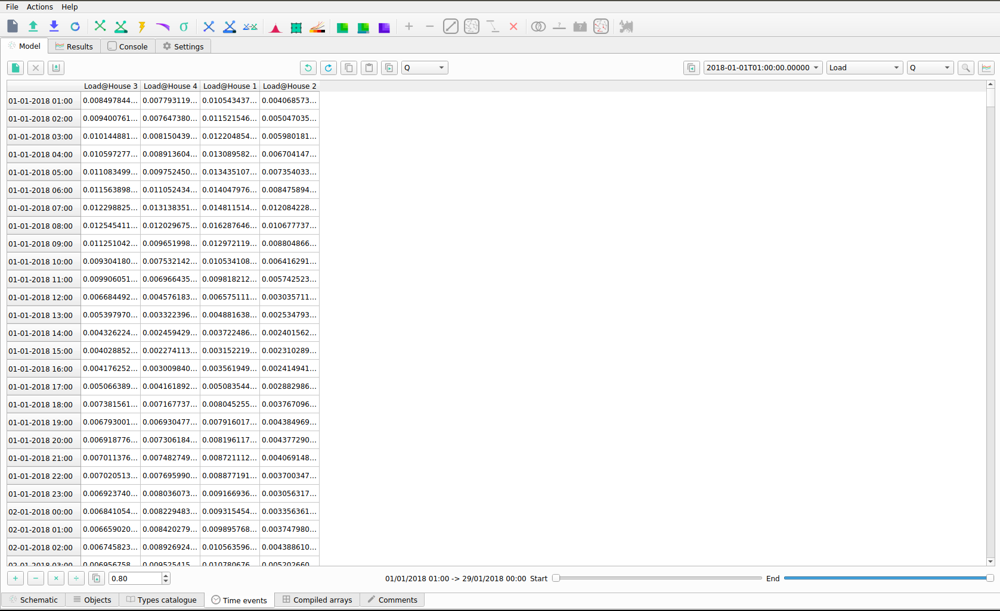


9. The profiles can be visualized by 1) selecting the times, and load, and clicking on the 'Plot the selected project's profile' button.


10. Power flow snapshots can be seen also by going to the 'Time events' tabs, and then

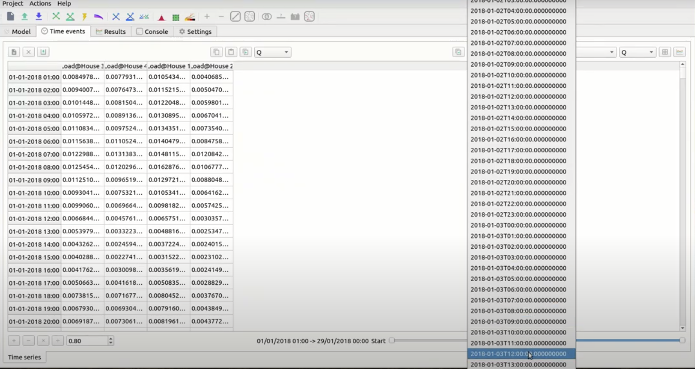


### Step 10: Set Power Flow From A Profile

Once we have checked that the profiles are okay, we can set the power flow snapshot from the profiles and run a power flow.

1. Head to the 'Time Series' Tab and select '2018+01-03T12:00:00.00000000000000'.


2. Select the 'Assign selected values to the selected time slot to the grid'.

3. Select 'Yes'.


### Step 11: Running a Power Flow

In order to run the power flow, we must select the slack bus. If you try run without one, you will get this error message:

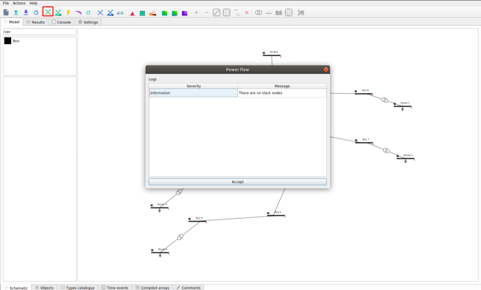


> Note: to run a Power Flow, select the 'Power Flow' button in the red square in the figure above.

1. Return to the 'Schematic' tab.

2. Select the 'HV Bus'.

3. On the left pane, select 'True' in the 'is_slack' option.

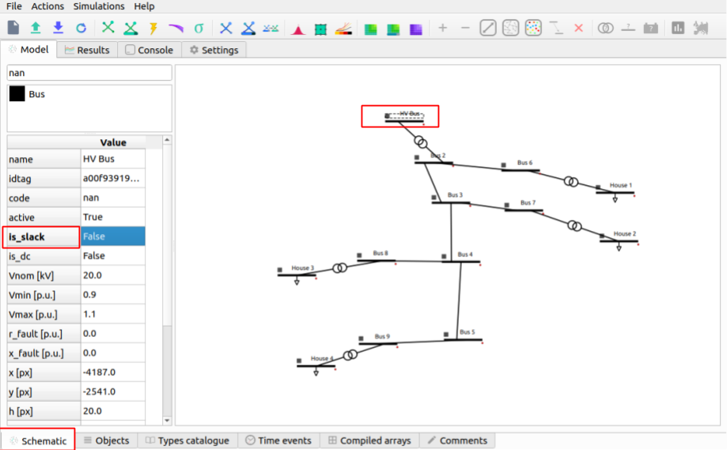


4. Click on the 'Power Flow' button and the grid will be colored according to the voltage or loading.


5. Click on the 'Power Flow Time Series' button and the grid will be colored according to th

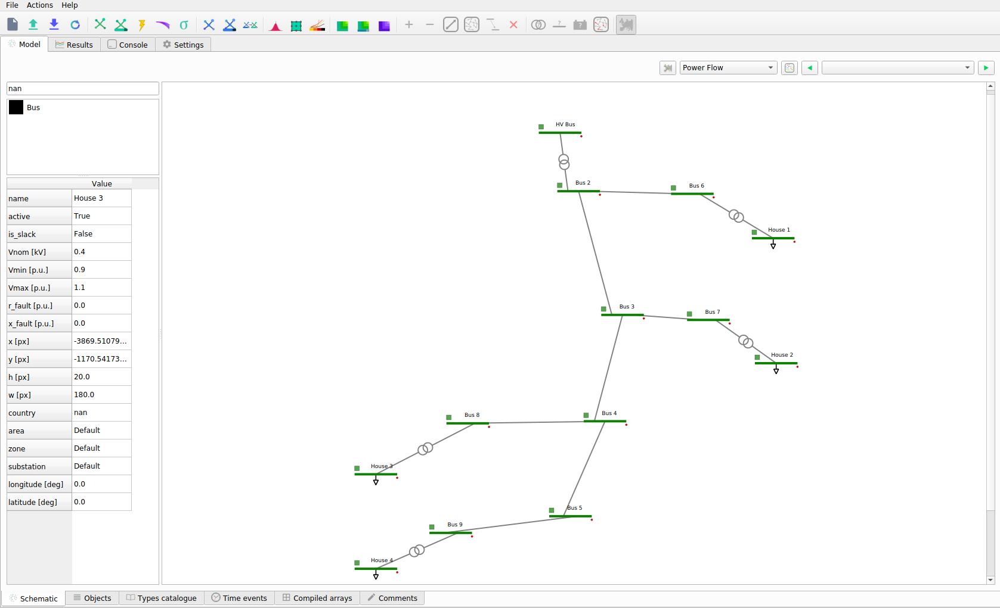


6. In addition by hovering above a transformer you can see the loading percentage and the power.


### Step 12: Results & Features

Here are some of the few results and features that are available with GridCal. All results can be found in the 'Results' tab. Here you can see a list of all studies perfomed and their respective results:


In the results you can also choose from:

- Study
- Result Type
- Devices

From here you can choose and customize the plot and results that are displayed to you.

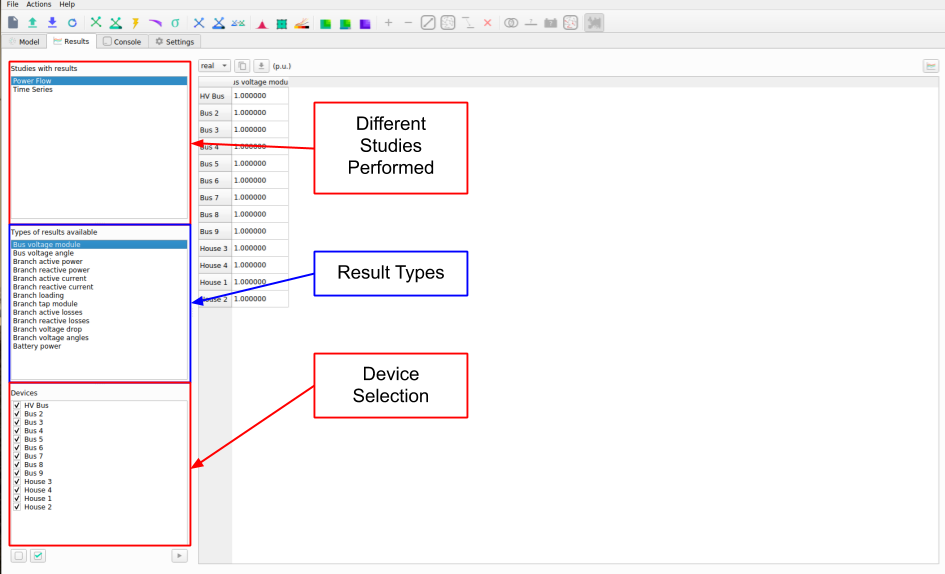


Select the Study, Result Type and Devices, then the Data will pop up in table format, 
to graph it use the 'Graph' button on the top right. The graph will come up on a new figure:

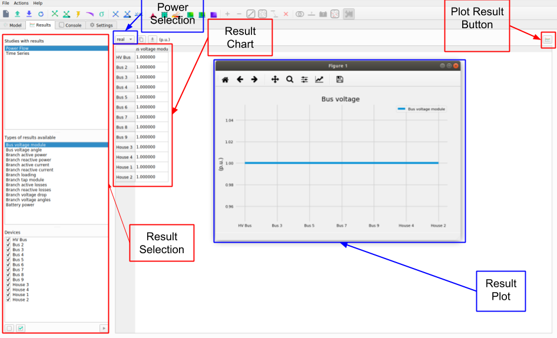

In the 'Schematic' Tab, you can visualize the result's profiles, by selection the load, right click and selecting 'Plot Profiles':


From the result plots you can do various things with the plot:


## 5 Node example (API)

This example creates the five-node grid from the fantastic book
"Power System Load Flow Analysis" and runs a power flow. After the power flow is executed,
the results are printed on the console.


```python
import GridCalEngine.api as gce

# declare a circuit object
grid = gce.MultiCircuit()

# Add the buses and the generators and loads attached
bus1 = gce.Bus('Bus 1', Vnom=20)
# bus1.is_slack = True  # we may mark the bus a slack
grid.add_bus(bus1)

# add a generator to the bus 1
gen1 = gce.Generator('Slack Generator', vset=1.0)
grid.add_generator(bus1, gen1)

# add bus 2 with a load attached
bus2 = gce.Bus('Bus 2', Vnom=20)
grid.add_bus(bus2)
grid.add_load(bus2, gce.Load('load 2', P=40, Q=20))

# add bus 3 with a load attached
bus3 = gce.Bus('Bus 3', Vnom=20)
grid.add_bus(bus3)
grid.add_load(bus3, gce.Load('load 3', P=25, Q=15))

# add bus 4 with a load attached
bus4 = gce.Bus('Bus 4', Vnom=20)
grid.add_bus(bus4)
grid.add_load(bus4, gce.Load('load 4', P=40, Q=20))

# add bus 5 with a load attached
bus5 = gce.Bus('Bus 5', Vnom=20)
grid.add_bus(bus5)
grid.add_load(bus5, gce.Load('load 5', P=50, Q=20))

# add Lines connecting the buses
grid.add_line(gce.Line(bus1, bus2, name='line 1-2', r=0.05, x=0.11, b=0.02))
grid.add_line(gce.Line(bus1, bus3, name='line 1-3', r=0.05, x=0.11, b=0.02))
grid.add_line(gce.Line(bus1, bus5, name='line 1-5', r=0.03, x=0.08, b=0.02))
grid.add_line(gce.Line(bus2, bus3, name='line 2-3', r=0.04, x=0.09, b=0.02))
grid.add_line(gce.Line(bus2, bus5, name='line 2-5', r=0.04, x=0.09, b=0.02))
grid.add_line(gce.Line(bus3, bus4, name='line 3-4', r=0.06, x=0.13, b=0.03))
grid.add_line(gce.Line(bus4, bus5, name='line 4-5', r=0.04, x=0.09, b=0.02))

results = gce.power_flow(grid)

print(grid.name)
print('Converged:', results.converged, 'error:', results.error)
print(results.get_bus_df())
print(results.get_branch_df())
```


## Definition of a line from the wire configuration


**Definition of the exercise**


In this tutorial we are going to define a 3-phase line with 4 wires of two different types.

The cable types are the following:

| name         | r        | x   | gmr      | max_current |
|--------------|----------|-----|----------|-------------|
| ACSR 6/1     | 1.050117 | 0.0 | 0.001274 | 180.0       |
| Class A / AA | 0.379658 | 0.0 | 0.004267 | 263.0       |

These are taken from the data_sheets__ section

The layout is the following:

| Wire         | x(m) | y(m) | Phase |
|--------------|------|------|-------|
| ACSR 6/1     | 0    | 7    | 1 (A) |
| ACSR 6/1     | 0.4  | 7    | 2 (B) |
| ACSR 6/1     | 0.8  | 7    | 3 (C) |
| Class A / AA | 0.3  | 6.5  | 0 (N) |

**Practice**


We may start with a prepared example from the ones provided in the `grids and profiles` folder.
The example file is `Some distribution grid.xlsx`. First define the wires that you are going 
to use in the tower. For that, we proceed to the tab `Database -> Catalogue -> Wire`.


Then, we proceed to the tab `Database -> Catalogue -> Tower`. Then we select
one of the existing towers or we create one with the (+) button.


By clicking on the edit button (pencil) we open a new window with the `Tower builder` editor. 
Here we enter the tower definition, and once we are done, we click on the compute button (calculator). 
Then the tower cross-section will
be displayed and the results will appear in the following tabs.


This tab shows the series impedance matrix ($\Omega / km$) in several forms:

- Per phase without reduction.
- Per phase with the neutral embedded.
- Sequence reduction.


This tab shows the series shunt admittance matrix ($\mu S / km$) in several forms:

- Per phase without reduction.
- Per phase with the neutral embedded.
- Sequence reduction.


When closed, the values are applied to the overhead line catalogue type that we were editing.


## Transformer definition from SC test values

The transformers are modeled as π branches too. In order to get the series impedance and shunt admittance of
the transformer to match the branch model, it is advised to transform the specification sheet values of the device
into the desired values. The values to take from the specs sheet are:

- $S_n$: Nominal power in MVA.
- $HV$: Voltage at the high-voltage side in kV.
- $LV$: Voltage at the low-voltage side in kV.
- $V_{hv\_bus}$: Nominal voltage of the high-voltage side bus kV.
- $V_{lv\_bus}$: Nominal voltage of the low-voltage side bus kV.
- $V_{sc}$: Short circuit voltage in %.
- $P_{cu}$: Copper losses in kW.
- $I_0$: No load current in %.
- $Share_{hv1}$: Contribution to the HV side. Value from 0 to 1.


Short circuit impedance (p.u. of the machine)

$$
    z_{sc} = \frac{V_{sc}}{100}
$$

Short circuit resistance (p.u. of the machine)

$$
    r_{sc} = \frac{P_{cu} / 1000}{ S_n }
$$

Short circuit reactance (p.u. of the machine)
Can only be computed if $r_{sc} < z_{sc}$

$$
    x_{sc} = \sqrt{z_{sc}^2 - r_{sc}^2}
$$

Series impedance (p.u. of the machine)

$$
    z_s = r_{sc} + j \cdot x_{sc}
$$

The issue with this is that we now must convert $zs$ from machine base to the system base.

First we compute the High voltage side:

$$
    z_{base}^{HV} = \frac{HV^2}{S_n}

    z_{base}^{hv\_bus} = \frac{V_{hv\_bus}^2}{S_{base}}

    z_{s\_HV}^{system}  = z_s\cdot  \frac{z_{base}^{HV}}{z_{base}^{hv\_bus}} \cdot Share_{hv1}  = z_s \cdot  \frac{HV^2 \cdot S_{base}}{V_{hv\_bus}^2 \cdot S_n}  \cdot Share_{hv1}
$$

Now, we compute the Low voltage side:

$$
    z_{base}^{LV} = \frac{LV^2}{S_n}

    z_{base}^{lv\_bus} = \frac{V_{lv\_bus}^2}{S_{base}}

    z_{s\_LV}^{system} = z_s \cdot \frac{z_{base}^{LV}}{z_{base}^{lv\_bus}}  \cdot (1 - Share_{hv1})  = z_s \cdot  \frac{LV^2 \cdot S_{base}}{V_{lv\_bus}^2 \cdot S_n}  \cdot (1 - Share_{hv1})
$$


Finally, the system series impedance in p.u. is:

$$
    z_s = z_{s\_HV}^{system} + z_{s\_LV}^{system}
$$

Now, the leakage impedance (shunt of the model)

$$
    r_m = \frac{S_{base}}{P_{fe} / 1000}
$$

$$
    z_m = \frac{100 \cdot S_{base}}{I0 \cdot S_n}
$$

$$
    x_m = \sqrt{\frac{ - r_m^2 \cdot z_m^2}{z_m^2 - r_m^2}}
$$

Finally, the shunt admittance is (p.u. of the system):

$$
    y_{shunt} = \frac{1}{r_m} + j \cdot \frac{1}{x_m}
$$


## Inverse definition of SC values from π model

In GridCal I found the need to find the short circuit values 
($P_{cu}, V_{sc}, r_{fe}, I0$) from the branch values (*R*, *X*, *G*, *B*). Hence the following formulas:

$$
    z_{sc} = \sqrt{R^2 + X^2}
$$

$$
    V_{sc} = 100 \cdot z_{sc}
$$

$$
    P_{cu} = R \cdot S_n \cdot 1000
$$


$$
    zl = 1 / (G + j B)
$$

$$
    r_{fe} = zl.real
$$

$$
    xm = zl.imag
$$

$$
    I0 = 100 \cdot \sqrt{1 / r_{fe}^2 + 1 / xm^2}
$$