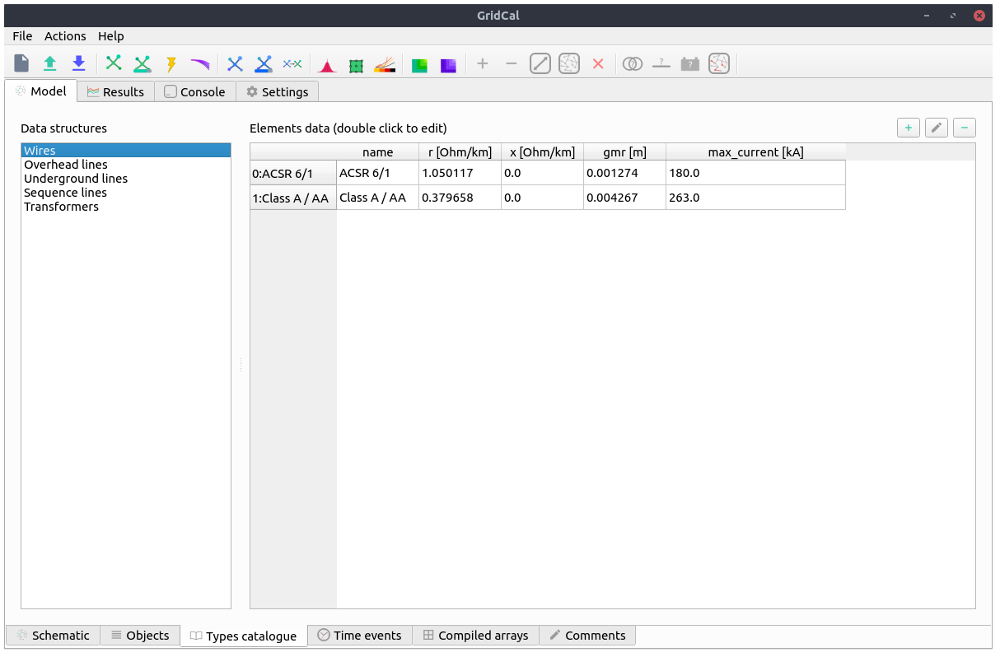
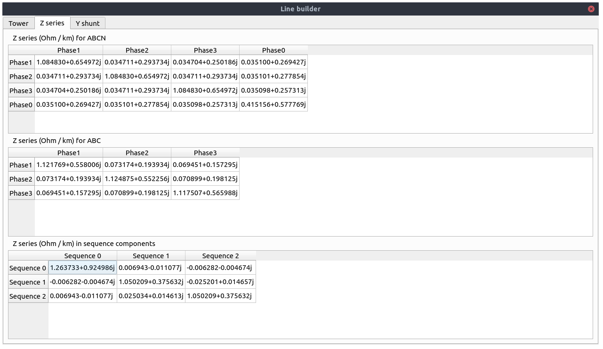
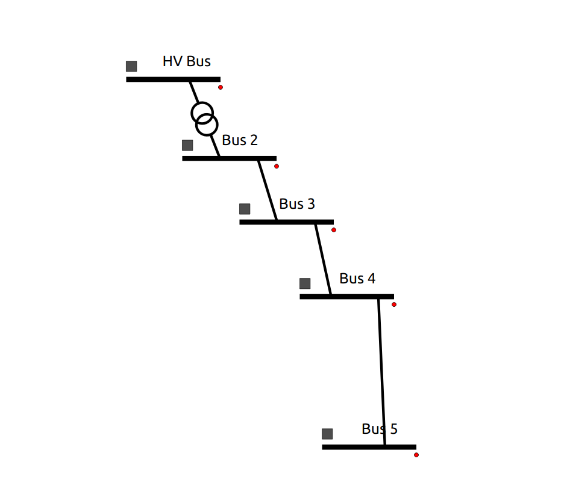
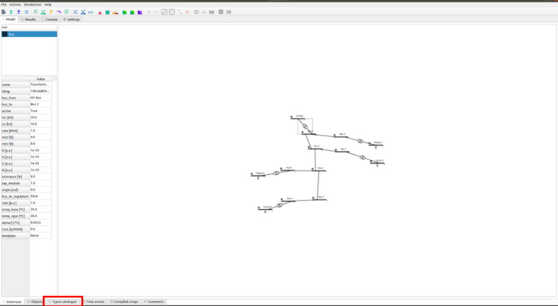
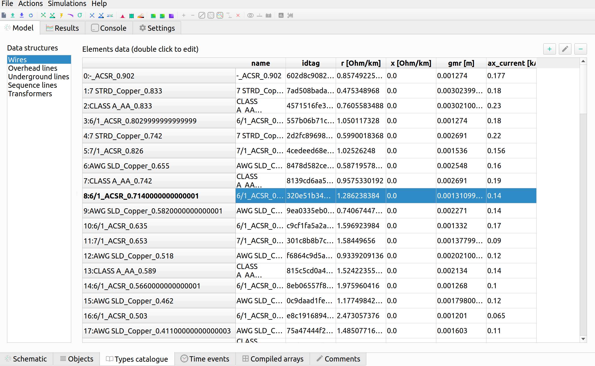
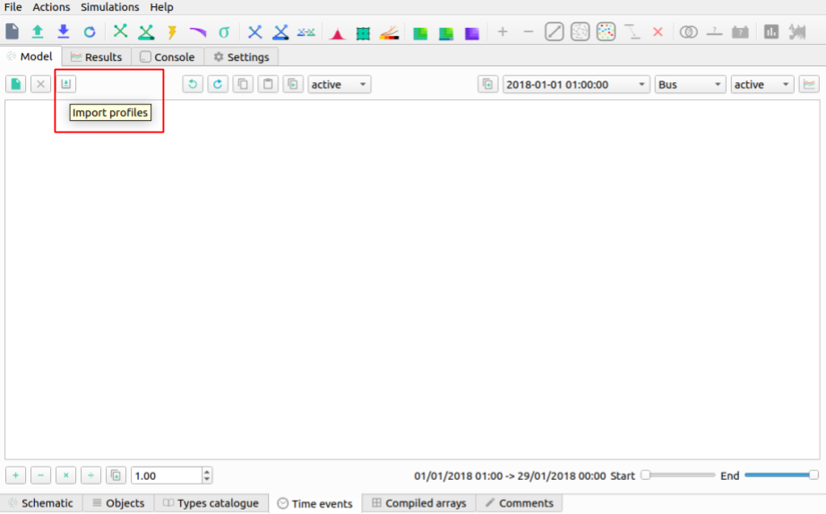
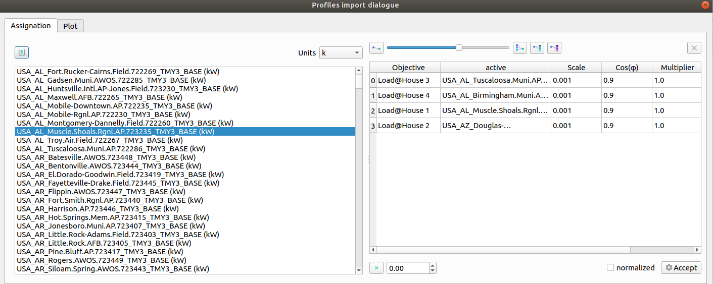
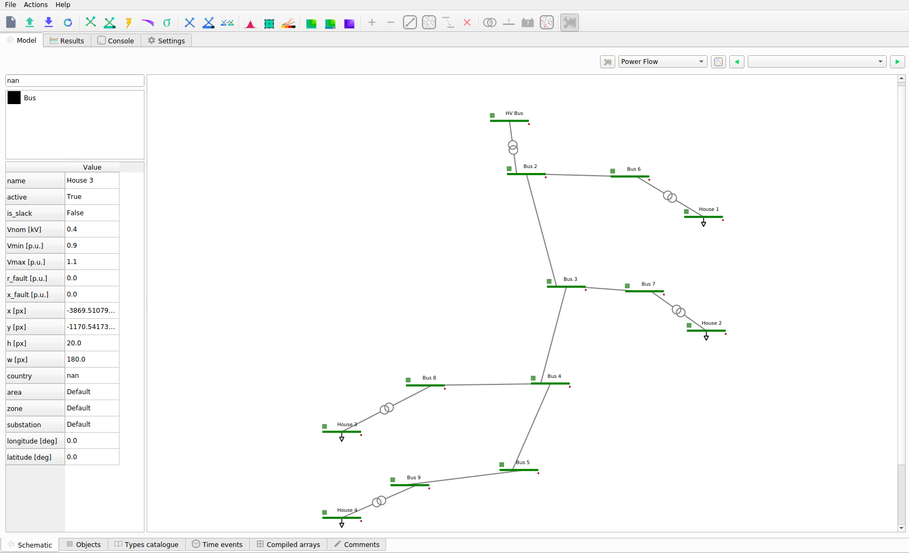
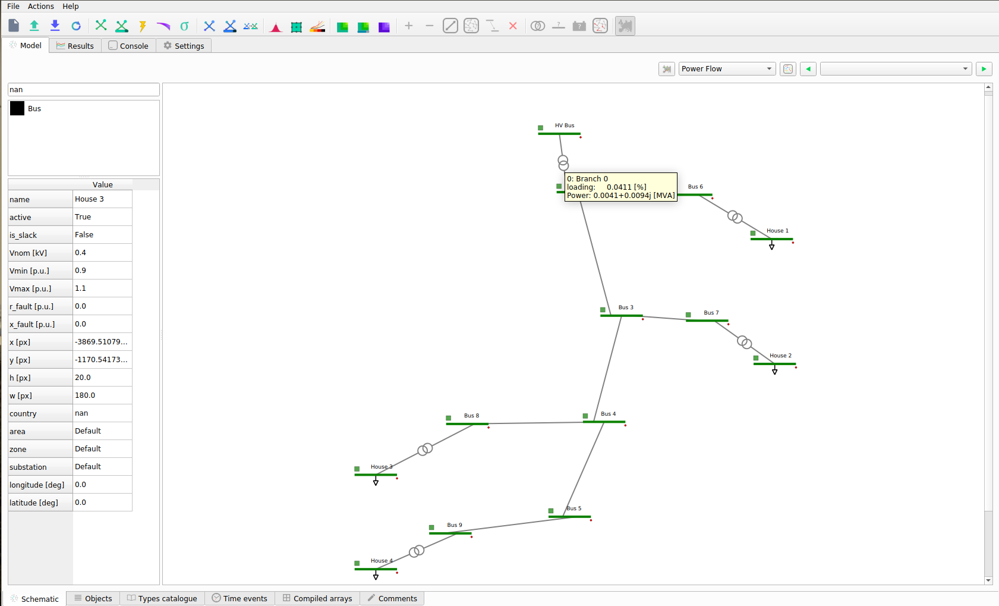

# 📐 Grid Modelling

Three-phase AC systems dominate power transmission and distribution for their efficiency, capacity, and compatibility.
While ideal systems are balanced and suitable for positive-sequence analysis, real networks often experience asymmetries
from untransposed lines, uneven loads, single-phase connections, and converter-based resources. The classical
symmetrical components method simplifies unbalanced fault analysis but struggles with strong sequence coupling,
non-linearities, and complex topologies.

Direct phase-domain (abc) modelling overcomes these limitations by representing actual phase quantities, naturally
handling asymmetry, non-linearities, and all fault types. It is particularly suited for transient simulations, EMTP
tools, and control design across all voltage levels.

Power systems comprise generators, transformers, lines, loads, and compensation equipment, interconnected from
generation through transmission and distribution to end users. Transmission operates at high voltages to reduce losses,
with transformers stepping voltages up or down as required. Transmission circuits often include series and shunt
compensation, while transformer winding configurations must be carefully modelled under unbalanced conditions. At the
distribution level, load points can be highly unbalanced due to single-phase connections.

<div style="text-align: center;">
    
</div>

<div style="text-align: center;">
    
</div>

<div style="text-align: center;">
    
</div>

## Lines

Power lines are essential in delivering electricity from generation to loads. They consist of phase conductors
positioned above the ground, sometimes using it as a return path, which must be considered in parameter calculations.
Transmission lines may use bundled conductors and ground wires, while distribution lines can include a neutral return.
Both types can introduce geometric and electrical unbalances. Accurate modelling aims to calculate voltage drops and
losses, based on determining the per-unit-length parameters: resistance $R$, inductance $L$, conductance $G$,
and capacitance $C$.

<div style="text-align: center;">
    
</div>

### π model

Transmission lines are mathematically modelled to describe their electrical behaviour. The inductive and resistive
effects of multiconductor lines are represented by a series impedance matrix, while capacitive effects are modelled as
a shunt admittance matrix. Together, these form the basis of the $\pi$-equivalent model commonly used in power system
studies.

<div style="text-align: center;">
    
</div>

It consists of:

- Series impedance: $Z_{\text{series}} = R + jX$

- Shunt admittance: $Y_{\text{shunt}} = G + jB$

In the $\pi$-model, $R$ represents conductor resistance, $X$ the self and mutual inductive reactances, $G$ the shunt
conductance through insulation, and $B$ the shunt susceptance from line capacitance. Shunt admittance is divided between
the ends, with series impedance in the middle. While the single-phase model is common, unbalanced systems require a 5-wire
representation, the three-phase conductors ($a$, $b$, $c$), the neutral ($n$), and the ground ($g$). The neutral returns
unbalanced current and stabilises voltage, while the ground provides a fault current path for safety. Each conductor
has its own impedance, and mutual coupling between all conductors requires a $5\times 5$ impedance or admittance matrix.

$$
\vec{Z} =
\begin{bmatrix}
\vec{Z}_{aa} & \vec{Z}_{ab} & \vec{Z}_{ac} & \vec{Z}_{an} & \vec{Z}_{ag} \\
\vec{Z}_{ba} & \vec{Z}_{bb} & \vec{Z}_{bc} & \vec{Z}_{bn} & \vec{Z}_{bg} \\
\vec{Z}_{ca} & \vec{Z}_{cb} & \vec{Z}_{cc} & \vec{Z}_{cn} & \vec{Z}_{cg} \\
\vec{Z}_{na} & \vec{Z}_{nb} & \vec{Z}_{nc} & \vec{Z}_{nn} & \vec{Z}_{ng} \\
\vec{Z}_{ga} & \vec{Z}_{gb} & \vec{Z}_{gc} & \vec{Z}_{gn} & \vec{Z}_{gg} \\
\end{bmatrix}
$$

In most transmission lines, the neutral conductor is absent as it is earthed at both ends. The ground return effect can
be incorporated into the phase impedance, allowing the line to be represented with a simplified $3\times 3$ matrix.

$$
\vec{Z} =
\begin{bmatrix}
\vec{Z}_{aa} & \vec{Z}_{ab} & \vec{Z}_{ac} \\
\vec{Z}_{ba} & \vec{Z}_{bb} & \vec{Z}_{bc} \\
\vec{Z}_{ca} & \vec{Z}_{cb} & \vec{Z}_{cc}
\end{bmatrix}
$$

### Series Impedance

Carson’s equations calculate the series self and mutual impedances of overhead transmission lines, accounting for the
ground return path. They assume long, horizontally arranged conductors with average height for sag effects, homogeneous
and lossless free space, uniform earth properties, and conductor spacing much greater than conductor radius to neglect
proximity effects. The impedance matrix elements are derived from the tower geometry and conductor characteristics.

<div style="text-align: center;">
    
</div>

Then, the following equations are implemented to obtain the self and mutual values:

$$
    \vec{Z}_{ii} = (R_i+R^c_{ii}) + j \left(\omega \frac{\mu_0}{2\pi} \ln{\frac{2h_i}{r_i}} + X_i + X^c_{ii} \right)
    \label{eq:Carson_Zii}
$$

$$
    \vec{Z}_{ij} = \vec{Z}_{ji} =
    R^c_{ij} + j \left( \omega \frac{\mu_0}{2\pi} \ln{\frac{D_{ij}}{d_{ij}}} + X^c_{ij} \right)
    \label{eq:Carson_Zij}
$$

Where:
- $R_i$ and $X_i$ are the internal resistance and reactance of conductor $i$ in $\Omega$/km.
- $R^c$ and $X^c$ are the Carson's correction terms for earth return effects in $\Omega$/km.
- $\mu_0 = 4\pi\cdot 10^{-4}$ is the permeability of free space in H/km.
- $\omega = 2\pi f$ is the angular frequency in rad/s.
- $h_i$ is the average height above ground of conductor $i$ in m.
- $r_i$ is the radius of conductor $i$ in m.
- $d_{ij}$ is the distance between conductors $i$ and $j$ in m.
- $D_{ij}$ is the distance between conductor $i$ and the image of conductor $j$ in m.

The correction terms $R^c$ and $X^c$ are derived from an infinite integral representing the impedance contribution due
to the earth return path.

### Shunt Admittance

Just as series impedance accounts for resistance and inductance, shunt admittance includes capacitance between
conductors and ground, and between conductors themselves. Under the assumptions of lossless air, uniformly grounded
earth, and conductor radii much smaller than inter-conductor spacing, these capacitances can be modelled mathematically
to compute the corresponding shunt admittances.

$$
    \vec{Y}_{ii} = j\frac{\omega}{2 \pi \varepsilon_0} \ln{\frac{2 h_i}{r_i}}
    \label{eq:self_Y}
$$

$$
    \vec{Y}_{ij} = j\frac{\omega}{2 \pi \varepsilon_0} \ln{\frac{D_{ij}}{d_{ij}}}
    \label{eq:mutual_Y}
$$

Where $\varepsilon_0 = \dfrac{1}{\mu_0 c^2} \approx 8,85 \cdot 10^{-12}$ F/m is the free space permittivity.

### Kron's reduction

Kron's reduction, or node elimination, is a technique from network theory used to simplify a multi-node electrical
network by eliminating certain nodes, often called internal or passive nodes, while preserving the electrical
behaviour at the remaining nodes.

Assuming a set of nodes divided into two groups between ground conductors $g$ (to eliminate) and phase conductors $p$
(to keep), the impedance matrix is partitioned accordingly:

$$
    \vec{Z} =
    \begin{bmatrix}
        \vec{Z}_{gg} & \vec{Z}_{gp} \\
        \vec{Z}_{pg} & \vec{Z}_{pp} 
    \end{bmatrix}
$$

Where:
- $\vec{Z}_{gg}$ is the impedance between eliminated nodes.
- $\vec{Z}_{gp}$ is the mutual impedance between eliminated and preserved nodes.
- $\vec{Z}_{pg}$ is the mutual impedance between preserved and eliminated nodes.
- $\vec{Z}_{pp}$ is the impedance between preserved nodes.

Then, the network equations are:

$$
    \begin{bmatrix}
        \vec{U}_{g} \\
        \vec{U}_{p}
    \end{bmatrix}
    =
    \begin{bmatrix}
        \vec{Z}_{gg} & \vec{Z}_{gp} \\
        \vec{Z}_{pg} & \vec{Z}_{pp} 
    \end{bmatrix}
    \begin{bmatrix}
        \vec{I}_{g} \\
        \vec{I}_{p}
    \end{bmatrix}
$$

Assuming that the eliminated nodes are held at zero voltage because they are grounded, $\vec{U}_{g} = 0$. From the
first row of the system:

$$
    \vec{I}_e = -\vec{Z}_{gg}^{-1} \cdot \vec{Z}_{gp} \cdot \vec{I}_{p}
$$

Then, substituting $\vec{I}_e$ in the second row:

$$
    \vec{U}_p = (\vec{Z}_{pp} - \vec{Z}_{pg} \cdot \vec{Z}_{gg}^{-1} \cdot \vec{Z}_{gp}) \vec{I}_{p}
$$

Finally, the Kron-reduced impedance matrix is defined as:

$$
    \vec{Z}_\text{Kron} = \vec{Z}_{pp} - \vec{Z}_{pg} \cdot \vec{Z}_{gg}^{-1} \cdot \vec{Z}_{gp}
$$

This new matrix allows to describe the electrical behaviour of the remaining phase nodes $p$, while implicitly
incorporating the effect of the eliminated ground nodes $g$, which were assumed to be held at 0 V.

### Line definition example

```python
import VeraGridEngine.api as gce
import numpy as np

logger = gce.Logger()
grid = gce.MultiCircuit()
grid.fBase = 60

# ----------------------------------------------------------------------------------------------------------------------
# Buses
# ----------------------------------------------------------------------------------------------------------------------
bus_632 = gce.Bus(name='632', Vnom=4.16, xpos=0, ypos=0)
bus_632.is_slack = True
grid.add_bus(obj=bus_632)

bus_671 = gce.Bus(name='671', Vnom=4.16, xpos=0, ypos=100 * 5)
grid.add_bus(obj=bus_671)

# ----------------------------------------------------------------------------------------------------------------------
# Impedance [Ohm/km] and Admittance [S/km]
# ----------------------------------------------------------------------------------------------------------------------
z_601 = np.array([
    [0.3465 + 1j * 1.0179, 0.1560 + 1j * 0.5017, 0.1580 + 1j * 0.4236],
    [0.1560 + 1j * 0.5017, 0.3375 + 1j * 1.0478, 0.1535 + 1j * 0.3849],
    [0.1580 + 1j * 0.4236, 0.1535 + 1j * 0.3849, 0.3414 + 1j * 1.0348]
], dtype=complex) / 1.60934

y_601 = np.array([
    [1j * 6.2998, 1j * -1.9958, 1j * -1.2595],
    [1j * -1.9958, 1j * 5.9597, 1j * -0.7417],
    [1j * -1.2595, 1j * -0.7417, 1j * 5.6386]
], dtype=complex) / 10 ** 6 / 1.60934

# ----------------------------------------------------------------------------------------------------------------------
# Line Configuration
# ----------------------------------------------------------------------------------------------------------------------
config_601 = gce.create_known_abc_overhead_template(name='Config. 601',
                                                    z_abc=z_601,
                                                    ysh_abc=y_601,
                                                    phases=np.array([1, 2, 3]),
                                                    Vnom=4.16,
                                                    frequency=60)
grid.add_overhead_line(config_601)

# ----------------------------------------------------------------------------------------------------------------------
# Lines Definition
# ----------------------------------------------------------------------------------------------------------------------
line_632_671 = gce.Line(bus_from=bus_632,
                        bus_to=bus_671,
                        length=2000 * 0.0003048)
line_632_671.apply_template(config_601, grid.Sbase, grid.fBase, logger)
grid.add_line(obj=line_632_671)
```

### Definition of a line from the wire configuration

**Definition of the exercise**

In this tutorial we are going to define a 3-phase line with 4 wires of two different types.

The cable types are the following:

| name         | r        | x   | gmr      | max_current |
|--------------|----------|-----|----------|-------------|
| ACSR 6/1     | 1.050117 | 0.0 | 0.001274 | 180.0       |
| Class A / AA | 0.379658 | 0.0 | 0.004267 | 263.0       |

These are taken from the data_sheets__ section

The layout is the following:

| Wire         | x(m) | y(m) | Phase |
|--------------|------|------|-------|
| ACSR 6/1     | 0    | 7    | 1 (A) |
| ACSR 6/1     | 0.4  | 7    | 2 (B) |
| ACSR 6/1     | 0.8  | 7    | 3 (C) |
| Class A / AA | 0.3  | 6.5  | 0 (N) |

**Practice**


We may start with a prepared example from the ones provided in the `grids and profiles` folder.
The example file is `Some distribution grid.xlsx`. First define the wires that you are going 
to use in the tower. For that, we proceed to the tab `Database -> Catalogue -> Wire`.



Then, we proceed to the tab `Database -> Catalogue -> Tower`. Then we select
one of the existing towers or we create one with the (+) button.


By clicking on the edit button (pencil) we open a new window with the `Tower builder` editor. 
Here we enter the tower definition, and once we are done, we click on the compute button (calculator). 
Then the tower cross-section will
be displayed and the results will appear in the following tabs.


This tab shows the series impedance matrix ($\Omega / km$) in several forms:

- Per phase without reduction.
- Per phase with the neutral embedded.
- Sequence reduction.



This tab shows the series shunt admittance matrix ($\mu S / km$) in several forms:

- Per phase without reduction.
- Per phase with the neutral embedded.
- Sequence reduction.


When closed, the values are applied to the overhead line catalogue type that we were editing.

## Transformers

Power transformers link network sections operating at different voltages, such as generators and transmission systems.
For two-winding, three-phase transformers, the winding impedance $\vec{Z}_s$ is derived from short-circuit tests, and
the iron-core shunt admittance $\vec{Y}_{sh}$ from open-circuit tests. Modelling begins with the schematic of the basic
two-winding transformer:

<div style="text-align: center;">
    
</div>

A transformer’s primary and secondary windings, with $N_p$ and $N_s$ turns respectively, have their voltages and
currents related through short-circuit and open-circuit admittance parameters. These relationships are represented in
the transformer’s electrical equivalent circuit:

<div style="text-align: center;">
    
</div>

In the per-unit system, the transformer voltage ratio $N_p:N_s$ becomes $1:1$. Many transformers include tap
changers to regulate voltage by adjusting the ratio to $\vec{m}:1$. In the $\pi$-model, virtual tap transformers
$m_f$ and $m_t$ reconcile device and bus nominal voltages. From the single-phase transformer model, the corresponding
primitive admittance matrix is then derived to relate primary and secondary voltages and currents.

$$
    \begin{bmatrix}
        \vec{I_p} \\
        \vec{I_s}
    \end{bmatrix}
    =
    \begin{bmatrix}
        \dfrac{ \vec{Y}_s+\dfrac{\vec{Y}_{sh}}{2}} {m^2 \, m_f^2} & \dfrac{-\vec{Y}_s}{\vec{m}^* \, m_f \, m_t} \\
        \dfrac{-\vec{Y}_s}{\vec{m} \, m_t \, m_f} & \dfrac{\vec{Y}_s+\dfrac{\vec{Y}_{sh}}{2}}{m_t^2}
    \end{bmatrix}
    \begin{bmatrix}
        \vec{U_p} \\
        \vec{U_s}
    \end{bmatrix}
$$

Using nodal analysis, single-phase transformer models can be extended to multi-winding, multi-phase configurations by
mapping winding voltages and currents (e.g., “$1,2,3,4,5,6$”) into the “$A,B,C,a,b,c$” phase frame. The primitive
parameters of three identical single-phase units are then combined to represent the full three-phase transformer.

$$
    \begin{bmatrix}
        \vec{I}_1 \\
        \vec{I}_2 \\
        \vec{I}_3 \\
        \vec{I}_4 \\
        \vec{I}_5 \\
        \vec{I}_6
    \end{bmatrix}
    =
    \begin{bmatrix}
        \dfrac{ \vec{Y}_s+\dfrac{\vec{Y}_{sh}}{2}} {m^2m_f^2} & \dfrac{-\vec{Y}_s}{\vec{m}^*m_fm_t} & 0 & 0 & 0 & 0 \\
        \dfrac{-\vec{Y}_s}{\vec{m}m_tm_f} & \dfrac{\vec{Y}_s+\dfrac{\vec{Y}_{sh}}{2}}{m_t^2} & 0 & 0 & 0 & 0 \\
        0 & 0 & \dfrac{ \vec{Y}_s+\dfrac{\vec{Y}_{sh}}{2}} {m^2m_f^2} & \dfrac{-\vec{Y}_s}{\vec{m}^*m_fm_t} & 0 & 0 \\
        0 & 0 & \dfrac{-\vec{Y}_s}{\vec{m}m_tm_f} & \dfrac{\vec{Y}_s+\dfrac{\vec{Y}_{sh}}{2}}{m_t^2} & 0 & 0 \\
        0 & 0 & 0 & 0 & \dfrac{ \vec{Y}_s+\dfrac{\vec{Y}_{sh}}{2}} {m^2m_f^2} & \dfrac{-\vec{Y}_s}{\vec{m}^*m_fm_t} \\
        0 & 0 & 0 & 0 & \dfrac{-\vec{Y}_s}{\vec{m}m_tm_f} & \dfrac{\vec{Y}_s+\dfrac{\vec{Y}_{sh}}{2}}{m_t^2}
    \end{bmatrix}
    \begin{bmatrix}
        \vec{U}_1 \\
        \vec{U}_2 \\
        \vec{U}_3 \\
        \vec{U}_4 \\
        \vec{U}_5 \\
        \vec{U}_6
    \end{bmatrix}
$$

Expressed in compact form, the resulting expression is:

$$
    \vec{I}_\text{coils} = \vec{Y}_\text{primitive} \cdot \vec{U}_\text{coils}
$$

Which can be operated in order to relate phase magnitudes:

$$
    \vec{I}_\text{phases} = C_I^{-1} \cdot \vec{Y}_\text{primitive} \cdot C_U \cdot \vec{U}_\text{phases}
    \label{eq:Y_transformer1}
$$

It follows that the next step is to find the connectivity matrices $C_U$ and $C_I$, which relate the voltages and
currents at each winding to the phase magnitudes, to obtain the transformer admittance matrix $\vec{Y}$.
This matrix links the primary and secondary phase voltages and currents:

$$
    \vec{Y} = C_I^{-1} \cdot \vec{Y}_\text{primitive} \cdot C_U
\label{eq:Y_transformer}
$$

The three-phase windings of power transformers may be connected in several ways. In high voltage transmission the most
popular connections are star and delta, although the zig-zag connection is also used in distribution systems, depicted
in figure bellow. Consequently, connectivity matrices must be computed for each configuration.

<div style="text-align: center;">
    
</div>

For instance, the following figure shows the three-phase delta-star (Dy) connection:

<div style="text-align: center;">
    
</div>

The transformation matrix $C_U$, which relates the voltages of each winding to the corresponding phase voltages,
is given explicitly in the following expression:

$$
    \begin{bmatrix}
        \vec{U}_1 \\
        \vec{U}_2 \\
        \vec{U}_3 \\
        \vec{U}_4 \\
        \vec{U}_5 \\
        \vec{U}_6
    \end{bmatrix}
    =
    \begin{bmatrix}
        \dfrac{1}{\sqrt{3}} & -\dfrac{1}{\sqrt{3}} & 0 & 0 & 0 & 0 \\
        0 & 0 & 0 & 1 & 0 & 0 \\
        0 & \dfrac{1}{\sqrt{3}} & -\dfrac{1}{\sqrt{3}} & 0 & 0 & 0 \\
        0 & 0 & 0 & 0 & 1 & 0 \\
        -\dfrac{1}{\sqrt{3}} & 0 & \dfrac{1}{\sqrt{3}} & 0 & 0 & 0 \\
        0 & 0 & 0 & 0 & 0 & 1 \\
    \end{bmatrix}
    \begin{bmatrix}
        \vec{U}_A \\
        \vec{U}_B \\
        \vec{U}_C \\
        \vec{U}_a \\
        \vec{U}_b \\
        \vec{U}_c
    \end{bmatrix}
$$

And in compact form:

$$
    \vec{U}_\text{coils} = C_U \cdot \vec{U}_\text{phases}
$$

Similarly, the inverse current connectivity matrix $C_I^{-1}$ is obtained:

$$
    \begin{bmatrix}
        \vec{I}_A \\
        \vec{I}_B \\
        \vec{I}_C \\
        \vec{I}_a \\
        \vec{I}_b \\
        \vec{I}_c
    \end{bmatrix}
    =
    \begin{bmatrix}
        \dfrac{1}{\sqrt{3}} & 0 & 0 & 0 & -\dfrac{1}{\sqrt{3}} & 0 \\
        -\dfrac{1}{\sqrt{3}} & 0 & \dfrac{1}{\sqrt{3}} & 0 & 0 & 0 \\
        0 & 0 & -\dfrac{1}{\sqrt{3}} & 0 & \dfrac{1}{\sqrt{3}} & 0 \\
        0 & 1 & 0 & 0 & 0 & 0 \\
        0 & 0 & 0 & 1 & 0 & 0 \\
        0 & 0 & 0 & 0 & 0 & 1 \\
    \end{bmatrix}
    \begin{bmatrix}
        \vec{I}_1 \\
        \vec{I}_2 \\
        \vec{I}_3 \\
        \vec{I}_4 \\
        \vec{I}_5 \\
        \vec{I}_6
    \end{bmatrix}
$$

And also in compact form:

$$
    \vec{I}_\text{phases} = C_I^{-1} \cdot \vec{I}_\text{coils}
$$

The full transformer admittance matrix for the Dy connection is obtained by substituting the connectivity matrices $C_U$
and $C_I$:

$$
    \vec{Y} = C_I^{-1} \cdot \vec{Y}_\text{primitive} \cdot C_U
$$

Finally, the transformer admittance matrix for the Dy connection is computed:

$$
\vec{Y}
    =
    \begin{bmatrix}
        \dfrac{2\vec{Y}_s+\vec{Y}_{sh}}{3m^2m_f^2} & \dfrac{-\vec{Y}_s-\dfrac{\vec{Y}_{sh}}{2}}{3m^2m_f^2} & \dfrac{-\vec{Y}_s-\dfrac{\vec{Y}_{sh}}{2}}{3m^2m_f^2} & \dfrac{-\vec{Y_s}}{\sqrt{3}\vec{m}^*m_fm_t} & 0 & \dfrac{\vec{Y_s}}{\sqrt{3}\vec{m}^*m_fm_t} \\
        \dfrac{-\vec{Y}_s-\dfrac{\vec{Y}_{sh}}{2}}{3m^2m_f^2} & \dfrac{2\vec{Y}_s+\vec{Y}_{sh}}{3m^2m_f^2} & \dfrac{-\vec{Y}_s-\dfrac{\vec{Y}_{sh}}{2}}{3m^2m_f^2} & \dfrac{\vec{Y_s}}{\sqrt{3}\vec{m}^*m_fm_t} & \dfrac{-\vec{Y_s}}{\sqrt{3}\vec{m}^*m_fm_t} & 0 \\
        \dfrac{-\vec{Y}_s-\dfrac{\vec{Y}_{sh}}{2}}{3m^2m_f^2} & \dfrac{-\vec{Y}_s-\dfrac{\vec{Y}_{sh}}{2}}{3m^2m_f^2} & \dfrac{2\vec{Y}_s+\vec{Y}_{sh}}{3m^2m_f^2} & 0 & \dfrac{\vec{Y_s}}{\sqrt{3}\vec{m}^*m_fm_t} & \dfrac{-\vec{Y_s}}{\sqrt{3}\vec{m}^*m_fm_t} \\
        \dfrac{-\vec{Y_s}}{\sqrt{3}\vec{m}m_tm_f} & \dfrac{\vec{Y_s}}{\sqrt{3}\vec{m}m_tm_f} & 0 & \dfrac{\vec{Y}_s+\dfrac{\vec{Y}_{sh}}{2}}{m_t^2} & 0 & 0 \\
        0 & \dfrac{-\vec{Y_s}}{\sqrt{3}\vec{m}m_tm_f} & \dfrac{\vec{Y_s}}{\sqrt{3}\vec{m}m_tm_f} & 0 & \dfrac{\vec{Y}_s+\dfrac{\vec{Y}_{sh}}{2}}{m_t^2} & 0 \\
        \dfrac{\vec{Y_s}}{\sqrt{3}\vec{m}m_tm_f} & 0 & \dfrac{-\vec{Y_s}}{\sqrt{3}\vec{m}m_tm_f} & 0 & 0 & \dfrac{\vec{Y}_s+\dfrac{\vec{Y}_{sh}}{2}}{m_t^2} \\
    \end{bmatrix}
$$

The admittance matrices for the other eight possible configurations have been obtained using exactly the same procedure.

### Vector group and clock notation

The vector group and clock notation define the connection type of the high-voltage (HV) and low-voltage (LV) windings
of a three-phase transformer, as well as the phase displacement between their voltages.
The HV side connection is indicated first using uppercase letters, followed by the LV side in lowercase.
The phase displacement is then specified using clock notation:

<div style="text-align: center;">
    
</div>

The full circumference of a clock is $360^\circ$, which, divided by its $12$ hours, assigns $30^\circ$ to each hour.
If the high-voltage (HV) side is taken as the reference, the low-voltage (LV) side indicates the phase displacement
between the two voltages. For instance, a \textbf{Dy5} transformer connection means that the HV side is delta-connected,
the LV side is star-connected, and the phase displacement between them is $150^\circ$ ($5 \cdot 30^\circ$), as
illustrated in the figure above.

### Transformer definition example

```python
import VeraGridEngine.api as gce
from VeraGridEngine import WindingType

logger = gce.Logger()
grid = gce.MultiCircuit()
grid.fBase = 60

# ----------------------------------------------------------------------------------------------------------------------
# Buses
# ----------------------------------------------------------------------------------------------------------------------
bus_1 = gce.Bus(name='633', Vnom=4.16, xpos=100 * 5, ypos=0)
grid.add_bus(obj=bus_1)

bus_2 = gce.Bus(name='634', Vnom=0.48, xpos=200 * 5, ypos=0)
grid.add_bus(obj=bus_2)

# ----------------------------------------------------------------------------------------------------------------------
# Transformer Definition
# ----------------------------------------------------------------------------------------------------------------------
trafo_1 = gce.Transformer2W(name='Transformer',
                            bus_from=bus_1,
                            bus_to=bus_2,
                            HV=4.16,
                            LV=0.48,
                            nominal_power=0.5,
                            rate=0.5,
                            r=1,
                            x=2)
trafo_1.conn_f = WindingType.GroundedStar
trafo_1.conn_t = WindingType.GroundedStar
grid.add_transformer2w(trafo_1)
```

### Transformer definition from SC test values

The transformers are modeled as π branches too. In order to get the series impedance and shunt admittance of
the transformer to match the branch model, it is advised to transform the specification sheet values of the device
into the desired values. The values to take from the specs sheet are:

- $S_n$: Nominal power in MVA.
- $HV$: Voltage at the high-voltage side in kV.
- $LV$: Voltage at the low-voltage side in kV.
- $V_{hv\_bus}$: Nominal voltage of the high-voltage side bus kV.
- $V_{lv\_bus}$: Nominal voltage of the low-voltage side bus kV.
- $V_{sc}$: Short circuit voltage in %.
- $P_{cu}$: Copper losses in kW.
- $I_0$: No load current in %.
- $Share_{hv1}$: Contribution to the HV side. Value from 0 to 1.


Short circuit impedance (p.u. of the machine)

$$
    z_{sc} = \frac{V_{sc}}{100}
$$

Short circuit resistance (p.u. of the machine)

$$
    r_{sc} = \frac{P_{cu} / 1000}{ S_n }
$$

Short circuit reactance (p.u. of the machine)
Can only be computed if $r_{sc} < z_{sc}$

$$
    x_{sc} = \sqrt{z_{sc}^2 - r_{sc}^2}
$$

Series impedance (p.u. of the machine)

$$
    z_s = r_{sc} + j \cdot x_{sc}
$$

The issue with this is that we now must convert $zs$ from machine base to the system base.

First we compute the High voltage side:

$$
    z_{base}^{HV} = \frac{HV^2}{S_n}
$$

$$
    z_{base}^{hv\_bus} = \frac{V_{hv\_bus}^2}{S_{base}}
$$

$$
    z_{s\_HV}^{system}  = z_s\cdot  \frac{z_{base}^{HV}}{z_{base}^{hv\_bus}} \cdot Share_{hv1}  = z_s \cdot  \frac{HV^2 \cdot S_{base}}{V_{hv\_bus}^2 \cdot S_n}  \cdot Share_{hv1}
$$

Now, we compute the Low voltage side:

$$
    z_{base}^{LV} = \frac{LV^2}{S_n}
$$

$$
    z_{base}^{lv\_bus} = \frac{V_{lv\_bus}^2}{S_{base}}
$$

$$
    z_{s\_LV}^{system} = z_s \cdot \frac{z_{base}^{LV}}{z_{base}^{lv\_bus}}  \cdot (1 - Share_{hv1})  = z_s \cdot  \frac{LV^2 \cdot S_{base}}{V_{lv\_bus}^2 \cdot S_n}  \cdot (1 - Share_{hv1})
$$


Finally, the system series impedance in p.u. is:

$$
    z_s = z_{s\_HV}^{system} + z_{s\_LV}^{system}
$$

Now, the leakage impedance (shunt of the model)

$$
    r_m = \frac{S_{base}}{P_{fe} / 1000}
$$

$$
    z_m = \frac{100 \cdot S_{base}}{I0 \cdot S_n}
$$

$$
    x_m = \sqrt{\frac{ - r_m^2 \cdot z_m^2}{z_m^2 - r_m^2}}
$$

Finally, the shunt admittance is (p.u. of the system):

$$
    y_{shunt} = \frac{1}{r_m} + j \cdot \frac{1}{x_m}
$$

### Inverse definition of SC values from π model

In VeraGrid I found the need to find the short circuit values 
($P_{cu}, V_{sc}, r_{fe}, I0$) from the branch values (*R*, *X*, *G*, *B*). Hence the following formulas:

$$
    z_{sc} = \sqrt{R^2 + X^2}
$$

$$
    V_{sc} = 100 \cdot z_{sc}
$$

$$
    P_{cu} = R \cdot S_n \cdot 1000
$$


$$
    zl = 1 / (G + j B)
$$

$$
    r_{fe} = zl.real
$$

$$
    xm = zl.imag
$$

$$
    I0 = 100 \cdot \sqrt{1 / r_{fe}^2 + 1 / xm^2}
$$

## Loads and Shunts

Given the diversity of loads in power networks, they are grouped into bulk consumption points and represented using the
ZIP model, which combines impedance, current, and power components.

<div style="text-align: center;">
    
</div>

In steady-state studies, loads are represented as three-phase power sinks, connected in star or delta. Since the
formulation uses phase-to-neutral voltages and line currents, all loads are modelled as
star-connected, requiring delta loads to be converted to star equivalents for impedance, current, and power injections.

<div style="text-align: center;">
    
</div>

### Constant impedance (Z) modelling of three-phase star-connected loads and shunts

Constant impedance loads and shunts are defined in terms of conductance G [MW] and susceptance B [MVAr].
If these elements have the three-phases active, and they are connected in star, the diagonal of the 3x3 admittance
matrix $\vec{Y}_0$ is simply filled with the values defined for each phase:

$$
\vec{Y}_0 =
\begin{bmatrix}
    \vec{Y}_a & 0 & 0 \\
    0 & \vec{Y}_b & 0 \\
    0 & 0 & \vec{Y}_c \\
\end{bmatrix}
$$

<div style="text-align: center;">
    
</div>

#### Example

```python
import VeraGridEngine.api as gce
from VeraGridEngine import ShuntConnectionType

logger = gce.Logger()
grid = gce.MultiCircuit()

# ----------------------------------------------------------------------------------------------------------------------
# Buses
# ----------------------------------------------------------------------------------------------------------------------
bus = gce.Bus(name='Bus', Vnom=0.48)
grid.add_bus(obj=bus)

# ----------------------------------------------------------------------------------------------------------------------
# Three-phase star impedance load
# ----------------------------------------------------------------------------------------------------------------------
load = gce.Load(G1=0.160,
                B1=0.110,
                G2=0.120,
                B2=0.090,
                G3=0.120,
                B3=0.090)
load.conn = ShuntConnectionType.GroundedStar
grid.add_load(bus=bus, api_obj=load)
```

### Constant impedance (Z) modelling of three-phase delta-connected loads and shunts

However, if the load is defined in delta connection, the 3x3 matrix shown bellow will be used to mathematically
model the load or the shunt element:

$$
\vec{Y}_0 = \dfrac{1}{3}
\begin{bmatrix}
    \vec{Y}_{ab} + \vec{Y}_{ca} & -\vec{Y}_{ab} & -\vec{Y}_{ca} \\
    -\vec{Y}_{ab} & \vec{Y}_{ab} + \vec{Y}_{bc} & -\vec{Y}_{bc} \\
    -\vec{Y}_{ca} & -\vec{Y}_{bc} & \vec{Y}_{bc} + \vec{Y}_{ca} \\
\end{bmatrix}
$$

<div style="text-align: center;">
    
</div>

#### Example

```python
import VeraGridEngine.api as gce
from VeraGridEngine import ShuntConnectionType

logger = gce.Logger()
grid = gce.MultiCircuit()

# ----------------------------------------------------------------------------------------------------------------------
# Buses
# ----------------------------------------------------------------------------------------------------------------------
bus = gce.Bus(name='Bus', Vnom=0.48)
grid.add_bus(obj=bus)

# ----------------------------------------------------------------------------------------------------------------------
# Three-phase delta impedance load
# ----------------------------------------------------------------------------------------------------------------------
load = gce.Load(G1=0.160,
                B1=0.110,
                G2=0.120,
                B2=0.090,
                G3=0.120,
                B3=0.090)
load.conn = ShuntConnectionType.Delta
grid.add_load(bus=bus, api_obj=load)
```

### Constant impedance (Z) modelling of two-phase loads and shunts

Two-phase loads and shunts defined as admittances are converted to their corresponding equivalent power values in star
configuration. This conversion is carried out using the voltage, and the resulting power values must be updated at each
iteration of the algorithm. Therefore, in this case, the values are not stored in the admittance matrix $\vec{Y}_0$ but
rather in the power vector $\vec{S}_0$. The current flowing through this type of load is equal to the voltage difference
between the phases to which it is connected, multiplied by its admittance, as shown the equation bellow. By multiplying
the resulting current in each phase by its corresponding voltage, the power value can be obtained.

$$
\vec{I}_{a} = (\vec{U}_{a} - \vec{U}_{b}) \cdot \dfrac{\vec{Y}_{ab}}{3}
$$

In the case where the load is connected between phases $a$ and $c$, the conversion is as follows:

$$
\vec{S}_0 = 
\begin{bmatrix}
    \vec{U}_{a} \cdot \left[ (\vec{U}_{a} - \vec{U}_{c}) \cdot \dfrac{\vec{Y}_{ca}}{3} \right]^* \\
    0 \\
    \vec{U}_{c} \cdot \left[ (\vec{U}_{c} - \vec{U}_{a}) \cdot \dfrac{\vec{Y}_{ca}}{3} \right]^* \\
\end{bmatrix}
$$

<div style="text-align: center;">
    
</div>

#### Example

```python
import VeraGridEngine.api as gce
from VeraGridEngine import ShuntConnectionType

logger = gce.Logger()
grid = gce.MultiCircuit()

# ----------------------------------------------------------------------------------------------------------------------
# Buses
# ----------------------------------------------------------------------------------------------------------------------
bus = gce.Bus(name='Bus', Vnom=0.48)
grid.add_bus(obj=bus)

# ----------------------------------------------------------------------------------------------------------------------
# Two-phase impedance load
# ----------------------------------------------------------------------------------------------------------------------
load = gce.Load(G1=0.0,
                B1=0.0,
                G2=0.0,
                B2=0.0,
                G3=0.230,
                B3=0.132)
load.conn = ShuntConnectionType.Delta
grid.add_load(bus=bus, api_obj=load)
```

### Constant impedance (Z) modelling of single-phase loads and shunts

Finally, single-phase loads and shunt elements are modelled as in the previous three-phase star case, but only saving
the admittance value for the active phase, for instance phase $b$:

$$
\vec{Y}_0 =
\begin{bmatrix}
    0 & 0 & 0 \\
    0 & \vec{Y}_b & 0 \\
    0 & 0 & 0 \\
\end{bmatrix}
$$

<div style="text-align: center;">
    
</div>

#### Example

```python
import VeraGridEngine.api as gce
from VeraGridEngine import ShuntConnectionType

logger = gce.Logger()
grid = gce.MultiCircuit()

# ----------------------------------------------------------------------------------------------------------------------
# Buses
# ----------------------------------------------------------------------------------------------------------------------
bus = gce.Bus(name='Bus', Vnom=0.48)
grid.add_bus(obj=bus)

# ----------------------------------------------------------------------------------------------------------------------
# Single-phase impedance load
# ----------------------------------------------------------------------------------------------------------------------
load = gce.Load(G1=0.0,
                B1=0.0,
                G2=0.128,
                B2=0.086,
                G3=0.0,
                B3=0.0)
load.conn = ShuntConnectionType.GroundedStar
grid.add_load(bus=bus, api_obj=load)
```

### Constant current (I) modelling of three-phase star-connected loads

Traditionally, in positive sequence power flow analysis, constant current loads are directly stored in the $\vec{I}_0$
vector. However, since we are performing a three-phase power flow, the voltage angles of phases b and c are not zero,
so they must be taken into account. For both three-phase current star-connected loads, the defined phase currents are
stored in the vector $\vec{I}_0$ as follows:

$$
\vec{I}_0 =
\begin{bmatrix}
    \vec{I}_a^* \, e^{j \, \delta_a} \\
    \vec{I}_b^* \, e^{j \, \delta_b} \\
    \vec{I}_c^* \, e^{j \, \delta_c} \\
\end{bmatrix}
$$

<div style="text-align: center;">
    
</div>

#### Example

```python
import VeraGridEngine.api as gce
from VeraGridEngine import ShuntConnectionType

logger = gce.Logger()
grid = gce.MultiCircuit()

# ----------------------------------------------------------------------------------------------------------------------
# Buses
# ----------------------------------------------------------------------------------------------------------------------
bus = gce.Bus(name='Bus', Vnom=0.48)
grid.add_bus(obj=bus)

# ----------------------------------------------------------------------------------------------------------------------
# Three-phase star current load
# ----------------------------------------------------------------------------------------------------------------------
load = gce.Load(Ir1=0.160,
                Ii1=0.110,
                Ir2=0.120,
                Ii2=0.090,
                Ir3=0.120,
                Ii3=0.090)
load.conn = ShuntConnectionType.GroundedStar
grid.add_load(bus=bus, api_obj=load)
```

### Constant current (I) modelling of three-phase delta-connected loads

However, if the current load is defined in delta connection, the vector shown bellow will be used to mathematically
model the element:

$$
\vec{I}_0 =
\begin{bmatrix}
\dfrac{\vec{I}_{ab}^* \, e^{j \, (\delta_a - \delta_b)} - \vec{I}_{ca}^* \, e^{j \, (\delta_c - \delta_a)}}{\sqrt{3}} \\
\dfrac{\vec{I}_{bc}^* \, e^{j \, (\delta_b - \delta_c)} - \vec{I}_{ab}^* \, e^{j \, (\delta_a - \delta_b)}}{\sqrt{3}} \\
\dfrac{\vec{I}_{ca}^* \, e^{j \, (\delta_c - \delta_a)} - \vec{I}_{bc}^* \, e^{j \, (\delta_b - \delta_c)}}{\sqrt{3}} \\
\end{bmatrix}
$$

Note that for loads connected between phases, the voltage angle to be applied is not that of the
phase to which the current load will be mapped, but rather the angle of the voltage difference
between the two phases to which the current-defined load is connected. Then, the angles
will be updated in each iteration, adding significant complexity compared to the traditional power flow.

<div style="text-align: center;">
    
</div>

#### Example

```python
import VeraGridEngine.api as gce
from VeraGridEngine import ShuntConnectionType

logger = gce.Logger()
grid = gce.MultiCircuit()

# ----------------------------------------------------------------------------------------------------------------------
# Buses
# ----------------------------------------------------------------------------------------------------------------------
bus = gce.Bus(name='Bus', Vnom=0.48)
grid.add_bus(obj=bus)

# ----------------------------------------------------------------------------------------------------------------------
# Three-phase delta current load
# ----------------------------------------------------------------------------------------------------------------------
load = gce.Load(Ir1=0.160,
                Ii1=0.110,
                Ir2=0.120,
                Ii2=0.090,
                Ir3=0.120,
                Ii3=0.090)
load.conn = ShuntConnectionType.Delta
grid.add_load(bus=bus, api_obj=load)
```

### Constant current (I) modelling of two-phase loads

Two-phase current loads, connected for instance between phases $a$ and $c$, are modelled in the same way as three-phase
delta-connected loads. The only difference is that, in this case, the current is defined solely as $vec{I}_{ca}$, while the
other phase-to-phase currents remain zero:

$$
\vec{I}_0 =
\begin{bmatrix}
\dfrac{- \vec{I}_{ca}^* \, e^{j \, (\delta_c - \delta_a)}}{\sqrt{3}} \\
0 \\
\dfrac{ \vec{I}_{ca}^* \, e^{j \, (\delta_c - \delta_a)}}{\sqrt{3}} \\
\end{bmatrix}
$$

<div style="text-align: center;">
    
</div>

#### Example

```python
import VeraGridEngine.api as gce
from VeraGridEngine import ShuntConnectionType

logger = gce.Logger()
grid = gce.MultiCircuit()

# ----------------------------------------------------------------------------------------------------------------------
# Buses
# ----------------------------------------------------------------------------------------------------------------------
bus = gce.Bus(name='Bus', Vnom=0.48)
grid.add_bus(obj=bus)

# ----------------------------------------------------------------------------------------------------------------------
# Two-phase current load
# ----------------------------------------------------------------------------------------------------------------------
load = gce.Load(Ir1=0.0,
                Ii1=0.0,
                Ir2=0.0,
                Ii2=0.0,
                Ir3=0.170,
                Ii3=0.151)
load.conn = ShuntConnectionType.Delta
grid.add_load(bus=bus, api_obj=load)
```

### Constant current (I) modelling of single-phase loads

Finally, single-phase current loads, connected for instance to phase $b$, are modelled in the same way as three-phase
star-connected loads. The difference lies in the fact that the absent phases are stored with a value of zero.

$$
\vec{I}_0 =
\begin{bmatrix}
    0 \\
    \vec{I}_b^* \, e^{j \, \delta_b} \\
    0 \\
\end{bmatrix}
$$

<div style="text-align: center;">
    
</div>

#### Example

```python
import VeraGridEngine.api as gce
from VeraGridEngine import ShuntConnectionType

logger = gce.Logger()
grid = gce.MultiCircuit()

# ----------------------------------------------------------------------------------------------------------------------
# Buses
# ----------------------------------------------------------------------------------------------------------------------
bus = gce.Bus(name='Bus', Vnom=0.48)
grid.add_bus(obj=bus)

# ----------------------------------------------------------------------------------------------------------------------
# Single-phase current load
# ----------------------------------------------------------------------------------------------------------------------
load = gce.Load(Ir1=0.0,
                Ii1=0.0,
                Ir2=0.170,
                Ii2=0.080,
                Ir3=0.0,
                Ii3=0.0)
load.conn = ShuntConnectionType.GroundedStar
grid.add_load(bus=bus, api_obj=load)
```

### Constant power (P) modelling of three-phase star-connected loads

Finally, we will address the modelling of constant power loads. In the case of a three-phase power load connected in
star, the values defined by the user are stored in the $vec{S}_0$ vector for each phase:

$$
\vec{S}_0 =
\begin{bmatrix}
\vec{S}_a \\
\vec{S}_b \\
\vec{S}_c \\
\end{bmatrix}
$$

<div style="text-align: center;">
    
</div>

#### Example

```python
import VeraGridEngine.api as gce
from VeraGridEngine import ShuntConnectionType

logger = gce.Logger()
grid = gce.MultiCircuit()

# ----------------------------------------------------------------------------------------------------------------------
# Buses
# ----------------------------------------------------------------------------------------------------------------------
bus = gce.Bus(name='Bus', Vnom=0.48)
grid.add_bus(obj=bus)

# ----------------------------------------------------------------------------------------------------------------------
# Three-phase star power load
# ----------------------------------------------------------------------------------------------------------------------
load = gce.Load(P1=0.485,
                Q1=0.190,
                P2=0.068,
                Q2=0.060,
                P3=0.290,
                Q3=0.212)
load.conn = ShuntConnectionType.GroundedStar
grid.add_load(bus=bus, api_obj=load)
```

### Constant power (P) modelling of three-phase delta-connected loads

In contrast, if the three-phase power load is connected in delta, the developed transformation to its star equivalent
involves the phase-to-ground voltages. Then, the power transformation vector to star will be
updated in each iteration, adding significant complexity compared to the traditional power flow.

$$
\vec{S}_0 = 
\begin{bmatrix}
\dfrac{\vec{U}_a \cdot \vec{S}_{ab}}{\vec{U}_a - \vec{U}_b} - \dfrac{\vec{U}_a \cdot \vec{S}_{ca}}{\vec{U}_c - \vec{U}_a} \\
\dfrac{\vec{U}_b \cdot \vec{S}_{bc}}{\vec{U}_b - \vec{U}_c} - \dfrac{\vec{U}_b \cdot \vec{S}_{ab}}{\vec{U}_a - \vec{U}_b} \\
\dfrac{\vec{U}_c \cdot \vec{S}_{ca}}{\vec{U}_c - \vec{U}_a} - \dfrac{\vec{U}_c \cdot \vec{S}_{bc}}{\vec{U}_b - \vec{U}_c} \\
\end{bmatrix}
$$

<div style="text-align: center;">
    
</div>

#### Example

```python
import VeraGridEngine.api as gce
from VeraGridEngine import ShuntConnectionType

logger = gce.Logger()
grid = gce.MultiCircuit()

# ----------------------------------------------------------------------------------------------------------------------
# Buses
# ----------------------------------------------------------------------------------------------------------------------
bus = gce.Bus(name='Bus', Vnom=0.48)
grid.add_bus(obj=bus)

# ----------------------------------------------------------------------------------------------------------------------
# Three-phase delta power load
# ----------------------------------------------------------------------------------------------------------------------
load = gce.Load(P1=0.385,
                Q1=0.220,
                P2=0.385,
                Q2=0.220,
                P3=0.385,
                Q3=0.220)
load.conn = ShuntConnectionType.Delta
grid.add_load(bus=bus, api_obj=load)
```

### Constant power (P) modelling of two-phase loads

Two-phase power loads, connected for instance between phases $a$ and $c$, are modelled in the same way as three-phase
delta-connected loads. The only difference is that, in this case, the power is defined solely as $vec{S}_{ca}$, while the
other phase-to-phase powers remain zero:

$$
\vec{S}_0 = 
\begin{bmatrix}
-\dfrac{\vec{U}_a \cdot \vec{S}_{ca}}{\vec{U}_c - \vec{U}_a} \\
0 \\
\dfrac{\vec{U}_c \cdot \vec{S}_{ca}}{\vec{U}_c - \vec{U}_a} \\
\end{bmatrix}
$$

<div style="text-align: center;">
    
</div>

#### Example

```python
import VeraGridEngine.api as gce
from VeraGridEngine import ShuntConnectionType

logger = gce.Logger()
grid = gce.MultiCircuit()

# ----------------------------------------------------------------------------------------------------------------------
# Buses
# ----------------------------------------------------------------------------------------------------------------------
bus = gce.Bus(name='Bus', Vnom=0.48)
grid.add_bus(obj=bus)

# ----------------------------------------------------------------------------------------------------------------------
# Two-phase power load
# ----------------------------------------------------------------------------------------------------------------------
load = gce.Load(P1=0.0,
                Q1=0.0,
                P2=0.0,
                Q2=0.0,
                P3=0.160,
                Q3=0.110)
load.conn = ShuntConnectionType.Delta
grid.add_load(bus=bus, api_obj=load)
```

### Constant power (P) modelling of single-phase loads

Finally, single-phase power loads, connected for instance to phase $b$, are modelled in the same way as three-phase
star-connected loads. The difference lies in the fact that the absent phases are stored with a value of zero:

$$
\vec{S}_0 =
\begin{bmatrix}
0 \\
\vec{S}_b \\
0 \\
\end{bmatrix}
$$

<div style="text-align: center;">
    
</div>

#### Example

```python
import VeraGridEngine.api as gce
from VeraGridEngine import ShuntConnectionType

logger = gce.Logger()
grid = gce.MultiCircuit()

# ----------------------------------------------------------------------------------------------------------------------
# Buses
# ----------------------------------------------------------------------------------------------------------------------
bus = gce.Bus(name='Bus', Vnom=0.48)
grid.add_bus(obj=bus)

# ----------------------------------------------------------------------------------------------------------------------
# Single-phase power load
# ----------------------------------------------------------------------------------------------------------------------
load = gce.Load(P1=0.0,
                Q1=0.0,
                P2=0.170,
                Q2=0.125,
                P3=0.0,
                Q3=0.0)
load.conn = ShuntConnectionType.GroundedStar
grid.add_load(bus=bus, api_obj=load)
```

## Generators

For the power flow simulations, generators had been modelled as simple power injections into the system, which was
completely valid. However, this is not sufficient when performing the short-circuit analysis, as the impedance of the
generator must also be taken into account. VeraGrid has been programmed to accept a $3 \times 3$ impedance matrix, which
includes both the self and mutual impedances between the $abc$ phases.

It is also common to encounter generator impedances in the sequence domain. Therefore, Fortescue’s theorem is
applied to obtain the equivalent values for the three phases:

$$
\vec{Z}_{gen_{abc}} =
\begin{bmatrix}
\vec{Z}_0 + \vec{Z}_1 + \vec{Z}_2 & \vec{Z}_0 + \vec{a}\vec{Z}_1 + \vec{a}^2\vec{Z}_2 & \vec{Z}_0 + \vec{a}^2\vec{Z}_1 + \vec{a}\vec{Z}_2 \\
\vec{Z}_0 + \vec{a}^2\vec{Z}_1 + \vec{a}\vec{Z}_2 & \vec{Z}_0 + \vec{Z}_1 + \vec{Z}_2 & \vec{Z}_0 + \vec{a}\vec{Z}_1 + \vec{a}^2\vec{Z}_2 \\
\vec{Z}_0 + \vec{a}\vec{Z}_1 + \vec{a}^2\vec{Z}_2 & \vec{Z}_0 + \vec{a}^2\vec{Z}_1 + \vec{a}\vec{Z}_2 & \vec{Z}_0 + \vec{Z}_1 + \vec{Z}_2
\end{bmatrix}
$$

Where the transformation eigenvector $\vec{a} = e^{j2\pi/3}$ is used.

The generator could be modelled during the short-circuit using the classic Thévenin equivalent, that is, as an ideal
voltage source in series with the generator’s impedance, as shown in the electrical circuit of the following figure:

<div style="text-align: center;">
    
</div>

However, this would require to add an additional bus to the original system between the generator’s impedance and the
ideal voltage source. Therefore, the generator can be also modelled using its Norton equivalent, that is, an ideal current source
in parallel with the generator’s impedance, as shown in the schematic bellow:

<div style="text-align: center;">
    
</div>

The Norton current source will take the value of the internal voltage multiplied by its admittance:

$$
\vec{I}_{N} = \vec{Y}_{gen} \cdot \ \vec{E}
$$

#### Example

```python
import VeraGridEngine.api as gce

logger = gce.Logger()
grid = gce.MultiCircuit()

# ----------------------------------------------------------------------------------------------------------------------
# Buses
# ----------------------------------------------------------------------------------------------------------------------
bus = gce.Bus(name='Bus', Vnom=4.16)
grid.add_bus(obj=bus)

# ----------------------------------------------------------------------------------------------------------------------
# Generator
# ----------------------------------------------------------------------------------------------------------------------
gen = gce.Generator(vset=1.0, r1=0.004, x1=0.5, r2=0.02, x2=0.5, r0=0.01, x0=0.08)
grid.add_generator(bus=bus, api_obj=gen)
```

## Voltage Source Converters

To be done.

## Distribution Grid Example in the Sequence Reference Frame

This tutorial shows a step by step guide on how to build distribution grid 
system that contains: 13 Buses, 4 Transformers, 4 Loads. 
The tutorial shows how to create a grid using time profiles and device templates. 
The tutorial also contains:

- Easy drag and drop creation of components.
- Transformer type creation.
- Overhead lines creation.
- Templates for transformers and overhead lines.
- Import of profiles into the loads.
- Set s power flow snapshot from the profiles.
- Execution of power flow.
- Execution of power flow time series.
- Automatic precision adjustment.
- Results visualization.
- Live results visualization (grid colouring).

A video tutorial can be found [here](https://www.youtube.com/watch?v=Yx3zRYRbe04&t=404s)

Note: this tutorial was made with VeraGrid v 4.0.0

However, we will do this using the VeraGrid GUI.

### Step 0: System Overview

The system grid is supposed to look like the figure below.


The system features:

- 9 Buses.
- 5 Transformers.
- 4 Loads.
- 7 Lines.

Solution file of the grid system can be found in 
[GitHub](https://github.com/SanPen/VeraGrid/blob/devel/Grids_and_profiles/grids/Some%20distribution%20grid%20(Video).veragrid)


### Step 1: Create a Transformer

Open VeraGrid:

1. 'Drag and drop' 2 'Bus' element to the diagram canvas:


2. Select (double 'click') Bus 0 and change the parameters (on the left side pane):


| name     | HV Bus |
|----------|--------|
| Vnom[kV] |   20   |


3. Select (double 'click') Bus 1 and change the parameters (on the left side pane):

|   name   | Bus 2  |
|----------|--------|
| Vnom[kV] | 10     |

4. Hover over either bus element, 'click and drag' (when there is a cross) to the other bus to create a branch.


> Note: A transformer will be created between HV Bus and Bus 2 when nominal voltage values are different.

> Note: The name of an element may not change until you 'double click' the element on the diagram canvas after the change.

### Step 2: Create Lines of Different Lengths

1. Create 3 more Buses (Bus 3, Bus 4 and Bus 5) and create a branch between them.




2. Select the branch between Bus 2 and Bus 3 and change its parameters to:


|   name     | Line 1 |
|------------|--------|
| length[km] | 5      |

3. Select the branch between Bus 3 and Bus 4 and change its parameters to:


|   name     | Line 2 |
|------------|--------|
| length[km] | 3      |


4. Select the branch between Bus 4 and Bus 5 and change its parameters to:

|   name     | Line 3 |
|------------|--------|
| length[km] | 7      |


> Note: Element placing can be changed by 'clicking' the square on the right hand side of a bus.

### Step 3: Add More Lines and Buses

1. Add Bus 6 to the right of Bus 2.
2. Add Bus 7 to the right of Bus 3.
3. Add Bus 8 and Bus 10 to the left of Bus 4.
4. Add Bus 9 and Bus 11 to the left of Bus 5.


5. Select the branch between Bus 2 and Bus 6 and change its parameters to:

|   name     | Line 4 |
|------------|--------|
| length[km] | 2      |

5. Select the branch between Bus 3 and Bus 7 and change its parameters to:


|   name     | Line 5 |
|------------|--------|
| length[km] | 1.6    |

6. Select the branch between Bus 4 and Bus 8 and change its parameters to:


|   name     | Line 7 |
|------------|--------|
| length[km] | 1.5    |


7. Select the branch between Bus 5 and Bus 9 and change its parameters to:


|   name     | Line 8 |
|------------|--------|
| length[km] | 2      |


### Step 4: Create Loads

1. Select Bus 10 and change parameters to:


|   name   | House 3  |
|----------|----------|
| Vnom[kV] | 0.4      |

2. Create a line between Bus 8 and House 3 (a transformer will be created). Rename it to 'TR House 3'.

3. Select Bus 11 and change parameters to:

|   name   | House 4  |
|----------|----------|
| Vnom[kV] | 0.4      |

4. Create a line between Bus 9 and House 4 (a transformer will be created). Rename it to 'TR House 4'.

5. Right 'click' on House 3 and select 'Add Load'.

6. Right 'click' on House 4 and select 'Add Load'.


### Step 5: Create House 1 and House 2

1. Create load House 1: Create a new bus and name it 'House 1' to the right of Bus 6, and a transformer in the line between Bus 6 and House 1. The parameters are the following:

| name     | House 1  |
|----------|----------|
| Vnom[kV] |   0.4    |

2. Create load House 2: Create a new bus and name it 'House 2' to the right of Bus 7, and a transformer in the line between Bus 7 and House 2. The parameters are the following:

| name     | House 2  |
|----------|----------|
| Vnom[kV] |   0.4    |

The full system topology looks like:


> Note: do not forget to add the load after you rename the House buses.

### Step 6: Defining the Main Transformer

In order to define the type of transformer a catalogue is available within the VeraGrid repository.

This transformer is the transformer between HV Bus and Bus 2. The transformer is: 25 MV 20/10 kV.

1. Access the catalogue (Excel file). It can be found in the repository at `VeraGrid/Grids_and_profiles/grids/equipment` and select 'equipment.ods'.

2. Select the 'Transformers' sheet.

3. Remove all filters on the 'Rate (MVA)' column by pressing on the downward arrow.


4. Select the '20 kV' filter on the 'HV (kV)' column using the downward arrow.

4. Select the '10 kV' filter on the 'LV (kV)' column using the downward arrow.


6. The parameters of the transformer are:

| name               | 25 MVA 20/10 kV |
|--------------------|-----------------|
| Rate[MVA]          | 25              |
| Frequency[Hz]      | 50              |
| HV[kV]             | 20              |
| LV[kV]             | 10              |
| Copper Losses[kW]  | 102.76          |
| No Load Losses[kW] | 10.96           |
| No Load Current[%] | 0.1             |
| V Short Circuit[%] | 10.3            |
| HV Vector Group    | YN              |
| LV Vector Group    | D               |
| Phase Shift        | 5               |

7. Double click on the transformer between HV Bus and Bus 2 and enter the 
following parameters (based on the model selected):

|   Sn   | 25     |
|--------|--------|
|  Pcu   | 102.76 |
|   Pfe  | 10.96  |
|   lo   | 0.1    |
|    Vsc | 10.3   |

8. Once the parameters are placed, right click and select 'Add to catalogue'. 
This way the branch p.u. values are calculated from the template values.

> Note: In the new VeraGrid version, a transformer can be defined by just 
  right clicking on the desired transformer and selecting the type from the drop down menu.

> Note: All of the element types can be found under the 'Types catalogue' 
> tab after clicking on the desired element, then clock 'Load Values' to change the parameters.

### Step 7: Defining Load Transformers

The transformers used for the 4 loads (houses) a 10 to 0.4 kV transformer will be used. 
The name is a '0.016 MVA 10/0.4 kV ET 16/23 SGB'.

1. Using the same catalogue find the transformer and do this for the transformer between Bus 6 and House 1.

2. The parameters of the transformer are:

|        name        | 0.016 MVA 10/0.4 kV ET 16/23 SGB  |
|--------------------|-----------------------------------|
|     Rate[MVA]      | 0.016                             |
|   Frequency[Hz]    | 50                                |
|       HV[kV]       | 10                                |
|       LV[kV]       | 0.4                               |
|  Copper Losses[kW] | 0.45                              |
| No Load Losses[kW] | 0.11                              |
| No Load Current[%] | 0.68751                           |
| V Short Circuit[%] | 3.75                              |
| HV Vector Group    | Y                                 |
|   LV Vector Group  | ZN                                |
|   Phase Shift      | 5                                 |

3. Fill these values out for the pop up menu:

|   Sn   | 0.016    |
|--------|----------|
|  Pcu   | 0.45     |
|   Pfe  | 0.11     |
|   lo   | 0.687510 |
|    Vsc | 3.75     |

4. Right click on the transformer and select 'Add to catalogue' this will create a template for quick add.

5. Rename the transformer to 'TR house 1'.

6. On the lower tabs select 'Types catalogue'.




7. Select the transformer that has the characteristics of the 10 to 0.4 kV transformer and 
rename it to 'House trafo'. Now you have defined a transformer type that can be added to many transformers.

> Note: In the new VeraGrid version, a transformer can be defined by just right clicking on 
  the desired transformer and selecting the type from the drop down menu.

### Step 8: Defining Other Transformers

Now that 'House trafo' has been created, other transformers can be set to the same type.

1. In the 'Schematic' tab change the name of the other load transformers to their respective load (i.e. House 3 transformer rename to 'TR house 3').

2. Double click on the transformer

3. Click 'Load Values' to set the parameters.

4. Repeat for all desired transformers: TR house 3, TR house 4, TR house 2.

> Note: this can be done with all elements either to preloaded models or models you create.


### Step 9: Defining Wires and Overhead Lines

1. Just like in Step 7 access the 'Types catalouge' and select 'Wires'.

2. All of the wire types will show up and select the 17th option 'AWG SLD'. The parameters are:


|  R [Oh/Km]        | 1.485077  |
|-------------------|-----------|
|   X [Ohm/Km]      | 0         |
|    GMR [m]        | 0.001603  |
|  Max Current [kA] | 0.11      |

> Note: A new wire or custom wire can be added using the '+' button on the top right.

3. Now that you have located the wire you will use, in the same tab of 'Data structures' select 'Overhead Lines'.

4. Click on the '+' sign at the top right to create a new element. A new element '0:Tower' should come up.

5. Select the element '0: Tower' and click on the pencil on the top right corner to edit. A new window should pop up.

6. Rename the overhead line to: 'Distribution Line'.

7. Select the wire 'AWG SLD', highlight it and click on the '+' sign on the 'Wire composition' section below:




8. Add the 'AWG SLD' wire three times to enter the wire arrangement. The formulas come from ATP-EMTP.

9. Give each cable a different phase: 1, 2 and 3. Enter the following parameters for Phase 2 and Phase 3.

| Wire      | X[m] | Y [m] | Phase |
|-----------|------|-------|-------|
|  AWG SLD  |  0   |  7.0  | 1     |
|  AWG SLD  |0.4   |  7.3  | 2     |
|  AWG SLD  |0.8   |  7.0  | 3     |


10. Click on the 'Compute matrices' button the little calculator on the bottom right and you will be able to see:

-Tower Wire Position (right).
- Z Series [Ohm/Km] for ABCN (under the 'Z series' tab at the top).
- Z Series [Ohm/Km] for ABC (under the 'Z series' tab at the top).
- Z Series [Ohm/Km] for the sequence components (under the 'Z series' tab at the top).
- Y shunt [uS/Km] for ABCN (under the 'Y shunt' tab at the top).
- Y shunt [uS/Km] for ABC (under the 'Y shunt' tab at the top).
- Y shunt [uS/Km] for the sequence components (under the 'Y shunt' tab at the top).

12. Close the window, and your 'Elements Data' tab should look lie:

13. To apply this model to the lines in the model: In the 'Schematic' tab change the name of the other load transformers to their respective load (i.e. House 3 transformer rename to 'TR house 3').

14. Double click on the desired line. Click 'Load Values' to set the parameters.

15. Repeat for all desired lines. In this case Line 1 to Line 8. The 'Objecs -> Line' Data tab should look like:


> Note: this can be done with all elements either to preloaded models or models you create.

### Step 10: Importing Load Profiles

1. Head to the 'Time Events' tab on the bottom part of the GUI. Then click on the left and select 'Import Profiles'. This should bring up the 'Profile Import Dialogue' box.



> Note: Make sure that the desired object is set to 'Load' and power types are both set to 'P'.

2. Click on 'Import file' box on the left. This will bring up a file explorer tab.

3. In the installation location head to '../VeraGrid/Grids_and_Profiles/profiles/..' then select the Excel file called: 'Total_profiles_1W_1H.xlsx'.


4. On the next dialogue box select 'Sheet 1' and 'OK'. Wait for all the profiles to load.

5. Any load profile can be selected. For example, click on 'USA_AL_Dothan.Muni.AP.7222268_TMY3_BASE(kW)'. Then select the 'Plot' tab to see the load profile in kW for January 2018.


> Note: in the 'Assignation' tab, the units can be changed to: T, G, k , m Watts.

Set the units to 'k'.

6. On the right, you can see the different 'Objectives', fill the out by double-clicking on a profile and then double-clicking in the 'active' box of the desired 'Objective'. The profiles are assigned as follows:
    - Load@House 1: 'USA_AL_Muscle.Shoals.Rgni.AP.723235_TMY3_BASE(k@)'.
    - Load@House 2: 'USA_AZ_Douglas-Bisbee.Douglas.intl.AP.722735_TMY3_BASE(k@)'.
    - Load@House 3: 'USA_AL_Tuscaloosa.Muni.AP.722286_TMY3_BASE(k@)'.
    - Load@House 4: 'USA_AL_Birmingham.Muni.AP.722286_TMY3_BASE(k@)'.

The selection should look like this:



Click 'Accept' to load the profiles.

7. On the 'Time events' tab, confirm that the time series has bene added:


8. To set the reactive power as a copy of the active power and scale it, click on the dropdown menu and select 'Q'. Then click next to it on the 'Copy the selected profile into the profiles selected next to this button' button. When the pop up box comes on confirming the action select 'Yes'.


9. On the bottom left side scale it by 0.8 and click on the multiply button. The profile should look like this:


9. The profiles can be visualized by 1) selecting the times, and load, and clicking on the 'Plot the selected project's profile' button.


10. Power flow snapshots can be seen also by going to the 'Time events' tabs, and then


### Step 10: Set Power Flow From A Profile

Once we have checked that the profiles are okay, we can set the power flow snapshot from the profiles and run a power flow.

1. Head to the 'Time Series' Tab and select '2018+01-03T12:00:00.00000000000000'.


2. Select the 'Assign selected values to the selected time slot to the grid'.

3. Select 'Yes'.


### Step 11: Running a Power Flow

In order to run the power flow, we must select the slack bus. If you try run without one, you will get this error message:


> Note: to run a Power Flow, select the 'Power Flow' button in the red square in the figure above.

1. Return to the 'Schematic' tab.

2. Select the 'HV Bus'.

3. On the left pane, select 'True' in the 'is_slack' option.


4. Click on the 'Power Flow' button and the grid will be colored according to the voltage or loading.




5. Click on the 'Power Flow Time Series' button and the grid will be colored according to th


6. In addition by hovering above a transformer you can see the loading percentage and the power.




### Step 12: Results & Features

Here are some of the few results and features that are available with VeraGrid. All results can be found in the 'Results' tab. Here you can see a list of all studies perfomed and their respective results:


In the results you can also choose from:

- Study
- Result Type
- Devices

From here you can choose and customize the plot and results that are displayed to you.


Select the Study, Result Type and Devices, then the Data will pop up in table format, 
to graph it use the 'Graph' button on the top right. The graph will come up on a new figure:


In the 'Schematic' Tab, you can visualize the result's profiles, by selection the load, right click and selecting 'Plot Profiles':


From the result plots you can do various things with the plot:


## Power Flow on the 5-Node Example Grid

This example creates the five-node grid from the fantastic book
"Power System Load Flow Analysis" and runs a power flow. After the power flow is executed,
the results are printed on the console.

```python
import VeraGridEngine.api as gce

# declare a circuit object
grid = gce.MultiCircuit()

# Add the buses and the generators and loads attached
bus1 = gce.Bus('Bus 1', Vnom=20)
# bus1.is_slack = True  # we may mark the bus a slack
grid.add_bus(bus1)

# add a generator to the bus 1
gen1 = gce.Generator('Slack Generator', vset=1.0)
grid.add_generator(bus1, gen1)

# add bus 2 with a load attached
bus2 = gce.Bus('Bus 2', Vnom=20)
grid.add_bus(bus2)
grid.add_load(bus2, gce.Load('load 2', P=40, Q=20))

# add bus 3 with a load attached
bus3 = gce.Bus('Bus 3', Vnom=20)
grid.add_bus(bus3)
grid.add_load(bus3, gce.Load('load 3', P=25, Q=15))

# add bus 4 with a load attached
bus4 = gce.Bus('Bus 4', Vnom=20)
grid.add_bus(bus4)
grid.add_load(bus4, gce.Load('load 4', P=40, Q=20))

# add bus 5 with a load attached
bus5 = gce.Bus('Bus 5', Vnom=20)
grid.add_bus(bus5)
grid.add_load(bus5, gce.Load('load 5', P=50, Q=20))

# add Lines connecting the buses
grid.add_line(gce.Line(bus1, bus2, name='line 1-2', r=0.05, x=0.11, b=0.02))
grid.add_line(gce.Line(bus1, bus3, name='line 1-3', r=0.05, x=0.11, b=0.02))
grid.add_line(gce.Line(bus1, bus5, name='line 1-5', r=0.03, x=0.08, b=0.02))
grid.add_line(gce.Line(bus2, bus3, name='line 2-3', r=0.04, x=0.09, b=0.02))
grid.add_line(gce.Line(bus2, bus5, name='line 2-5', r=0.04, x=0.09, b=0.02))
grid.add_line(gce.Line(bus3, bus4, name='line 3-4', r=0.06, x=0.13, b=0.03))
grid.add_line(gce.Line(bus4, bus5, name='line 4-5', r=0.04, x=0.09, b=0.02))

results = gce.power_flow(grid)

print(grid.name)
print('Converged:', results.converged, 'error:', results.error)
print(results.get_bus_df())
print(results.get_branch_df())
```

## AC-DC modelling

To be done.

## Substations modelling

To be done.