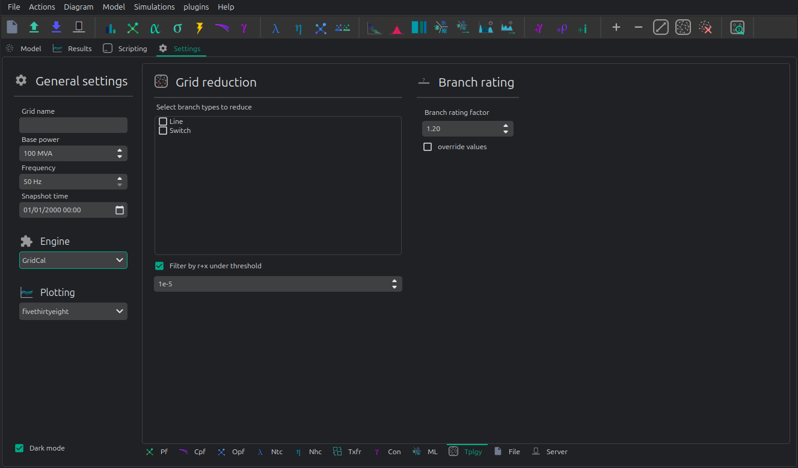
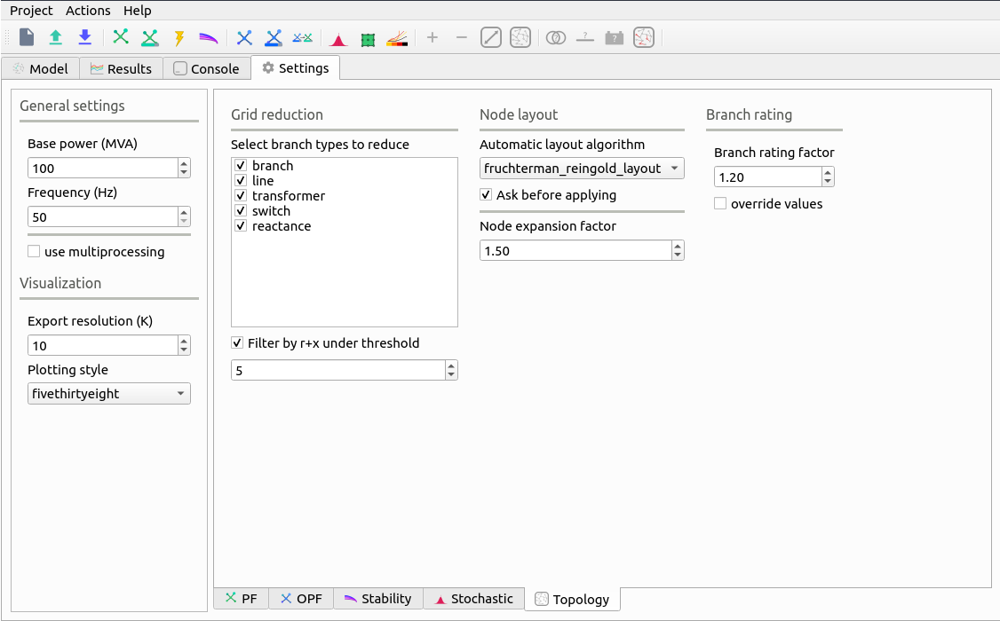
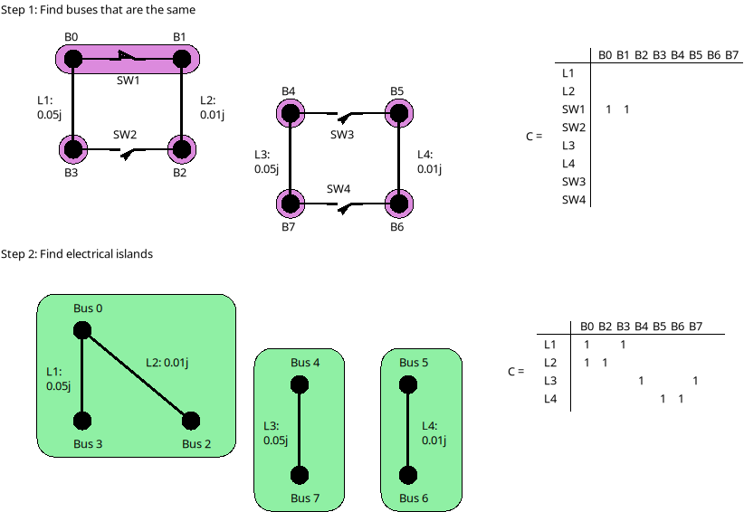
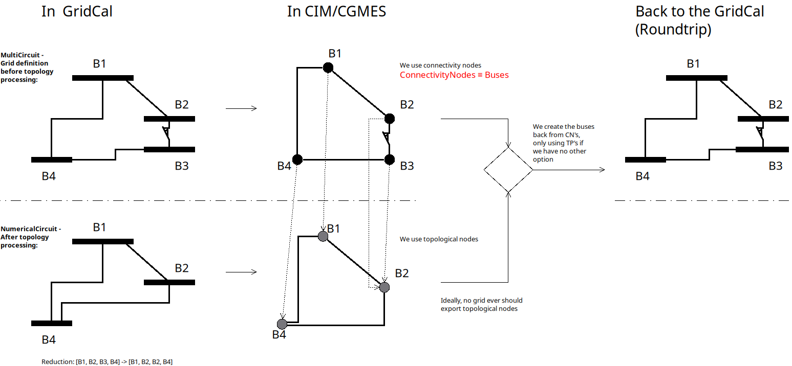

# 🌵 Topology

The topology processing in VeraGrid is handled automatically, and you need to do nothing for it to work.

Branches with the `reducible` flag enabled are candidates for disappearing at the 
`NumericalCircuit level when computing any simulation. Typically, switches will be reduced, but if not they will
use their declared impedance, which is not advised.



## Other topology functions

There are some other topological functions that can be accessed through the GUI for special purposes.



Select branch types to reduce
    The topological reduction is a top feature of VeraGrid. With it you can remove the influence of the redundant
    branches. This is specially relevant when you are provided with grids that have thousands of switches and
    connection branches that add no simulation value. Those can be removed in a very smart way.

Filter by r+x under threshold
    This feature establishes if to topologically remove branches whose resistance + reactance
    is lower than a threshold. The threshold is given by the exponent number. i.e. 5 corresponds to `r+x < 1e-5`.

Automatic layout algorithm
    Another nice feature in VeraGrid is the ability to sort bus bar locations according to a graph algorithm.
    This is especially useful when you are provided with a grid that has no schematic, where the graphical
    representation depict all the bus bars in the same place.

Ask before applying
    Raise a question before applying the graph layout algorithm.

Node expansion factor
    The nodes in VeraGrid can be expanded (far from each other) or shrink (closer) this parameter
    set the "explosion" factor that determines how far from each other shall the nodes become.

Branch rating factor
    For the branch automatic rating, this is the rate multiplier.

Override values
    If selected any non-zero rate is overridden by the calculated value.


## Theory
In this section, we are going to explain how to do topology processing properly
once and for all. This topic is of capital importance in power systems but is
rarely dealt with in a structured and comprehensive manner.

**A Graph in Power Systems**

A graph is composed of:

- **Nodes:** These are the buses of a model that represent points of calculation, such as substation bars, 
generation points, or load centers.
- **Edges:** Represent the connections, such as transmission lines, transformers, or switches.

This abstraction simplifies the network from the bolts and welds to a simpler, 
yet correct simplification that retains the essential connectivity information.

Note about ontologies: In the ontologies world, any device can be related to any other in a all-to-all fashion.
This means that nothig prevents a line to be connected to more than two points, 
among many other wasteful modelling propositions.
In this article we will use proper network theory graphs where branches 
transmit electricity and nodes are the points where we measure.

**Why is Topology Processing Important?**

Topology processing ensures that the network's operational model reflects 
accurately its physical state. Without proper processing, analyses may yield
inaccurate results, leading to operational inefficiencies or even failures.

Topology processing helps to ensure the model is computationally feasible,
to identify and correct data inconsistencies and to optimize the simulation 
by reducing unnecessary complexities.

In less abstract terms, topology processing is about determining the simulatable
sub-circuits within a a collection of equipment. 
Here, a circuit refers to a collection of equipment, its relationships, 
and states in the most general sense. 

We perform the topology processing as a precaution before simulating, 
because what we want is to be able to use the electrotechnical formulas 
to get the physical magnitudes, and for that we must abide to some rules. 
Thus, from circuit theory, we derive the following fundamental relationship:

$$ Y \times V = I^* $$

Where:

- $Y$ is the nodal admittance matrix.
- $V$ is the vector of bus voltages.
- $I$ is the vector of current injections at the buses.

To solve for $V$, we need to invert $Y$:

$$V = Y^{-1} \times I^*$$

However, $Y$ may not always be invertible for any arbitrary collection
of equipment. This is because certain branches in the circuit might have 
zero impedance, making $Y$ singular. 
Or simply because there are grid parts disconnected from the rest, 
making $Y$ also singular.

The topology processing involves the following steps:

1. **Reduce problematic branches:** Address switches and jumpers that cause singularities.
2. **Find the simulatable islands:** Identify isolated groups of interconnected elements.
3. **Segment the circuit into sub-circuits:** Divide the system into smaller, manageable parts.
4. **Simulate each circuit independently:** Perform separate analyses for each sub-circuit.*
5. **Reassemble the results:** Combine outcomes to match the original circuit structure.


> Steps 2 to 5 are necessary only for simulations reliant on equality constraints,
  such as power flow. Simulations involving overdetermined linear systems, such as
  optimizations, do not require separate handling of islands.


### Step 1: Reduce the problematic branches

In the context of power systems, certain branches can cause computational issues due
to their characteristics, such as zero impedance or inactive status. These branches,
referred here to as *problematic branches*, must be effectively removed^ to ensure accurate
simulations and analyses. To better understand this, let’s examine the following
example circuit:

| Bus from | Bus to  | Reducible | impedance | active |
|----------|---------|-----------|-----------|--------|
| 0        | 1       | yes       | 0         | yes    |
| 0        | 2       | no        | 0.05j     | yes    |
| 1        | 3       | no        | 0.01j     | yes    |
| 2        | 3       | yes       | 0         | no     |


> It is important to understand the meaning of zero when talking about physical magnitudes
  such as the impedance. Zero is the *absence of*, therefore zero impedance means that
  the branch is not there. Hence, we must remove it and join the buses it connects.

This circuit consists of 4 buses and 4 branches. Two of these branches are marked
as "reducible," meaning their removal is needed to not impact the network's functional
properties for simulation purposes. These zero-impedance branches do not contribute to
the network’s overall impedance matrix, but would make it singular if added.
To identify reducible branches, we construct an adjacency matrix representing
connections between buses. The adjacency matrix is computed using the following algorithm:

```python
    n = number of buses
    m = number of branches
    A = lil_matrix(n, n)
    for k=0 to m:
        f = bus from of the branch k
        t = bus to of the branch k
        if branch k is active and reducible:
            A(f, f) += 1
            A(f, t) += 1
            A(t, f) += 1
            A(t, t) += 1
        end-if
    end-for
```

A method that is found to be approximately 2.5 times faster in practice is 
to form the computationally simpler connectivity matrix C, and then compute A
from it by $A = C \times C^\top$

See the following pseudo-code:

```python
    n = number of buses
    m = number of branches
    C = lil_matrix(m, n)
    for k=0 to m:
        f = bus from of the branch k
        t = bus to of the branch k
        if branch k is active and reducible:
            C(k, f) = 1
            C(k, t) = 1
        end-if
    end-for
    A = C.transpose x C
```

> Both methods require matrices `C` and `A` to be sparse. Dense matrices would
  demand excessive memory and computational resources, making them impractical
  for power system applications.


The nifty trick of composing `A` with the reducible elements, allows us to use a
standard **island-finding algorithm** (see the annex) to identify groups of buses connected by
reducible elements that can be treated as a single bus because they are
*topologically* the same place. The result of that will be a mapping vector of size equal to the 
number of nodes where each value represents the index of the node that remain for calculation

In the given example, buses 0 and 1 are grouped, meaning bus 1 is effectively
merged into bus 0. Buses 2 and 3 remain as independent nodes.

After processing the reducible branches, the simplified circuit is:

| Bus from | Bus to | impedance |
|----------|--------|-----------|
| 0        | 2      | 0.05j     |
| 0        | 3      | 0.01j     |

The mapping vector of this 4 bus example would be:

```
[0, 0, 2, 3]
```

The bus at position 0 remain, the bus at position 1 is removed and represented by the bus 0
the buses 2 and 3 each remain.


### Step 2: Find the simulatable islands

Splitting into islands that are electrically connected requires 
**the island search function** (*see the annex*) again but used with a different adjacency matrix.
For that, we need to compute the Adjacency matrix using the
non-reducible, active branches. This is, the branches that have impedances and
can transmit electricity. 
These are the branches that we did not eliminate in the step 1.

To compose the connected adjancency matrix `A` we do need to fill the incidence matric `C`.
With that $A = C \times C\top$: 
```python
    n = number of buses
    m = number of branches
    C = lil_matrix(m, n)
    for k=0 to m:
        f = bus from of the branch k
        t = bus to of the branch k
        if (branch k is active) and (bus f is active) and (bus t is active):
            C(k, f) = 1
            C(k, t) = 1
        end-if
    end-for

    A = C.transpose x C
```

The steps here are:
1. **Initialization:** The connectivity matrix `C` is initialized to capture branch
   connections.
2. **Branch Iteration:** Each branch is checked for status=active and the corresponding buses
   are verified to be active as well.
3. **Matrix Assembly:** Connections between the "from" and "to" buses are recorded in `C`.
4. **Adjacency Matrix Construction:** The final adjacency matrix `A` is obtained through
   a matrix multiplication operations on `C`.

With the adjacency matrix `A` constructed, standard island-detection algorithms can be
applied to identify groups of interconnected buses. These groups, referred to as
"simulatable islands," represent sub-networks that can independently support simulation.

```python
islands = find_islands(A)
```

The `islands` variable contains a list of vectors, where each vector represents the
indices of buses within a single island. For example, in a simple network, two
interconnected buses might form one island, while isolated buses form separate islands.




For each identified island, it is crucial to verify the presence of at least one voltage
source or slack node. Without a slack node, the island cannot be powered, resulting in a
blackout for that portion of the network. Slack nodes provide the necessary reference
voltage and power balance for the island’s operation.


### Step 3: Segment the circuit into electrical islands

After removing problematic branches, and finding the bus indices that constitute islands, 
the next crucial step is to segment the circuit into sub-circuits or *islands*.

An island is defined as a group of interconnected buses that form an
independent sub-network. This segmentation is essential for accurately analyzing and
simulating the system. To achieve this, we slice the grid's data structures based on
the island information.

An island is represented as a vector of bus indices. For instance, if an island
contains buses 4, 5, 6, and 7, this vector would be `[4, 5, 6, 7]`. Using this
information, slicing a data structure containing only bus data is straightforward.
However, slicing structures such as branches or loads requires additional steps
to relate them to the buses that define the island.

To efficiently handle slicing, we create a bus mapping array that maps the original
bus indices to the indices of the island. For instance, consider a circuit with 8
buses, where the mentioned island comprises buses 4, 5, 6, and 7. 
The mapping process is as follows:

1. Initialize an array of size 8 filled with `-1` to represent unmapped buses.
2. Assign new island indices to the corresponding positions in the array.

```python
island = (4, 5, 6, 7)
bus_map = -1 x ones(8)
ii = 0
for i in island:
    bus_map[i] = ii
    ii += 1
end-for
```

The bus map is:
```
bus_map = (-1, -1, -1, -1, 0, 1, 2, 3)
```

Now, consider the following branch data for the 8-bus grid:

| Name     | bus_from | bus_to |
|----------|----------|--------|
| 0:Branch | 2        | 0      |
| 1:Branch | 3        | 2      |
| 2:Branch | 1        | 0      |
| 3:Branch | 1        | 2      |
| 4:Branch | 6        | 4      |
| 5:Branch | 7        | 6      |
| 6:Branch | 5        | 4      |
| 7:Branch | 5        | 6      |

With the following algorithm we can determine which branch indices belong to the island:

```python
    m = number of branches
    elements_indices = list()
    for k=0 to m:
        f = branch k from bus
        t = branch k to bus
        if bus_map[f] > -1 and bus_map[t] > -1:
            elements_indices.add(k)
```

In this case, the branch indices are `(4, 5, 6, 7)`. 
Hence, the sliced island branch data is:

| Name     | bus_from | bus_to |
|----------|----------|--------|
| 4:Branch | 6        | 4      |
| 5:Branch | 7        | 6      |
| 6:Branch | 5        | 4      |
| 7:Branch | 5        | 6      |

We use the `bus_map` to re-map the "from" and "to" buses of the sliced structure
from the original bus indices to the island bus indices:

| Name     | bus_from | bus_to |
|----------|----------|--------|
| 4:Branch | 2        | 0      |
| 5:Branch | 3        | 2      |
| 6:Branch | 1        | 0      |
| 7:Branch | 1        | 2      |

For data structures like loads or generators, the slicing process is similar. However, these
structures typically involve a single bus index rather than "from" and "to" indices.
By consistently applying the bus mapping array, we can accurately extract relevant
data for any island.

Segmenting the circuit into islands eliminates inactive buses, branches, and devices
that might otherwise introduce errors into simulations. This step significantly
improves computational efficiency and ensures cleaner, more reliable data for
numerical calculations such as power flow analysis. The resulting islands form
distinct, manageable sub-networks ready for independent simulation and analysis.

### Step 4: Simulate the islands independently

This is a very straight forward step, since we have already processed
the initial grid information into clean and simulatable sub-circuits.
In this step we simulate them one by one using the power flow simulation for instance.

### Step 5: Reassembly 

At step 4 provides us with the values for the nodes that remained after the topology processing.
However we need to expand those results into the complete set of nodes.
We use the mapping vector found at step 1 to expand the bus results such as the voltage.


### The spirit of CIM

If you've encountered CIM or CGMES, or participated in guild discussions, you've
likely heard about **node-breaker** and **bus-branch** modeling styles as distinct
approaches. ENTSO-e's introductory CGMES training has historically taught that
you can model using either **ConnectivityNodes** or **TopologicalNodes** (AKA Buses).
This guidance has been shared with hundreds of engineers accustomed to simpler
models of buses, lines, etc., only to face what seems to be gratuitous complexity.

The modeling approaches are often thought of as follows:

- **Bus-branch modeling:** This style involves using **TopologicalNodes** and
  no switches.
- **Node-breaker modeling:** This style involves using **ConnectivityNodes**
  and switches.

This school of thought leaves us in a vacuum that we may feel inclined to fill
with ad-hoc topology processing cases. But, after going through the described steps, 
one finds that this complexity is indeed unjustified because the **node-breaker** 
and **bus-branch** philosophies are fundamentally the same. In steps 1 to 3
we have implicitly demonstrated that:

> - A ConnectivityNode is a **bus** before the topology processing.
> - A TopologyNode is a **bus** after the topology processing.

Following this new found truth, the TopologyNode should not be shared in any
model or database since they are a particular product of the database state 
and the switches should always be reduced before simulation to avoid numerical singularities.

Again, a common misconception is that bus-branch models 
lack switches, whereas node-breaker models include them. In practice, both 
approaches can incorporate switches. This fact is often emphasized in official CGMES trainings.
If a **ConnectivityNode** must have an `N:1` association with a **TopologicalNode**, this
implies that any ConnectivityNode ultimately represents a TopologicalNode.
This reinforces the argument that both are two faces of the same coin,
**Making both styles fundamentally equal.**

**The Philosophy Behind CIM**

In this light, one can only imagine that the intent behind CIM’s design philosophy is to model
grids using **ConnectivityNodes**, with **TopologicalNodes** emerging afterwards
through topological reductions (e.g., simplifying branches).
This implies that we should not share TopologicalNodes, since those are
internal artifacts of a calculation software such as VeraGrid.

Over time, the practice of treating detailed models as node-breaker
and less-detailed models as bus-branch has created an
artificial divide that has proven impractical and needlessly complicated.
This is further exacerbated by the fact that most common mainstream software
also makes a division between substation nodes and other nodes, when all
nodes are in fact equal in the eyes of math.

**Then, why the Complexity?**

One can understand that the lack of a clear topology processing method
has likely sparked this complexity, creating a middle ground that combines the
worst aspects of both approaches. Engineers attempting to reconcile the two
styles often encounter unnecessary confusion and inefficiency mostly
steaming from folklore rather than rigor.

**Revisiting CIM’s Spirit**

If we examine the original spirit of CIM: **ConnectivityNodes are no different
from traditional Buses.** The distinction is a myth that adds unnecessary
complexity to modeling workflows. By adhering to this perspective, we can
simplify processes and focus on building more efficient, accurate 
and interoperable models.


### How is it done in VeraGrid?

In VeraGrid, the **MultiCircuit** serves as the grid's in-memory database. It is
crucial that no topological processing is ever performed directly on the
MultiCircuit. Doing so risks altering the topology of elements, potentially
breaking the consistency of the original configuration.

**Why Avoid Topological Processing on the MultiCircuit?**

Consider a generator initially connected to **Bus 1**. 
After performing topological processing, it might end up connected to
**Bus 2**. How could we recover the original connection to **Bus 1**? Simply put,
we cannot. And believe you me, the genrator in the power plant is connected to bus 1,
and no operator ever unwelds it to weld it to bus 2. 
That is only a fiction of the topology processing.

Altering the MultiCircuit directly compromises the data integrity,
making it impossible to restore the original topology. In CIM, this is probably why
there are two distinct sets of objects; ConnectivityNode to maintain the structure
and TopologicalNode to represent the final connectivity for simulation porpuses. 
This reinforces the idea that we must only model with ConnectivityNodes, 
which for simplicity are always buses in the end in VeraGrid.

**The Role of NumericalCircuit**

If topology processing should not occur over the database, then where should it
be done? The solution in VeraGrid is to provide the **NumericalCircuit**, a snapshot of
the MultiCircuit at a specific state. This snapshot is **fungible**, meaning that any
modifications made to it will not impact the original MultiCircuit and will
vanish after the calculation. As such, all topology processing steps are
performed on the **NumericalCircuit**, as described earlier in this section.
This is a clean, correct and paralelizable appeach.

**CIM Compatibility Adjustments**

To ensure compatibility with CIM standards, we have introduced a single
adjustment:

- Every **ConnectivityNode** must either create a bus or be associated with an
  existing bus.
- Similarly, every **TopologicalNode** must either create a connectivity node or be
  associated with one.

This guarantees that no matter which object you use for modeling, the system
will ultimately rely on buses, maintaining consistency across all calculation
processes in every scenario and avoiding the superficial complexity of having two
sets of objects for the same thing; Representing a node in a graph.

By doing this, we also put an end to the node-breaker vs. bus-branch feud,
allowing for compatibility with the so-called legacy models.




### Takeaways


- Bus-branch and node-breaker modelling styles are the same thing.
- In VeraGrid (or any other sofwtare), always model with buses, you'll thank me later.
- In CIM/CGMES, model always with ConnectivityNodes and forget
  about the TopologicalNodes, you'll thank me later.
- In topology processing, we use the find-islands algorithm (DFS), combined
  with different compositions of adjacency matrices (A). General element traversing
  should only happen when composing the adjacency matrices.


### Annex: The islands search function

The island search function is a depth-first search that exploits the CSC structure of
the adjacency matrix. The particular version of the DFS algorithm presented here avoids
recursivity in favor of cues for faster execution.

```bash
indptr: index pointers in the CSC scheme
indices: column indices in the CSCS scheme
active: array of bus active states
n = bus number

visited = zeros(n)

islands = list()

node_count = 0
current_island = zeros(n)

island_idx = 0

for node=0 to node_number:

    if not visited[node] and active[node]:

        stack = list()
        stack.add(node)

        while stack.size > 0:

            v = stack.first
            remove first element from the stack

            if not visited[v]:

                visited[v] = 1

                current_island[node_count] = v
                node_count += 1

                for i=indptr[v] to indptr[v + 1]:
                    k = indices[i]
                    if not visited[k] and active[k]:
                        stack.add(k)
                    end-if
                end-for
            end-if
        end-while

        # slice the current island to its actual size
        island = current_island[:node_count].copy()
        island.sort()  # sort in-place

        # assign the current island
        islands.append(island)

        # increase the islands index, because
        island_idx += 1

        # reset the current island
        # no need to re-allocate "current_island" since it is going to be overwritten
        node_count = 0
    end-if
end-for
```